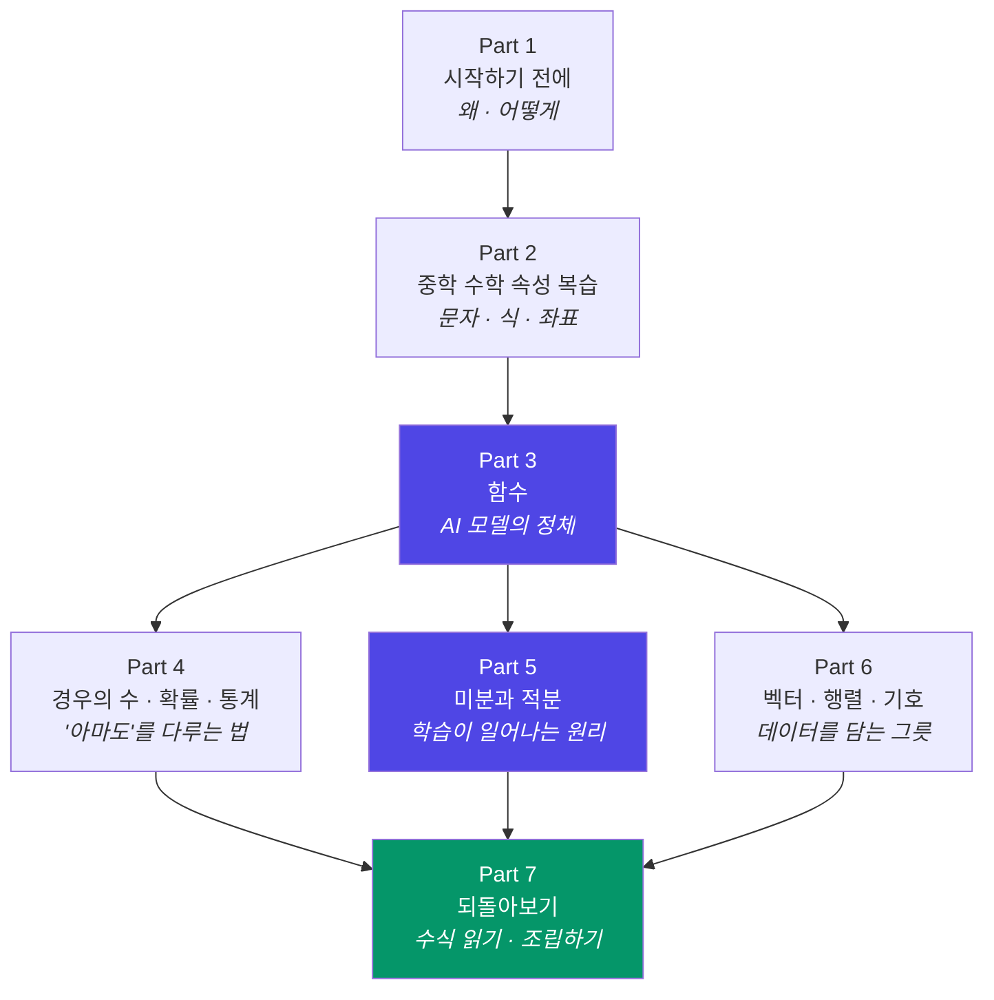

# 그림으로 이해하는, AI를 위한 기초 수학

> 수학을 거의 잊어버린 사람도 따라올 수 있는, **AI 공부에 실제로 필요한 만큼만**의 중·고등학교 수학

---

## 이 프로젝트는 무엇인가요?

AI를 공부하려고 책이나 강의를 펼쳤다가 이런 수식 앞에서 멈춘 적 있으신가요?

$$
\theta \leftarrow \theta - \eta \frac{\partial L}{\partial \theta}
\qquad
\text{softmax}(z_i) = \frac{e^{z_i}}{\sum_j e^{z_j}}
$$

이 프로젝트는 저 기호들이 **무섭지 않아지는 것**을 목표로 합니다.
수학과 학생을 만들려는 게 아니라, **AI를 설명하는 문장을 읽을 수 있는 사람**을 만들려는 것입니다.

### 세 가지 원칙

| 원칙 | 뜻 |
|---|---|
| 🖼️ **그림 먼저, 수식은 나중** | 모든 개념은 그림·그래프·애니메이션으로 먼저 이해하고, 수식은 "그 그림을 짧게 적은 것"으로만 등장합니다 |
| ✂️ **필요한 것만** | 시험을 위한 계산 테크닉(인수분해 요령, 복잡한 적분 기교 등)은 과감히 버립니다. AI에 쓰이는 것만 남깁니다 |
| 🔗 **항상 AI와 연결** | 모든 절 끝에 "그래서 이게 AI 어디에 쓰이나요?"를 붙입니다 |

### 이런 분을 위해 만들었습니다

- 문과 출신이거나, 수학을 놓은 지 10년 이상 된 분
- 딥러닝 강의를 듣다가 수식 슬라이드에서 매번 튕겨 나오는 분
- 미분·확률이라는 단어만 들어도 긴장되는 개발자
- "AI 논문 수식을 대충이라도 읽고 싶다"는 분

> **선수 지식**: 사칙연산과 분수. 그 이상은 이 프로젝트 안에서 전부 다시 설명합니다.

---

## 전체 학습 지도

**가장 중요한 세 덩어리**는 `함수`(모델이란 무엇인가) · `미분`(어떻게 학습하는가) · `벡터/행렬`(데이터를 어떻게 담는가) 입니다.
나머지는 이 셋을 이해하기 위한 준비물이거나, 결과를 해석하기 위한 도구입니다.

---

## 목차

### Part 1. 시작하기 전에 — AI에 수학이 왜 필요한가

수학 공부를 시작하기 전에, **어디까지만 하면 되는지** 지도를 먼저 그립니다.

| 번호 | 제목 | 한 줄 요약 |
|---|---|---|
| 1-1 | AI를 이해하는 데 수학이 필요한 진짜 이유 | 수식은 장식이 아니라 "동작 설명서"입니다 |
| 1-2 | 어디까지만 알면 되는가 — 범위 지도 | 고등학교 수학의 약 30%면 충분한 이유 |
| 1-3 | 이 프로젝트의 특징과 구성 | 그림 → 감각 → 수식 → AI 연결의 4단 구성 |
| 1-4 | 수학 기호 읽는 법 사전 | `∑` `∈` `→` `θ` … 읽을 줄만 알면 절반은 끝 |
| 1-5 | 학습 방법과 추천 순서 | 막히면 건너뛰어도 되는 지점 표시 |

---

### Part 2. 중학교 수학 속성 복습 — 30분이면 됩니다

이후 모든 내용의 **바닥**입니다. 이미 아는 내용이면 표만 훑고 넘어가세요.

| 번호 | 제목 | 한 줄 요약 |
|---|---|---|
| 2-1 | 수의 세계 — 자연수부터 실수까지 | 수를 담는 상자들이 겹겹이 들어 있는 그림 |
| 2-2 | 문자와 식 — `x`는 왜 필요한가 | "아직 모르는 수"에 이름을 붙이는 기술 |
| 2-3 | 식을 정리하는 법 — 전개와 대입 | 규칙 4개면 끝나는 계산 |
| 2-4 | 방정식 — 저울로 이해하기 | 양쪽에 같은 일을 하면 균형은 유지된다 |
| 2-5 | 부등식과 대소 관계 | `>` 는 "더 좋다"를 표현하는 도구 |
| 2-6 | 거듭제곱과 제곱근 | `x²`, `√x` 를 넓이와 한 변의 길이로 보기 |
| 2-7 | 좌표평면 — 숫자를 점으로 바꾸기 | **데이터 한 줄 = 평면 위의 점 하나** |
| 2-8 | 비례와 반비례 | 가장 단순한 두 가지 관계 |
| 2-9 | 삼각형과 피타고라스 정리 | 두 점 사이 "거리"를 재는 유일한 도구 |
| 2-10 | 🔗 AI 연결 — 데이터는 결국 점들의 모임 | 산점도 하나로 보는 머신러닝의 출발점 |

---

### Part 3. 함수 — AI 모델의 정체

**"AI 모델 = 거대한 함수 하나"**. 이 파트가 이 프로젝트의 심장입니다.

| 번호 | 제목 | 한 줄 요약 |
|---|---|---|
| 3-1 | 함수란 무엇인가 — 입력과 출력의 상자 | 자판기 그림 하나로 끝내는 정의 |
| 3-2 | 함수를 그래프로 보는 법 | 식이 아니라 **모양**으로 기억하기 |
| 3-3 | 일차함수와 직선 — `y = ax + b` | 기울기 `a`와 절편 `b`의 의미 |
| 3-4 | 🔗 직선 하나로 예측하기 — 선형회귀 | 점들 사이에 가장 알맞은 선 긋기 |
| 3-5 | 이차함수와 포물선 | **골짜기 모양**, 그리고 "가장 낮은 지점" |
| 3-6 | 🔗 포물선의 바닥 = 오차가 가장 작은 지점 | 손실 함수(loss)를 미리 만나보기 |
| 3-7 | 그래프의 이동과 확대·축소 | 가중치와 편향이 그래프에 하는 일 |
| 3-8 | 지수함수 — 폭발적으로 커지는 수 | 접었던 종이가 달까지 닿는 이야기 |
| 3-9 | 로그함수 — 지수를 거꾸로 뒤집기 | "몇 자리 수인가"를 재는 자 |
| 3-10 | 🔗 로그가 AI에 등장하는 이유 | 로그 스케일 그래프와 로그 가능도(log-likelihood) |
| 3-11 | 삼각함수 sin·cos·tan — 원 위의 그림자 | 직각삼각형이 아니라 **회전**으로 이해하기 |
| 3-12 | 🔗 sin·cos가 AI에 쓰이는 곳 | 주기·각도·위치 인코딩 맛보기 |
| 3-13 | 합성함수 — 상자를 상자에 넣기 | **층을 쌓는다**는 말의 진짜 의미 |
| 3-14 | 🔗 AI에서 자주 보는 함수 3종 세트 | 시그모이드 · ReLU · 소프트맥스를 그림으로 |

---

### Part 4. 경우의 수 · 확률 · 통계 — AI가 "아마도"를 말하는 법

AI의 출력은 정답이 아니라 **확신의 정도**입니다. 그것을 읽는 법을 배웁니다.

| 번호 | 제목 | 한 줄 요약 |
|---|---|---|
| 4-1 | 경우의 수 — 세는 것부터 시작 | 나무 그림(수형도) 한 장 |
| 4-2 | 순열과 조합 | "순서가 중요한가?" 하나로 갈리는 두 세계 |
| 4-3 | 확률의 기본 — 넓이로 이해하기 | 전체 대비 얼마나 차지하는가 |
| 4-4 | 조건부확률 — 정보가 늘면 확률이 바뀐다 | 사각형을 잘라내는 그림 |
| 4-5 | 베이즈 정리 — 믿음을 갱신하는 공식 | 검사 결과가 양성이어도 안심인 이유 |
| 4-6 | 확률분포와 기댓값 | "평균적으로 얼마쯤"을 계산하기 |
| 4-7 | 평균 · 분산 · 표준편차 | 데이터가 얼마나 흩어져 있는가 |
| 4-8 | 정규분포 — 세상에서 가장 흔한 종 모양 | 68 - 95 - 99.7 규칙 |
| 4-9 | 🔗 데이터 전처리의 수학 — 정규화와 표준화 | 단위가 다른 데이터를 같은 자로 재기 |
| 4-10 | 🔗 AI의 출력은 왜 확률인가 | 분류 확률 · 샘플링 · temperature |

---

### Part 5. 미분과 적분 — 학습이 일어나는 원리

**"AI가 학습한다"는 말은 곧 "미분해서 조금씩 내려간다"는 뜻**입니다.

| 번호 | 제목 | 한 줄 요약 |
|---|---|---|
| 5-1 | 수열 — 규칙이 있는 숫자의 줄 | 반복(iteration)을 적는 언어 |
| 5-2 | 극한 — "한없이 가까워진다"의 뜻 | 무한을 무서워하지 않는 법 |
| 5-3 | 미분 ① 기울기 = 변화의 속도 | 언덕의 경사를 재는 그림 |
| 5-4 | 미분 ② 접선, 그리고 순간의 기울기 | 점점 확대하면 곡선도 직선이 된다 |
| 5-5 | 미분 공식 최소 세트 | 외울 것은 딱 다섯 줄 |
| 5-6 | 최댓값·최솟값 — 기울기가 0인 지점 | 산꼭대기와 골짜기 바닥 찾기 |
| 5-7 | 편미분 — 손잡이가 여러 개일 때 | 다른 건 고정하고 하나씩 돌려보기 |
| 5-8 | 기울기 벡터(gradient) — 가장 가파른 방향 | 안개 낀 산에서 내려오는 방법 |
| 5-9 | 연쇄법칙 — 함수가 겹쳐 있을 때 | **역전파(backpropagation)의 심장** |
| 5-10 | 🔗 경사하강법 — AI가 학습하는 전 과정 | 학습률(learning rate)을 그림으로 이해하기 |
| 5-11 | 적분 — 잘게 쪼개서 넓이 구하기 | 미분을 거꾸로 되감기 |
| 5-12 | 🔗 확률밀도와 넓이 | 연속 확률에서 적분이 필요한 이유 |

---

### Part 6. 벡터 · 행렬 · 기호 — 데이터를 담는 그릇

AI가 다루는 것은 숫자 하나가 아니라 **숫자 뭉치**입니다. 그 뭉치를 다루는 문법입니다.

| 번호 | 제목 | 한 줄 요약 |
|---|---|---|
| 6-1 | 집합과 논리 기호 | `∈` `∪` `∩` 읽는 법 |
| 6-2 | 시그마(∑) 기호 — 반복문의 수학 버전 | `for` 루프와 나란히 놓고 보기 |
| 6-3 | 벡터 — 크기와 방향을 가진 화살표 | 숫자 여러 개를 한 덩어리로 |
| 6-4 | 벡터의 덧셈과 스칼라 곱 | 화살표를 이어 붙이고 늘이기 |
| 6-5 | 내적 — 두 화살표가 얼마나 닮았는가 | 곱해서 더하면 나오는 "닮음 점수" |
| 6-6 | 🔗 코사인 유사도와 임베딩 | "왕 - 남자 + 여자 = 여왕"의 정체 |
| 6-7 | 행렬 — 숫자를 표로 묶기 | 데이터셋이 곧 행렬 |
| 6-8 | 행렬의 곱셈 — 그림으로 완전 정복 | 행과 열이 만나는 규칙 |
| 6-9 | 🔗 신경망 한 층 = 행렬 곱 한 번 | `Wx + b` 를 그림으로 분해하기 |
| 6-10 | 차원과 shape — 에러 메시지 읽는 법 | `(32, 784) × (784, 128)` 이 말하는 것 |
| 6-11 | (선택) 복소수 아주 짧게 | 지금 당장은 몰라도 되는 이유 포함 |

---

### Part 7. 되돌아보기 — 배운 수학으로 AI 조립하기

흩어져 있던 조각들을 하나로 맞춥니다.

| 번호 | 제목 | 한 줄 요약 |
|---|---|---|
| 7-1 | 전체 지도 다시 보기 | 한 장으로 압축한 요약 포스터 |
| 7-2 | 수식 읽기 연습 ① 선형회귀 | 배운 것만으로 처음부터 끝까지 해부 |
| 7-3 | 수식 읽기 연습 ② 신경망 순전파 | 행렬 곱 + 합성함수 |
| 7-4 | 수식 읽기 연습 ③ 크로스엔트로피 손실 | 로그 + 확률 + 시그마 |
| 7-5 | 수식 읽기 연습 ④ 경사하강 갱신식 | 편미분 + 학습률 |
| 7-6 | 종이 위에서 돌려보는 미니 신경망 | 계산기만으로 학습 1회분 직접 굴려보기 |
| 7-7 | 자주 헷갈리는 기호 총정리 | 한 장 치트시트 |
| 7-8 | 다음 단계 — 여기서 어디로 갈까 | 선형대수 · 최적화 · 통계학 추천 경로 |

---

## 각 절의 공통 구성

모든 절은 같은 4단 구조로 쓰입니다. 어디서 시작하든 리듬이 같습니다.

| 단계 | 내용 |
|---|---|
| 🎯 **한 문장 요약** | 이 절에서 딱 하나만 가져간다면 이것 |
| 🖼️ **그림으로 이해하기** | 다이어그램 · 그래프 · 비유 (수식 없음) |
| ✍️ **수식으로 적어보기** | 방금 본 그림을 짧게 적으면 이렇게 됩니다 |
| 🔗 **AI에서는 이렇게 쓰입니다** | 실제 코드·논문·모델 속 등장 지점 |
| ✅ **1분 확인 문제** | 계산이 아니라 "감각"을 확인하는 질문 |

---

## 진행 상황

- [x] 전체 목차 설계
- [ ] Part 1 집필
- [ ] Part 2 집필
- [ ] Part 3 집필
- [ ] Part 4 집필
- [ ] Part 5 집필
- [ ] Part 6 집필
- [ ] Part 7 집필

---

## 라이선스

추후 결정 예정
