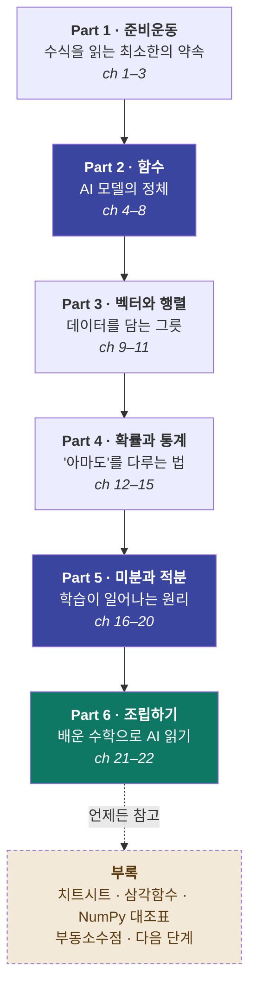

# 그림으로 이해하는, AI를 위한 수학

> 수학을 놓은 지 오래된 사람도 따라올 수 있는, **AI를 이해하는 데 필요한 만큼만**의 수학

---

## 이 프로젝트가 하려는 것

AI를 공부하려고 책이나 강의를 펼쳤다가, 이런 수식 앞에서 멈춘 적 있으신가요?

```
θ ← θ − η·∂L/∂θ            softmax(zᵢ) = e^zᵢ / Σⱼ e^zⱼ
```

이 프로젝트를 끝내면 저 수식이 이렇게 읽힙니다.

> “언덕에서 **가장 가파른 방향**을 찾아, 보폭 η만큼 **아래로 한 발** 내려간다.”
> “점수들을 **전부 양수로 만든 뒤**, 합이 1이 되도록 **비율로 나눈다**.”

목표는 수학자가 되는 게 아닙니다. **AI를 설명하는 문장을 읽을 수 있는 사람**이 되는 것입니다.

### 네 가지 원칙

| 원칙 | 뜻 |
|---|---|
| 🖼️ **그림 먼저, 수식은 나중** | 모든 개념을 그림·그래프·비유로 먼저 이해합니다. 수식은 "그 그림을 짧게 적은 것"으로만 등장합니다 |
| 🎯 **AI에 쓰이는 것만** | 시험용 계산 테크닉은 전부 덜어냅니다. 인수분해 요령, 복잡한 적분 기교는 없습니다 |
| 🔗 **수학과 AI를 따로 두지 않음** | "AI 연결" 코너를 따로 만들지 않습니다. 기울기를 배우는 그 자리에서 그게 가중치라고 말합니다 |
| 🐢 **한 번에 한 걸음** | 한 절에는 새 개념이 하나만 등장합니다. 막히면 그 절만 다시 보면 됩니다 |

### 이런 분을 위해 만들었습니다

- 문과 출신이거나, 수학을 놓은 지 10년 이상 된 분
- 딥러닝 강의를 듣다가 수식 슬라이드에서 매번 튕겨 나오는 분
- 라이브러리는 쓸 줄 아는데 안에서 무슨 일이 일어나는지 모르겠는 개발자
- 논문 수식을 대충이라도 읽고 싶은 분

> **선수 지식**: 사칙연산과 분수. 그 이상은 전부 이 안에서 다시 설명합니다.

---

## 전체 학습 지도



**Part 2(함수) · Part 3(벡터·행렬) · Part 5(미분)** 이 세 개가 기둥입니다.
각각 **"모델이란 무엇인가" · "데이터를 어떻게 담는가" · "어떻게 학습하는가"** 에 답합니다.

---

## 목차

**6개 Part · 22개 Chapter**. 앞에서부터 순서대로 읽는 것을 기준으로 설계했습니다.
💡 표시는 흐름을 끊지 않는 보조 읽을거리(칼럼)이며 건너뛰어도 됩니다.

---

### Part 1. 준비운동 — 수식이 무섭지 않아지기

#### [Chapter 01. 이 코스의 지도](docs/part1/ch01-roadmap.md) ✅

| 번호 | 제목 |
|---|---|
| 1.1 | AI 공부는 왜 하필 수식에서 막히는가 |
| 1.2 | 필요한 건 계산 실력이 아니라 '읽는 힘' |
| 1.3 | 이 코스에서 배우는 것 — 한 장 지도 |
| 1.4 | 그림 → 감각 → 수식, 이 순서로 갑니다 |
| 1.5 | 막혀도 되는 곳, 건너뛰면 안 되는 곳 |
| 💡 | 칼럼 — 계산은 컴퓨터가 합니다 |

#### [Chapter 02. 수식을 읽는 최소한의 약속](docs/part1/ch02-reading-notation.md) ✅

| 번호 | 제목 |
|---|---|
| 2.1 | 0보다 작은 수 |
| 2.2 | 마이너스를 포함한 덧셈과 뺄셈 |
| 2.3 | 마이너스를 포함한 곱셈과 나눗셈 |
| 2.4 | 같은 수를 여러 번 곱하는 거듭제곱 |
| 2.5 | 두 번 곱하면 원래 수가 되는 루트 |
| 2.6 | 문자식 — x는 '아직 모르는 수' |
| 2.7 | 문자식 쓰기 규칙 (3a, ab, x²) |
| 2.8 | 그리스 문자에 겁먹지 않기 (θ, η, α, σ) |
| 2.9 | 첨자 읽는 법 (x₁, xᵢ, W⁽¹⁾) |
| 💡 | 칼럼 — 수식은 소리 내어 읽으면 쉬워진다 |

#### [Chapter 03. 좌표와 그래프 — 데이터를 눈으로 보기](docs/part1/ch03-coordinates.md) ✅

| 번호 | 제목 |
|---|---|
| 3.1 | 좌표평면 — 숫자 두 개로 위치를 찍는다 |
| 3.2 | **데이터 한 줄 = 점 하나** |
| 3.3 | 점이 모이면 보이는 것 — 산점도 |
| 3.4 | 그래프를 읽는 세 가지 질문 |
| 3.5 | 축이 3개를 넘어가면? — '차원'이라는 말 |
| 💡 | 칼럼 — 학습 곡선(loss curve) 미리 보기 |

---

### Part 2. 함수 — AI 모델의 정체

> **AI 모델은 결국 거대한 함수 하나**입니다. 이 파트가 전체의 심장입니다.

#### [Chapter 04. 함수 — 입력과 출력의 상자](docs/part2/ch04-function.md) ✅

| 번호 | 제목 |
|---|---|
| 4.1 | 함수란 무엇인가 |
| 4.2 | 함수의 예(1): 자판기 |
| 4.3 | 함수의 예(2): 택시 요금 |
| 4.4 | 함수 식을 쓰는 법 |
| 4.5 | 함수를 그래프로 그려 보기 |
| 4.6 | **AI 모델도 결국 함수 하나입니다** |
| 💡 | 칼럼 — 입력이 여러 개인 함수 |

#### [Chapter 05. 일차함수 — 가장 단순한 예측기](docs/part2/ch05-linear.md) ✅

| 번호 | 제목 |
|---|---|
| 5.1 | 일차함수 y = ax + b |
| 5.2 | 일차함수의 그래프 |
| 5.3 | 기울기 a가 뜻하는 것 |
| 5.4 | 절편 b가 뜻하는 것 |
| 5.5 | 예: 공부 시간과 점수 |
| 5.6 | **점들 사이에 선 하나 긋기 — 예측의 시작** |
| 5.7 | **a와 b를 AI는 '가중치'와 '편향'이라 부릅니다** |
| 💡 | 칼럼 — 왜 하필 직선부터 시작할까 |

#### [Chapter 06. 이차함수 — 오차를 담는 골짜기](docs/part2/ch06-quadratic-loss.md) ✅

| 번호 | 제목 |
|---|---|
| 6.1 | 이차함수 |
| 6.2 | 이차함수의 그래프는 골짜기 모양 |
| 6.3 | 예측이 틀린 정도를 숫자로 — 오차 |
| 6.4 | 오차를 제곱해서 더하면 골짜기가 된다 |
| 6.5 | **골짜기의 바닥 = 가장 좋은 예측** |
| 6.6 | **이것이 손실 함수(loss)입니다** |
| 💡 | 칼럼 — 왜 하필 제곱을 할까 |

#### [Chapter 07. 지수함수와 로그함수](docs/part2/ch07-exp-log.md) ✅

| 번호 | 제목 |
|---|---|
| 7.1 | 거듭제곱 복습 |
| 7.2 | 지수함수 — 급격히 증가하는 수 |
| 7.3 | 예: 두 배씩 늘어나는 것들 |
| 7.4 | 2⁻¹, 2⁰·⁵도 계산할 수 있다 |
| 7.5 | **e — AI에서 가장 자주 보는 숫자** |
| 7.6 | 로그 — 몇 제곱을 하면 되는가 |
| 7.7 | 로그함수와 로그 그래프 |
| 7.8 | **로그 스케일로 봐야 보이는 것 (학습 곡선)** |
| 7.9 | **확률에 로그를 씌우는 이유** |
| 💡 | 칼럼 — 계산기로 로그 구하기 |

#### [Chapter 08. 합성함수와 활성화 함수 — 상자를 겹쳐 쌓기](docs/part2/ch08-composite-activation.md) ✅

| 번호 | 제목 |
|---|---|
| 8.1 | 함수를 함수에 넣기 |
| 8.2 | 합성함수의 그래프 |
| 8.3 | **직선만 쌓으면 결국 직선입니다 — 한계** |
| 8.4 | **그래서 구부러뜨립니다 — 활성화 함수** |
| 8.5 | 시그모이드 — 무엇이든 0과 1 사이로 |
| 8.6 | ReLU — 가장 단순하고 가장 많이 쓰이는 것 |
| 8.7 | 소프트맥스 — 여러 개를 확률로 |
| 8.8 | **'층을 쌓는다'의 진짜 의미** |
| 💡 | 칼럼 — 활성화 함수 세 개를 그림으로 비교하기 |

---

### Part 3. 벡터와 행렬 — AI가 데이터를 담는 그릇

> AI가 다루는 것은 숫자 하나가 아니라 **숫자 뭉치**입니다.

#### [Chapter 09. 벡터 — 숫자 여러 개를 한 덩어리로](docs/part3/ch09-vector.md) ✅

| 번호 | 제목 |
|---|---|
| 9.1 | 숫자 하나로는 부족하다 |
| 9.2 | 벡터 — 크기와 방향을 가진 화살표 |
| 9.3 | 벡터를 좌표로 적기 |
| 9.4 | 벡터의 덧셈과 뺄셈 |
| 9.5 | 스칼라 곱 — 늘이고 줄이기 |
| 9.6 | 벡터의 길이(크기) |
| 9.7 | **단어를 벡터로 — 임베딩이란** |
| 💡 | 칼럼 — 3차원을 넘어가면 어떻게 상상할까 |

#### [Chapter 10. 내적 — '닮음'을 숫자로 재기](docs/part3/ch10-dot-product.md) ✅

| 번호 | 제목 |
|---|---|
| 10.1 | 두 화살표가 얼마나 닮았는가 |
| 10.2 | 내적 계산법 — 곱해서 더한다 |
| 10.3 | 내적의 부호가 말해 주는 것 |
| 10.4 | 각도와 내적의 관계 |
| 10.5 | **코사인 유사도** |
| 10.6 | **검색과 추천은 이걸로 돌아갑니다** |
| 💡 | 칼럼 — 길이를 1로 맞추면 편해진다 |

#### [Chapter 11. 행렬과 행렬 곱 — 신경망 한 층의 정체](docs/part3/ch11-matrix.md) ✅

| 번호 | 제목 |
|---|---|
| 11.1 | 행렬 — 숫자를 표로 묶기 |
| 11.2 | **데이터셋은 그 자체로 행렬입니다** |
| 11.3 | 행렬과 벡터의 곱 |
| 11.4 | 행렬 곱을 그림으로 완전 정복 |
| 11.5 | **Wx + b — 신경망 한 층** |
| 11.6 | **층을 여러 개 쌓으면** |
| 11.7 | **shape 읽는 법과 차원 오류 메시지** |
| 💡 | 칼럼 — 전치(transpose)가 필요한 순간 |

---

### Part 4. 확률과 통계 — AI가 '아마도'를 말하는 법

> AI의 출력은 정답이 아니라 **확신의 정도**입니다.

#### Chapter 12. 경우의 수 — 세는 법부터

| 번호 | 제목 |
|---|---|
| 12.1 | 가짓수를 세어 봅시다 |
| 12.2 | 수형도 |
| 12.3 | 수형도의 한계 |
| 12.4 | 곱의 법칙 |
| 12.5 | 순열 — 순서가 중요할 때 |
| 12.6 | 조합 — 순서가 상관없을 때 |
| 12.7 | **가짓수가 폭발할 때 AI가 택하는 길** |
| 💡 | 칼럼 — 게임과 경우의 수 |

#### Chapter 13. 확률과 기댓값

| 번호 | 제목 |
|---|---|
| 13.1 | 확률 — 넓이로 이해하기 |
| 13.2 | 확률을 계산하는 법 |
| 13.3 | 곱의 법칙과 덧셈 |
| 13.4 | 기댓값 — '평균적으로 얼마쯤' |
| 13.5 | 기댓값 계산 방법 |
| 13.6 | **AI의 출력은 정답이 아니라 확률입니다** |
| 13.7 | **확률을 조절하는 손잡이 — temperature** |
| 💡 | 칼럼 — 확률에 관한 흔한 오해 |

#### Chapter 14. 조건부확률과 베이즈 정리

| 번호 | 제목 |
|---|---|
| 14.1 | 정보가 늘면 확률이 바뀐다 |
| 14.2 | 조건부확률을 그림으로 |
| 14.3 | 베이즈 정리 |
| 14.4 | 예: 검사 결과가 양성이어도 안심인 이유 |
| 14.5 | **스팸 메일 필터의 원리** |
| 💡 | 칼럼 — 사전확률과 사후확률 |

#### Chapter 15. 통계 — 데이터의 생김새 읽기

| 번호 | 제목 |
|---|---|
| 15.1 | 데이터를 분석해 보자 |
| 15.2 | 히스토그램 — 전체 모양 보기 |
| 15.3 | 평균값 |
| 15.4 | 편차가 왜 중요한가 |
| 15.5 | 분산과 표준편차 |
| 15.6 | 정규분포 — 가장 흔한 종 모양 |
| 15.7 | **단위가 다른 데이터를 같은 자로 — 표준화** |
| 15.8 | **0~1로 맞추기 — 정규화** |
| 15.9 | **상관계수 — 두 값이 함께 움직이는가** |
| 💡 | 칼럼 — 평균값과 중앙값 |
| 💡 | 칼럼 — 상관관계는 인과관계가 아니다 |

---

### Part 5. 미분과 적분 — 학습이 일어나는 원리

> **"AI가 학습한다"는 말은 곧 "미분해서 조금씩 내려간다"**는 뜻입니다.

#### Chapter 16. 수열과 시그마 — 반복을 적는 언어

| 번호 | 제목 |
|---|---|
| 16.1 | 수열이란 수의 나열이다 |
| 16.2 | 등차수열과 등비수열 |
| 16.3 | 수열의 합 |
| 16.4 | 시그마(∑) 기호 읽는 법 |
| 16.5 | **∑는 for 루프입니다** |
| 16.6 | **AI 수식에서 만나는 ∑ 세 가지 패턴** |
| 💡 | 칼럼 — 첨자가 두 개인 ∑ |

#### Chapter 17. 미분 — 변화의 속도를 보는 도구

| 번호 | 제목 |
|---|---|
| 17.1 | 변화의 속도란 |
| 17.2 | 평균 기울기에서 순간 기울기로 |
| 17.3 | 접선 — 곡선도 확대하면 직선 |
| 17.4 | 미분 기호 읽는 법 (dy/dx, f′(x)) |
| 17.5 | 미분 공식 최소 세트 (외울 건 다섯 줄) |
| 17.6 | **기울기가 0인 곳 = 골짜기 바닥** |
| 17.7 | **미분으로 손실 함수의 바닥 찾기** |
| 💡 | 칼럼 — 미분에 관한 주의점 |

#### Chapter 18. 편미분과 기울기 — 손잡이가 여러 개일 때

| 번호 | 제목 |
|---|---|
| 18.1 | 변수가 여러 개인 함수 |
| 18.2 | 나머지는 고정하고 하나만 움직이기 |
| 18.3 | 편미분 기호 ∂ |
| 18.4 | **기울기 벡터(gradient)** |
| 18.5 | **가장 가파른 방향** |
| 18.6 | **파라미터가 10억 개여도 원리는 같습니다** |
| 💡 | 칼럼 — 안개 낀 산에서 내려오기 |

#### Chapter 19. 연쇄법칙과 경사하강법 — 학습의 전 과정

| 번호 | 제목 |
|---|---|
| 19.1 | 함수가 겹쳐 있을 때의 미분 |
| 19.2 | 연쇄법칙 |
| 19.3 | **층을 거슬러 올라가기 — 역전파** |
| 19.4 | **경사하강법의 한 걸음** |
| 19.5 | **학습률(learning rate)을 그림으로** |
| 19.6 | 너무 크면 튕겨 나가고, 너무 작으면 못 갑니다 |
| 19.7 | **학습 전체를 한 장으로** |
| 💡 | 칼럼 — 지역 최솟값 이야기 |

#### Chapter 20. 적분 — 쌓인 값과 확률

| 번호 | 제목 |
|---|---|
| 20.1 | 누적값을 보는 적분 |
| 20.2 | 잘게 쪼개서 넓이 구하기 |
| 20.3 | 적분 계산해 보기 |
| 20.4 | 미분과 적분은 정반대다 |
| 20.5 | **확률밀도 — 넓이가 곧 확률** |
| 20.6 | **AUC라는 지표** |
| 💡 | 칼럼 — 적분 기호 읽는 법 |

---

### Part 6. 조립하기 — 배운 수학으로 AI 읽기

#### Chapter 21. AI 수식 해부하기

| 번호 | 제목 |
|---|---|
| 21.1 | 해부 ① 선형회귀 `y = wx + b` |
| 21.2 | 해부 ② 신경망 순전파 `a = f(Wx + b)` |
| 21.3 | 해부 ③ 크로스엔트로피 손실 |
| 21.4 | 해부 ④ 경사하강 갱신식 `θ ← θ − η ∂L/∂θ` |
| 21.5 | 해부 ⑤ 소프트맥스 |
| 21.6 | 처음 보는 수식을 만났을 때의 3단계 읽기법 |

#### Chapter 22. 종이 위에서 굴려보는 미니 신경망

| 번호 | 제목 |
|---|---|
| 22.1 | 아주 작은 신경망 하나 |
| 22.2 | 순전파를 손으로 계산하기 |
| 22.3 | 손실 계산하기 |
| 22.4 | 역전파와 갱신 1회 |
| 22.5 | 전체 복습 — 한 장 요약 |
| 22.6 | 여기서 어디로 갈까 |

---

### 부록 — 필요할 때 펼치는 참고 자료

> 순서대로 읽는 자료가 아닙니다. 막혔을 때 찾아보는 사전에 가깝습니다.

| 번호 | 제목 |
|---|---|
| A | **기호 · 그리스 문자 치트시트** — 한 장으로 정리한 수식 사전 |
| B | **삼각함수 아주 짧게** — 회전, 주기, 그리고 위치 인코딩 |
| C | **수식 ↔ 파이썬/NumPy 대조표** — `Σ` → `sum()`, `Wx` → `W @ x` |
| D | **2진법과 부동소수점** — float32, bfloat16, 양자화가 하는 일 |
| E | **다음 단계 로드맵** — 선형대수 · 최적화 · 통계학으로 가는 길 |

---

## 각 절의 공통 구성

모든 절은 같은 4단 구조로 쓰입니다. 어디를 펼쳐도 리듬이 같습니다.

| 단계 | 내용 |
|---|---|
| 🎯 **한 문장 요약** | 이 절에서 딱 하나만 가져간다면 이것 |
| 🖼️ **그림으로 이해하기** | 다이어그램 · 그래프 · 일상 비유 (수식 없음) |
| ✍️ **수식으로 적어보기** | 방금 본 그림을 짧게 적으면 이렇게 됩니다 |
| ✅ **1분 확인** | 계산이 아니라 '감각'을 확인하는 질문 하나 |

AI 이야기는 별도 코너가 아니라 **본문 절 안에** 있습니다.
기울기를 배우는 그 자리에서 그게 왜 가중치인지 함께 말합니다.

---

## 진행 상황

- [x] 전체 목차 · 진행 순서 확정 (6 Part / 22 Chapter + 부록)
- [x] Part 1 (ch 1–3) 집필 — 그림 15장 포함
- [x] Part 2 (ch 4–8) 집필 — 그림 20장 포함
- [x] Part 3 (ch 9–11) 집필 — 그림 10장 포함
- [ ] Part 4 (ch 12–15) 집필
- [ ] Part 5 (ch 16–20) 집필
- [ ] Part 6 (ch 21–22) 집필
- [ ] 부록 A–E 집필

---

## 라이선스

추후 결정 예정
