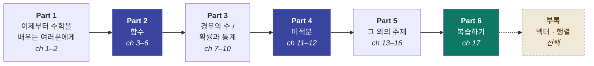

# 그림으로 이해하는, AI를 위한 기초 수학

> 수학을 놓은 지 오래된 사람도 따라올 수 있는, **AI 공부에 실제로 필요한 만큼만**의 중·고등학교 수학

---

## 이 프로젝트는 무엇인가요?

AI를 공부하려고 책이나 강의를 펼쳤다가 이런 수식 앞에서 멈춘 적 있으신가요?

```
θ ← θ − η·∂L/∂θ            softmax(zᵢ) = e^zᵢ / Σⱼ e^zⱼ
```

이 프로젝트의 목표는 저 기호들이 **더 이상 무섭지 않아지는 것**입니다.
수학자를 만들려는 게 아니라, **AI를 설명하는 문장을 읽을 수 있는 사람**을 만들려는 것입니다.

### 세 가지 원칙

| 원칙 | 뜻 |
|---|---|
| 🖼️ **그림 먼저, 수식은 나중** | 모든 개념을 그림·그래프·비유로 먼저 이해합니다. 수식은 "그 그림을 짧게 적은 것"으로만 등장합니다 |
| ✂️ **필요한 것만** | 시험용 계산 테크닉은 덜어냅니다. AI를 읽는 데 쓰이는 것만 남깁니다 |
| 🔗 **항상 AI와 연결** | 각 장 끝에 **AI 노트**를 붙여, 방금 배운 개념이 실제 모델·코드·논문 어디에 등장하는지 짚습니다 |

### 이런 분을 위해 만들었습니다

- 문과 출신이거나, 수학을 놓은 지 10년 이상 된 분
- 딥러닝 강의를 듣다가 수식 슬라이드에서 매번 튕겨 나오는 분
- 미분·확률이라는 단어만 들어도 긴장되는 개발자

> **선수 지식**: 사칙연산과 분수. 그 이상은 전부 이 안에서 다시 설명합니다.

---

## 전체 학습 지도



**앞에서부터 순서대로** 읽는 것을 기준으로 설계했습니다. 각 파트는 앞 파트의 내용을 전제로 합니다.

---

## 목차

전체 **6개 Part · 17개 Chapter** 구성입니다.
각 장 끝의 🔗 **AI 노트**와 💡 **칼럼**은 본문 흐름을 끊지 않는 보조 읽을거리입니다.

---

### Part 1. 이제부터 수학을 배우는 여러분에게

#### Chapter 01. 이 코스의 특징과 구성

| 번호 | 제목 |
|---|---|
| 1.1 | 누구라도 고등학교 기초 수학을 배울 수 있다 |
| 1.2 | 짧은 시간에 전부 읽을 수 있다 |
| 1.3 | 이 코스에서 배우는 것 |
| 🔗 | **AI 노트** — AI를 이해하는 데 수학이 필요한 진짜 이유 |

#### Chapter 02. 먼저 중학교 기초 수학을 빠르게 배워 보자

| 번호 | 제목 |
|---|---|
| 2.1 | 0보다 작은 수 |
| 2.2 | 마이너스를 포함하는 덧셈 |
| 2.3 | 마이너스를 포함하는 뺄셈 |
| 2.4 | 마이너스를 포함하는 곱셈 / 나눗셈 |
| 2.5 | 같은 숫자를 여러 번 곱하는 거듭제곱 |
| 2.6 | 두 번 곱하면 원래의 수가 되는 루트 |
| 2.7 | 문자식 |
| 2.8 | 문자식 쓰기 규칙 |
| 2.9 | 고등학교 수학을 시작하자 |
| 🔗 | **AI 노트** — 마이너스 · 루트가 AI 코드에 등장하는 자리 |

---

### Part 2. 함수

> AI 모델은 결국 **거대한 함수 하나**입니다. 이 파트가 전체의 심장입니다.

#### Chapter 03. 완전 초보도 이해하는 함수

| 번호 | 제목 |
|---|---|
| 3.1 | 함수 |
| 3.2 | 함수의 예(1): 자동차 운전 |
| 3.3 | 함수의 예(2): 거스름돈 |
| 3.4 | 함수 식을 쓰는 법 |
| 3.5 | 함수의 이해를 돕는 그래프 |
| 🔗 | **AI 노트** — "모델"이라는 말은 함수라는 뜻입니다 |

#### Chapter 04. 일차함수와 이차함수

| 번호 | 제목 |
|---|---|
| 4.1 | 일차함수 |
| 4.2 | 일차함수의 그래프 |
| 4.3 | 일차함수의 예(1): 연봉 |
| 4.4 | 일차함수의 예(2): 전기요금 |
| 4.5 | 이차함수 |
| 4.6 | 이차함수의 그래프 |
| 💡 | **칼럼** — 삼차함수 |
| 🔗 | **AI 노트** — 직선 하나로 예측하기(선형회귀)와 골짜기 모양의 오차 |

#### Chapter 05. 급격히 증가하는 지수함수

| 번호 | 제목 |
|---|---|
| 5.1 | 거듭제곱 복습 |
| 5.2 | 지수함수 |
| 5.3 | 급격히 증가하는 지수함수 |
| 5.4 | 지수함수의 예(1): 감염병의 확대 |
| 5.5 | 지수함수의 예(2): 회사의 성장 |
| 5.6 | 2⁻¹ 또는 2⁰·⁵도 계산할 수 있다 |
| 🔗 | **AI 노트** — e와 시그모이드, 소프트맥스에 지수가 쓰이는 이유 |

#### Chapter 06. 몇 년 만에 10배가 될까? 로그함수

| 번호 | 제목 |
|---|---|
| 6.1 | 로그, 몇 제곱을 하면 좋은가 |
| 6.2 | 로그함수 |
| 6.3 | 로그함수의 예(1): 투자 |
| 6.4 | 로그함수의 예(2): 로그 그래프 |
| 💡 | **칼럼** — 로그를 계산기로 계산하는 방법 |
| 🔗 | **AI 노트** — 학습 곡선의 로그 스케일과 로그 가능도 |

---

### Part 3. 경우의 수 / 확률과 통계

> AI의 출력은 정답이 아니라 **확신의 정도**입니다. 그것을 읽는 법을 배웁니다.

#### Chapter 07. 패턴의 가짓수를 세는 경우의 수

| 번호 | 제목 |
|---|---|
| 7.1 | 패턴의 가짓수를 세어 봅시다 |
| 7.2 | 수형도 |
| 7.3 | 수형도의 문제점 |
| 7.4 | 공식(1): 곱의 법칙 |
| 7.5 | 순열 공식을 배우기 전에 |
| 7.6 | 공식(2): 순열 공식 |
| 7.7 | 조합 공식을 배우기 전에 |
| 7.8 | 공식(3): 조합 공식 |
| 7.9 | 조합 공식을 사용해 보자 |
| 💡 | **칼럼** — 게임과 경우의 수 |
| 🔗 | **AI 노트** — 경우의 수가 폭발할 때 AI가 택하는 길 |

#### Chapter 08. 확률과 기댓값을 이해하자

| 번호 | 제목 |
|---|---|
| 8.1 | 확률 |
| 8.2 | 확률을 계산하려면 |
| 8.3 | 확률 계산 방법(1): 나눗셈 공식 |
| 8.4 | 확률 계산 방법(2): 곱의 법칙 |
| 8.5 | 기댓값 |
| 8.6 | 기댓값 계산 방법 |
| 8.7 | 확률과 기댓값의 예(1): 위험도 분석 |
| 8.8 | 확률과 기댓값의 예(2): 손익 분석 |
| 💡 | **칼럼** — 확률에 관한 흔한 오해 |
| 🔗 | **AI 노트** — 분류 모델의 출력값과 샘플링(temperature) |

#### Chapter 09. 데이터 분석을 위한 통계

| 번호 | 제목 |
|---|---|
| 9.1 | 데이터를 분석해 보자 |
| 9.2 | 데이터 전체를 파악하는 히스토그램 |
| 9.3 | 히스토그램의 문제점 |
| 9.4 | 데이터를 하나로 종합한 평균값 |
| 9.5 | 데이터 편차의 중요성 |
| 9.6 | 편차의 지표, 표준편차 |
| 9.7 | 표준편차로 알 수 있는 것 |
| 💡 | **칼럼** — 편찻값에 대하여 |
| 💡 | **칼럼** — 평균값과 중앙값 |
| 🔗 | **AI 노트** — 데이터 전처리: 정규화와 표준화 |

#### Chapter 10. 데이터 분석을 좀 더 깊게 해 보자

| 번호 | 제목 |
|---|---|
| 10.1 | 관계의 세기를 측정하려면 |
| 10.2 | 상관계수 |
| 10.3 | 상관계수 계산 방법 |
| 10.4 | 상관계수에 관한 주의점 |
| 🔗 | **AI 노트** — 상관관계와 코사인 유사도는 사촌 사이 |

> ☕ **휴식** — 사고력을 높이는 퍼즐

---

### Part 4. 미적분

> **"AI가 학습한다"는 말은 곧 "미분해서 조금씩 내려간다"**는 뜻입니다.

#### Chapter 11. 변화의 속도를 보는 미분

| 번호 | 제목 |
|---|---|
| 11.1 | 변화의 속도를 보는 미분 |
| 11.2 | 미분에 관한 주의점 |
| 11.3 | 함수를 미분해 보자 (1) |
| 11.4 | 함수를 미분해 보자 (2) |
| 11.5 | 미분계수를 정확하게 계산하려면 |
| 11.6 | 미분 공식 |
| 💡 | **칼럼** — 삼차함수의 미분 공식 |
| 🔗 | **AI 노트** — 경사하강법: 안개 낀 산에서 내려오는 방법 |

#### Chapter 12. 누적값을 보는 적분

| 번호 | 제목 |
|---|---|
| 12.1 | 누적값을 보는 적분 |
| 12.2 | 적분에 관한 주의점 |
| 12.3 | 적분을 계산해 보자 (1) |
| 12.4 | 적분을 계산해 보자 (2) |
| 12.5 | 좀 더 복잡한 적분을 계산하려면 |
| 12.6 | 적분 공식 |
| 12.7 | 미분과 적분은 정반대다 |
| 💡 | **칼럼** — 심화: 적분을 쓰는 법 |
| 🔗 | **AI 노트** — 확률밀도와 넓이, AUC라는 지표 |

---

### Part 5. 그 외의 주제

#### Chapter 13. 정수(1): 유클리드 호제법

| 번호 | 제목 |
|---|---|
| 13.1 | 최대공약수 복습 |
| 13.2 | 최대공약수를 빠르게 계산하는 법 |
| 13.3 | 유클리드 호제법 |
| 13.4 | 최소공배수 복습 |
| 13.5 | 최소공배수를 빠르게 계산하는 법 |
| 🔗 | **AI 노트** — "빠른 알고리즘"이라는 사고방식 |

#### Chapter 14. 정수(2): 10진법과 2진법

| 번호 | 제목 |
|---|---|
| 14.1 | 10진법이란 |
| 14.2 | 2진법 |
| 14.3 | 10진법과 2진법의 관계 |
| 14.4 | 2진법 → 10진법 변환 |
| 14.5 | 10진법 → 2진법 변환 |
| 💡 | **칼럼** — 정확하게 변환이 되는 이유 |
| 💡 | **칼럼** — 컴퓨터와 2진법 |
| 🔗 | **AI 노트** — float32 · bfloat16, 그리고 양자화(quantization) |

#### Chapter 15. 수열을 정복하자

| 번호 | 제목 |
|---|---|
| 15.1 | 수열이란 수의 나열이다 |
| 15.2 | 등차수열과 등비수열 |
| 15.3 | 수열 합 |
| 15.4 | 등차수열의 합을 계산하자 |
| 15.5 | 수열의 합 공식이 정확한 이유 |
| 💡 | **칼럼** — 등비수열의 합의 공식 |
| 💡 | **칼럼** — 필요조건과 충분조건 |
| 🔗 | **AI 노트** — 시그마(∑) 기호는 for 루프입니다 |

#### Chapter 16. 삼각비와 삼각함수를 정복하자

| 번호 | 제목 |
|---|---|
| 16.1 | 삼각비를 배우기 전에 |
| 16.2 | 삼각비(1): sin |
| 16.3 | 삼각비(2): cos |
| 16.4 | 삼각비(3): tan |
| 16.5 | 삼각비 정리 |
| 16.6 | 삼각비 계산 방법 |
| 16.7 | 삼각비를 사용하는 예(1): 경사 |
| 16.8 | 삼각비를 사용하는 예(2): 비행기 |
| 16.9 | 삼각함수 |
| 💡 | **칼럼** — sin 0°가 0이 되는 이유 |
| 🔗 | **AI 노트** — 코사인 유사도와 위치 인코딩 |

---

### Part 6. 지금까지의 내용을 복습해 보자

#### Chapter 17. 고등학교 수학 기초 마무리

| 번호 | 제목 |
|---|---|
| 17.1 | 이 코스에서 배운 것 |
| 17.2 | Part 2 함수 |
| 17.3 | Part 3 경우의 수 / 확률과 통계 |
| 17.4 | Part 4 미적분 |
| 17.5 | Part 5 그 외의 주제 |
| 17.6 | 🔗 배운 수학으로 AI 수식 읽어보기 — 선형회귀 · 순전파 · 손실함수 · 경사하강 |
| — | 문제는 여기까지입니다 |

---

### 부록 (선택) — AI를 위해 한 걸음 더

> 본 코스 범위 밖이지만, 딥러닝 코드를 읽으려면 결국 필요해지는 최소한의 도구입니다.
> **본편을 다 읽은 뒤에** 보셔도 됩니다.

| 번호 | 제목 |
|---|---|
| A.1 | 벡터 — 숫자 여러 개를 한 덩어리로 |
| A.2 | 내적 — 두 화살표가 얼마나 닮았는가 |
| A.3 | 행렬과 행렬 곱 — 그림으로 완전 정복 |
| A.4 | 신경망 한 층 = 행렬 곱 한 번 (`Wx + b`) |
| A.5 | 차원과 shape — 에러 메시지 읽는 법 |
| A.6 | 편미분과 연쇄법칙 — 역전파의 심장 |
| A.7 | 자주 헷갈리는 기호 총정리 (치트시트) |

---

## 각 절의 공통 구성

모든 절은 같은 4단 구조로 쓰입니다. 어디를 펼쳐도 리듬이 같습니다.

| 단계 | 내용 |
|---|---|
| 🎯 **한 문장 요약** | 이 절에서 딱 하나만 가져간다면 이것 |
| 🖼️ **그림으로 이해하기** | 다이어그램 · 그래프 · 일상 비유 (수식 없음) |
| ✍️ **수식으로 적어보기** | 방금 본 그림을 짧게 적으면 이렇게 됩니다 |
| ✅ **1분 확인** | 계산이 아니라 "감각"을 확인하는 질문 하나 |

그리고 각 장의 끝에 🔗 **AI 노트**가 붙습니다.

---

## 진행 상황

- [x] 전체 목차 · 진행 순서 확정 (6 Part / 17 Chapter)
- [ ] Part 1 (ch 1–2) 집필
- [ ] Part 2 (ch 3–6) 집필
- [ ] Part 3 (ch 7–10) 집필
- [ ] Part 4 (ch 11–12) 집필
- [ ] Part 5 (ch 13–16) 집필
- [ ] Part 6 (ch 17) 집필
- [ ] 부록 집필

---

## 라이선스

추후 결정 예정
