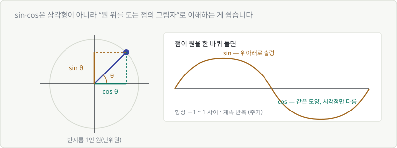
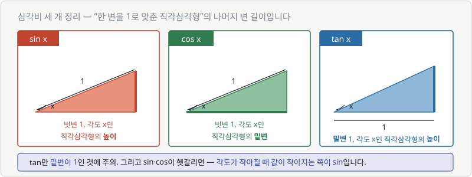
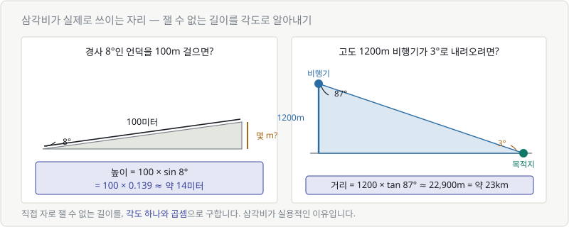

# 부록 B. 삼각함수 아주 짧게

> **본편에서 뺀 이유**: AI를 이해하는 데 삼각함수는 **거의 필요 없습니다.**
> 다만 두 곳에서 얼굴을 내밀어서, 그 두 곳만 짧게 다룹니다.

---

## B.1 sin·cos을 이해하는 가장 쉬운 방법

직각삼각형으로 배우면 어렵습니다. **원 위를 도는 점**으로 보세요.

반지름이 1인 원 위에 점이 있고, 각도가 $\theta$ 일 때:

| | 뜻 |
|---|---|
| $\cos\theta$ | 그 점의 **가로** 위치 |
| $\sin\theta$ | 그 점의 **세로** 위치 |

**그게 전부입니다.**

점이 원을 한 바퀴 돌면 두 값은 **−1과 1 사이를 출렁이며 반복**합니다.
그래서 파도 모양(주기 함수)이 나옵니다.

| 각도 | $\cos$ | $\sin$ |
|---|---|---|
| 0° | 1 | 0 |
| 90° | 0 | 1 |
| 180° | −1 | 0 |
| 270° | 0 | −1 |

---

## B.1-1 삼각비 세 개 — "한 변을 1로 맞춘 삼각형"

학교에서 배우는 방식도 알아 두면 편합니다. 외울 것은 **어느 변을 1로 두느냐** 뿐입니다.

| | 무엇을 1로 두나 | 값은 무엇 |
|---|---|---|
| $\sin x$ | **빗변** = 1 | 삼각형의 **높이** |
| $\cos x$ | **빗변** = 1 | 삼각형의 **밑변** |
| $\tan x$ | **밑변** = 1 | 삼각형의 **높이** |

> ⚠️ **tan만 밑변이 1** 입니다. 여기가 가장 헷갈리는 지점입니다.

값을 하나씩 보면 감이 옵니다. (계산기로 구합니다)

| | 20°일 때 |
|---|---|
| $\sin 20°$ | 약 **0.342** |
| $\cos 20°$ | 약 **0.940** |
| $\tan 20°$ | 약 **0.364** |

> 💡 **sin과 cos이 헷갈릴 때**
> **각도가 작아질 때 값이 작아지는 쪽이 sin** 이라고 기억하세요.
> 각도를 0에 가깝게 눕히면 높이(sin)는 납작해지고, 밑변(cos)은 빗변만큼 길어집니다.

---

## B.1-2 삼각비가 실제로 쓰이는 곳

"잴 수 없는 길이를 각도로 알아내는 것" — 이게 삼각비가 실용적인 이유입니다.

### 예 ① 경사 8°인 언덕을 100m 걸으면 몇 m 높아질까

빗변 1일 때 높이가 $\sin 8°$ 이므로, 빗변이 100이면 높이는 100배입니다.

$$
100 \times \sin 8° = 100 \times 0.139 \approx \textbf{약 14미터}
$$

### 예 ② 고도 1200m 비행기가 3°로 하강하면 목적지까지 몇 km 남았나

목적지에서 본 각도는 $90° - 3° = 87°$ 입니다.
밑변이 1일 때 높이가 $\tan 87°$ 이므로, 반대로 높이가 1200일 때 밑변은:

$$
1200 \times \tan 87° \approx 1200 \times 19.08 \approx \textbf{약 23km}
$$

> 💬 줄자를 댈 수 없는 거리를, **각도 하나와 곱셈**으로 구했습니다.
> 측량·항법·건축이 전부 이 방식으로 돌아갑니다.

---

## B.2 첫 번째 자리 — 코사인 유사도

Chapter 10에서 이미 만났습니다.

$$
\cos\theta = \frac{\mathbf{a} \cdot \mathbf{b}}{|\mathbf{a}||\mathbf{b}|}
$$

두 벡터 사이 각도의 코사인 값입니다. 그래서 **항상 −1 ~ 1** 사이죠.

| 각도 | $\cos\theta$ | 뜻 |
|---|---|---|
| 0° | 1 | 완전히 같은 방향 |
| 90° | 0 | 무관 |
| 180° | −1 | 정반대 |

> 🔑 **여기서 필요한 건 "cos은 −1~1 사이의 방향 닮음 점수"라는 것 하나뿐입니다.**
> 삼각함수를 몰라도 Chapter 10은 완전히 이해됩니다.

---

## B.3 두 번째 자리 — 위치 인코딩

트랜스포머(GPT 같은 모델)에는 문제가 하나 있습니다.

> **입력을 한꺼번에 처리해서, 단어의 순서를 모릅니다.**

"개가 사람을 물었다"와 "사람이 개를 물었다"를 구분하려면 순서 정보가 필요하죠.

그래서 **각 위치마다 고유한 숫자 패턴**을 만들어 더해 줍니다.

$$
PE_{(pos,\,2i)} = \sin\left(\frac{pos}{10000^{2i/d}}\right)
$$

무섭게 생겼지만, 하는 일은 이렇습니다.

> **"위치마다 서로 다른 주기의 파도를 겹쳐서, 위치별 고유한 지문을 만든다."**

### 왜 하필 sin·cos인가

| 이유 | 설명 |
|---|---|
| **값이 안 터짐** | 항상 −1~1 사이 (위치가 10000번째여도) |
| **상대 위치 표현** | 주기 함수라 "3칸 떨어짐" 같은 관계가 자연스럽게 표현됨 |
| **학습 없이 계산 가능** | 그냥 공식으로 만들면 됨 |

> 💬 **여기서도 필요한 건 감각뿐입니다.**
> *"위치를 파도 모양 숫자로 바꿔서 더해 주는구나."*
>
> 실제로 최근 모델들은 RoPE 같은 다른 방식을 더 많이 씁니다.
> 그래도 아이디어는 같습니다 — **회전과 주기로 위치를 표현하기.**

---

## B.4 tan은?

$$
\tan\theta = \frac{\sin\theta}{\cos\theta}
$$

**기울기**입니다. 경사도를 각도로 표현할 때 씁니다.

AI에서는 거의 안 씁니다. 이름만 알아 두세요.

---

## 정리

> 🎯 **삼각함수에 대해 AI 공부에 필요한 것은 이 두 줄입니다.**
>
> 1. **cos은 두 방향이 얼마나 같은지를 −1~1로 나타낸다** (코사인 유사도)
> 2. **sin·cos은 반복되는 파도라서 위치 표현에 쓰인다** (위치 인코딩)
>
> 나머지 삼각함수 공식들은 AI에서 만날 일이 없습니다.
>
> 덤으로 **빗변(또는 밑변) 1 기준의 삼각비 정의**를 알아 두면,
> 경사·거리처럼 일상에서 마주치는 계산도 할 수 있습니다.

---

| ⬅️ [부록 A. 기호 치트시트](a-symbol-cheatsheet.md) | 다음 ➡️ [부록 C. NumPy 대조표](c-numpy-table.md) |
|---|---|
