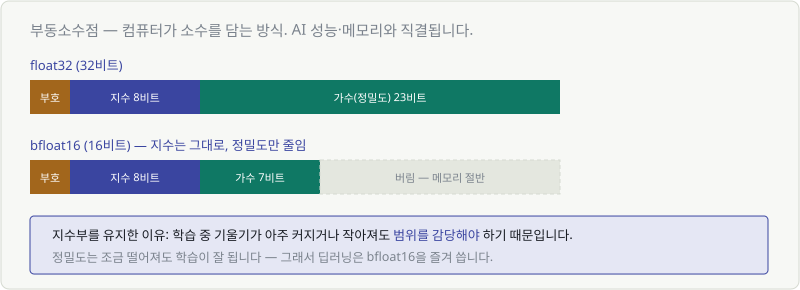

# 부록 D. 2진법과 부동소수점

> **왜 알아야 하나**: 모델 용량, GPU 메모리, 양자화(quantization) 이야기가 전부 여기서 나옵니다.
> "7B 모델이 14GB"라는 계산이 어디서 오는지 알게 됩니다.

---

## D.1 2진법 — 컴퓨터의 언어

우리는 10개 숫자(0~9)를 씁니다. 컴퓨터는 **2개(0, 1)** 만 씁니다.

| 10진법 | 2진법 | 계산 |
|---|---|---|
| 1 | 1 | $1$ |
| 2 | 10 | $2$ |
| 5 | 101 | $4 + 1$ |
| 8 | 1000 | $8$ |
| 255 | 11111111 | $128+64+32+16+8+4+2+1$ |

자리마다 **2의 거듭제곱**입니다. Chapter 07의 지수가 여기 있습니다.

$$
\ldots,\ 2^3(8),\ 2^2(4),\ 2^1(2),\ 2^0(1)
$$

> 💬 **비트(bit)** = 0 또는 1 한 자리
> **바이트(byte)** = 8비트 → $2^8 = 256$가지 표현 가능

---

## D.2 부동소수점 — 소수를 담는 법

정수는 쉬운데 소수(0.1, 3.14...)는 어떻게 담을까요?

**과학적 표기법**과 같은 방식을 씁니다.

$$
1234.5 = 1.2345 \times 10^3
$$

여기서 필요한 것은 세 가지입니다: **부호 · 지수 · 정밀도(가수)**



| 형식 | 비트 | 지수부 | 가수부 | 크기 |
|---|---|---|---|---|
| **float32** | 32 | 8비트 | 23비트 | 4바이트 |
| **float16** | 16 | 5비트 | 10비트 | 2바이트 |
| **bfloat16** | 16 | **8비트** | 7비트 | 2바이트 |

### bfloat16이 딥러닝에서 인기 있는 이유

float16과 bfloat16은 둘 다 16비트인데 배분이 다릅니다.

| | 지수(범위) | 가수(정밀도) |
|---|---|---|
| float16 | 5비트 — **범위 좁음** | 10비트 |
| bfloat16 | 8비트 — **float32와 같음** | 7비트 |

> 🎯 **딥러닝에서는 정밀도보다 범위가 중요합니다.**
>
> Chapter 19에서 봤듯 학습 중에 기울기가 **아주 커지거나(폭발) 아주 작아집니다(소실).**
> 범위가 좁으면 그 순간 값이 넘치거나 0이 되어 학습이 망가집니다.
>
> 반면 정밀도는 좀 떨어져도 괜찮습니다. 어차피 확률적으로 조금씩 움직이니까요.

---

## D.3 모델 크기 계산하기

이제 실전 계산이 가능합니다.

> **"7B 모델"** = 파라미터 70억 개 (B = billion)

| 형식 | 파라미터당 | 7B 모델 크기 |
|---|---|---|
| float32 | 4바이트 | **28 GB** |
| bfloat16 | 2바이트 | **14 GB** |
| int8 (양자화) | 1바이트 | **7 GB** |
| int4 (양자화) | 0.5바이트 | **3.5 GB** |

$$
7{,}000{,}000{,}000 \times 2\text{바이트} = 14\text{GB}
$$

> 💬 **"내 GPU에서 이 모델이 돌아갈까?"** 의 답이 여기서 나옵니다.
> VRAM 16GB 그래픽카드면 7B 모델을 bfloat16으로 겨우 올릴 수 있습니다.
> (실제로는 활성화값 저장 공간도 필요해서 더 빠듯합니다)

---

## D.4 양자화 (quantization)

**정밀도를 더 낮춰서 모델을 작게 만드는 기술**입니다.

> bfloat16(2바이트) → int8(1바이트) → int4(0.5바이트)

| 얻는 것 | 잃는 것 |
|---|---|
| 메모리 절반 이하 | 정밀도 |
| 추론 속도 향상 | 약간의 성능 하락 |
| 작은 GPU에서도 실행 | |

> 💬 놀랍게도 int4까지 낮춰도 **성능이 생각보다 덜 떨어집니다.**
> 신경망이 정밀도에 그리 민감하지 않다는 뜻이죠.
>
> 다만 **학습**할 때는 정밀도가 더 필요합니다. 아주 작은 갱신값을 다뤄야 하니까요.
> 그래서 보통 **학습은 bfloat16, 추론은 int8/int4** 로 갑니다.

---

## D.5 알아 두면 좋은 함정

### 0.1 + 0.2 ≠ 0.3

```python
0.1 + 0.2    # 0.30000000000000004
```

**버그가 아닙니다.** 0.1을 2진법으로 정확히 표현할 수 없어서 생기는 현상입니다.
(10진법으로 1/3을 정확히 못 쓰는 것과 같습니다: 0.3333...)

> 그래서 소수를 비교할 때는 `==` 를 쓰지 않습니다.
> ```python
> abs(a - b) < 1e-9    # 이렇게 비교합니다
> ```

### NaN과 inf

| 값 | 언제 나오나 |
|---|---|
| `inf` | 표현 범위를 넘김 (기울기 폭발) |
| `NaN` | 0/0, inf−inf 등 정의 안 되는 계산 |

> 🚨 **손실이 NaN이 되면** — Chapter 19에서 봤듯 학습률부터 낮춰 보세요.
> 그다음 확인할 것: 로그에 0이 들어갔는지 (`log(0) = -inf`).
>
> 그래서 실무 코드에는 `log(x + 1e-8)` 처럼 **아주 작은 수(엡실론)** 를 더해 둡니다.

---

| ⬅️ [부록 C. NumPy 대조표](c-numpy-table.md) | 다음 ➡️ [부록 E. 다음 단계 로드맵](e-next-steps.md) |
|---|---|
