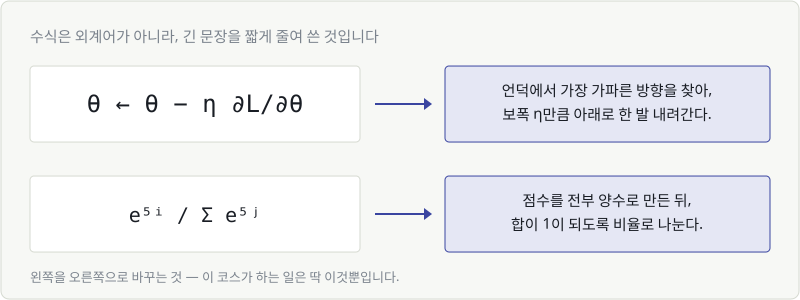
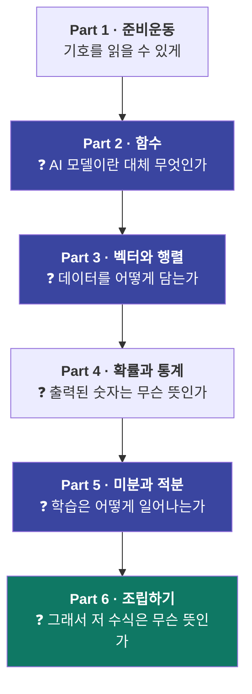
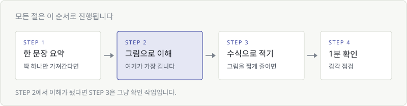

# Chapter 01. 이 코스의 지도

> **이 장의 목표**
> 수학 공부를 시작하기 전에, **어디까지만 하면 되는지** 지도를 그립니다.
> 계산은 한 개도 하지 않습니다. 마음의 준비만 합니다.

---

## 1.1 AI 공부는 왜 하필 수식에서 막히는가

AI를 공부하겠다고 마음먹은 사람이 포기하는 지점은 놀랍도록 비슷합니다.

강의 3번째 시간, 또는 책 40페이지쯤. 갑자기 이런 게 나옵니다.

$$
\theta \leftarrow \theta - \eta \frac{\partial L}{\partial \theta}
$$

그리고 강사는 말합니다. **"자, 여기서 이렇게 미분하면 되겠죠?"**

되지 않습니다. 미분을 몰라서가 아닙니다. 진짜 문제는 이겁니다.

> **저 기호들을 소리 내어 읽을 수조차 없다.**

θ가 뭔지, ∂가 뭔지, 화살표가 왜 왼쪽을 향하는지 모르는 상태에서는
"미분한다"는 설명이 귀에 들어올 리가 없습니다.
모르는 단어로 가득한 외국어 문장을 두고 문법 설명을 듣는 것과 같습니다.

**그러니까 문제는 수학 실력이 아니라 어휘입니다.**

---

## 1.2 필요한 건 계산 실력이 아니라 '읽는 힘'

여기서 좋은 소식이 하나 있습니다.

수식은 어렵게 만들려고 쓴 게 아닙니다.
**긴 문장을 짧게 줄여 쓴 것**일 뿐입니다.



위 그림의 왼쪽을 오른쪽으로 바꿀 수 있게 되는 것 —
이 코스가 하려는 일은 정확히 이것뿐입니다.

그리고 중요한 건, **계산은 우리가 하지 않는다**는 사실입니다.

| | 사람이 하는 일 | 컴퓨터가 하는 일 |
|---|---|---|
| 미분 | "여기서 미분이 왜 필요한지" 이해하기 | 실제로 미분값 계산하기 |
| 행렬 곱 | "이 층에서 뭐가 일어나는지" 이해하기 | 수백만 번 곱하고 더하기 |
| 확률 | "이 숫자가 뭘 뜻하는지" 해석하기 | 확률값 뽑아내기 |

우리는 **왼쪽 열만** 하면 됩니다.
오른쪽 열은 `torch`나 `numpy`가 0.001초에 끝냅니다.

> 🎯 **이 코스가 기르려는 힘**
> 수식을 보고 **"아, 이건 이런 뜻이구나"** 하고 한국어 문장으로 바꿀 수 있는 힘.
> 손으로 푸는 능력이 아닙니다.

---

## 1.3 이 코스에서 배우는 것 — 한 장 지도

전체는 6개 파트입니다. 각 파트가 답하는 질문은 이렇습니다.



파란색으로 칠한 **함수 · 벡터와 행렬 · 미분** 세 개가 기둥입니다.
이 셋만 잡으면 나머지는 따라옵니다.

그리고 **배우지 않는 것**도 분명히 해 두겠습니다.

| 배우지 않습니다 | 이유 |
|---|---|
| 인수분해, 근의 공식 | AI에 안 씁니다 |
| 복잡한 적분 기교 | 컴퓨터가 합니다 |
| 도형 증명, 기하 | AI와 무관합니다 |
| 계산 속도 훈련 | 우리는 계산기를 씁니다 |

시험을 보는 게 아니니까요.

---

## 1.4 그림 → 감각 → 수식, 이 순서로 갑니다

이 코스의 모든 절은 같은 순서로 진행됩니다.



핵심은 **STEP 2가 가장 길다**는 점입니다.

보통의 수학책은 정의(수식)를 먼저 던지고 나중에 예를 듭니다.
이 코스는 반대로 갑니다. **그림으로 충분히 이해한 다음에야** 수식을 봅니다.

그래서 STEP 3에 도착했을 때 여러분은 이런 반응을 하게 됩니다.

> "아, 아까 그 그림을 이렇게 적는 거구나."

이게 목표입니다. 새로운 걸 배우는 게 아니라, **이미 이해한 것에 이름표를 붙이는 것.**

### AI 이야기는 따로 있지 않습니다

이 코스에는 "AI 응용" 코너가 뒤에 따로 붙어 있지 않습니다.
대신 **배우는 그 자리에서** 말합니다.

- 일차함수의 기울기를 배우는 그 절에서 → *"이 기울기를 AI는 가중치라고 부릅니다"*
- 이차함수 골짜기를 그리는 그 절에서 → *"이 골짜기가 손실 함수입니다"*
- 시그마(∑)를 배우는 그 절에서 → *"이건 그냥 for 루프입니다"*

수학과 AI를 따로 배우면 두 번 배우게 됩니다. 한 번에 배웁니다.

---

## 1.5 막혀도 되는 곳, 건너뛰면 안 되는 곳

솔직하게 말씀드리면, **중간에 막히는 건 정상**입니다.
다만 어디서 막혔는지에 따라 대응이 다릅니다.

### ✅ 막혀도 괜찮은 곳 — 그냥 넘어가세요

- **칼럼(💡)** — 곁가지 이야기입니다. 전부 건너뛰어도 본문 이해에 지장 없습니다.
- **계산 예시의 숫자** — "왜 저 숫자가 나왔지?"는 나중에 봐도 됩니다. 모양만 보세요.
- **부록** — 사전입니다. 필요할 때 찾아보는 용도입니다.

### 🚨 막히면 반드시 돌아가야 하는 곳

딱 네 곳입니다. 여기서 막힌 채로 진도를 나가면 반드시 다시 무너집니다.

| 돌아가야 할 지점 | 확인 질문 |
|---|---|
| **2.6 문자식** | x가 무슨 뜻인지 말할 수 있는가? |
| **3.2 데이터 한 줄 = 점 하나** | 표와 그래프를 머릿속에서 연결할 수 있는가? |
| **4.1 함수** | "입력을 넣으면 출력이 나온다"는 그림이 그려지는가? |
| **17.3 접선과 기울기** | 기울기가 "변화의 속도"라는 감각이 있는가? |

이 네 개는 뒤에서 계속 재등장합니다. 여기서만큼은 시간을 쓰세요.

> ⏱️ **속도에 대해**
> 하루에 한 챕터, 3주면 끝납니다. 하지만 속도는 중요하지 않습니다.
> **Part 2(함수)에서 일주일을 써도 됩니다.** 거기가 심장이니까요.

---

## 💡 칼럼 — 계산은 컴퓨터가 합니다

수학에 대한 가장 큰 오해는 **"수학 = 계산"** 이라는 생각입니다.

이건 "요리 = 칼질"이라고 말하는 것과 비슷합니다.
칼질은 요리의 일부지만, 요리의 본질은 **무엇을 왜 넣는가**입니다.

AI 실무에서 실제로 일어나는 일을 보면 더 분명합니다.

```python
import numpy as np

# 표준편차 구하기 — 손으로 하면 5분, 여기선 한 줄
np.std([172, 165, 180, 158, 177])

# 미분 — 딥러닝 프레임워크가 자동으로 합니다
loss.backward()
```

`loss.backward()` 이 한 줄이 **역전파 전체**를 수행합니다.
여러분이 손으로 미분할 일은 평생 없을 겁니다.

그런데도 미분을 배워야 하는 이유는 하나입니다.

> **학습이 안 될 때, 왜 안 되는지 알아야 하니까.**

학습률을 올려야 할지 내려야 할지, 손실이 왜 발산하는지,
gradient가 왜 사라지는지 — 이건 `backward()`가 알려주지 않습니다.

계산은 컴퓨터에게. **의미는 사람에게.**

---

## ✅ 1분 확인

계산 문제가 아닙니다. 감각만 확인합니다.

1. 이 코스가 기르려는 능력은 "수식을 손으로 푸는 힘"이다. (O / X)
2. 다음 중 이 코스에서 **배우지 않는** 것은?
   ① 미분 ② 인수분해 ③ 행렬 곱 ④ 확률
3. 중간에 막혔을 때, 반드시 앞으로 돌아가야 하는 주제 하나를 떠올려 보세요.

<details>
<summary>답 보기</summary>

1. **X** — 기르려는 것은 "수식을 한국어 문장으로 바꾸는 힘"입니다. 계산은 컴퓨터가 합니다.
2. **② 인수분해** — AI에서 쓰이지 않아 다루지 않습니다.
3. 문자식(2.6) / 데이터 한 줄 = 점 하나(3.2) / 함수(4.1) / 접선과 기울기(17.3) 중 하나면 정답입니다.

</details>

---

| ⬅️ 이전 | 다음 ➡️ |
|---|---|
| [코스 소개](../../README.md) | [Chapter 02. 수식을 읽는 최소한의 약속](ch02-reading-notation.md) |
