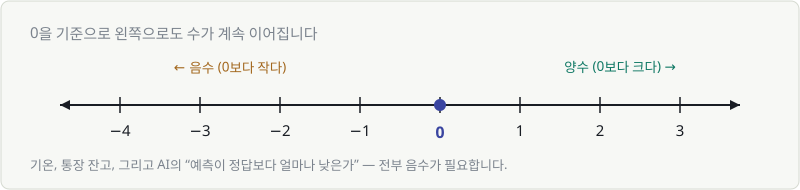
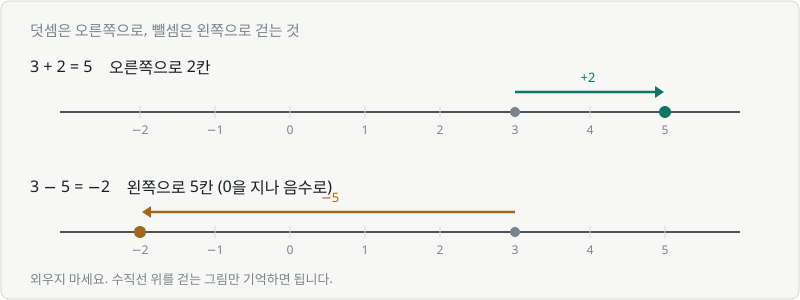
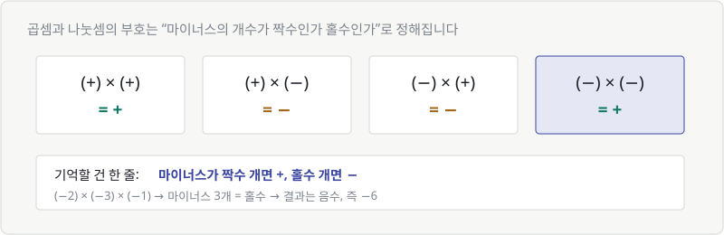
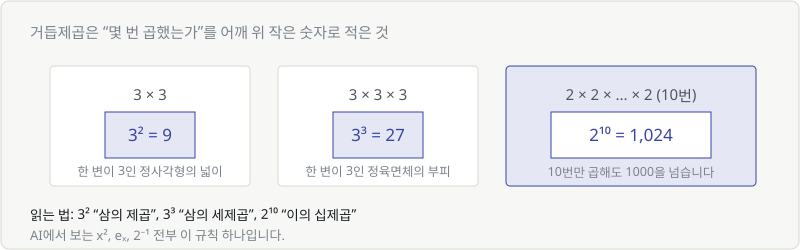
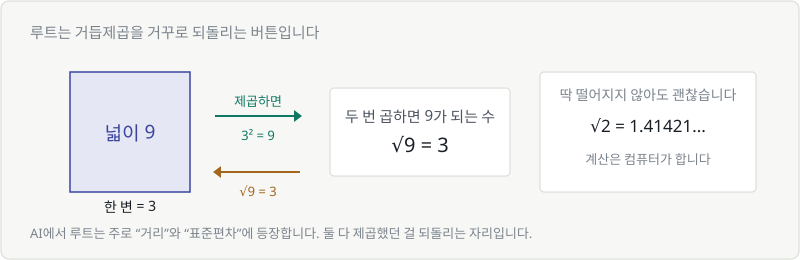
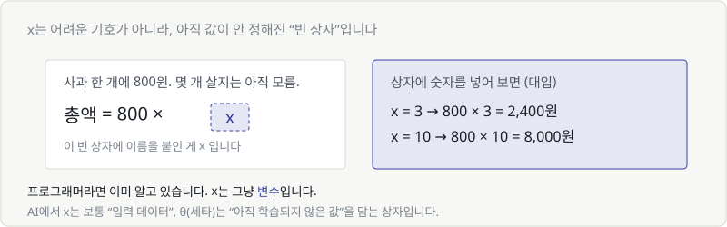
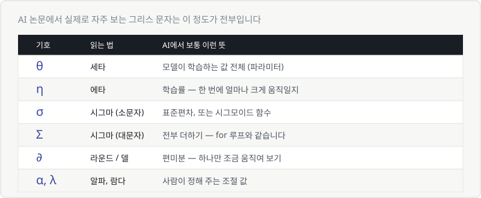
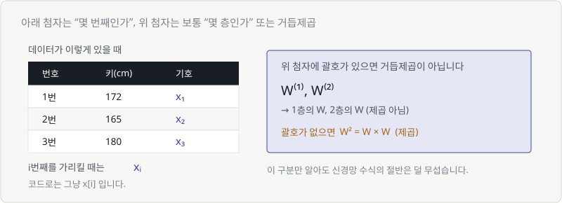

# Chapter 02. 수식을 읽는 최소한의 약속

> **이 장의 목표**
> AI 수식에 나오는 기호를 **소리 내어 읽을 수 있게** 만듭니다.
> 계산을 잘하게 되는 게 목적이 아닙니다. 겁먹지 않는 게 목적입니다.
>
> ⏱️ 이미 아는 내용이면 그림만 훑고 **2.8부터** 보셔도 됩니다.

---

## 2.1 0보다 작은 수

숫자는 0에서 끝나지 않습니다. 왼쪽으로도 계속 이어집니다.



- **양수**: 0보다 큰 수 (1, 2, 3, ...)
- **음수**: 0보다 작은 수 (−1, −2, −3, ...)

일상에서도 이미 쓰고 있습니다. 영하 5도, 잔고 −30,000원, 지하 2층.

**AI에서는 이런 자리에 나옵니다.**
예측이 정답보다 낮으면 오차가 음수가 됩니다.
`예측 70점 − 정답 85점 = −15` — 이 마이너스가 "덜 예측했다"는 신호이고,
나중에 배울 학습은 이 부호를 보고 **어느 쪽으로 고칠지**를 정합니다.

---

## 2.2 마이너스를 포함한 덧셈과 뺄셈

규칙을 외우려 하지 마세요. **수직선 위를 걷는 그림**만 기억하면 됩니다.

- **더하기** = 오른쪽으로 걷기
- **빼기** = 왼쪽으로 걷기



`3 − 5`는 3에서 출발해 왼쪽으로 5칸 걷는 것입니다.
0을 지나쳐도 멈추지 않고 계속 걸으면 −2에 도착합니다.

### 헷갈리는 경우 하나

`3 − (−2)` 처럼 마이너스가 두 개 붙으면?

> **"빼기"는 방향을 뒤집는 것**이라고 생각하세요.
> 왼쪽으로 걸어야 하는데(−) 그 대상이 이미 왼쪽 방향(−2)이면, 뒤집혀서 오른쪽입니다.
> 그래서 `3 − (−2) = 3 + 2 = 5`.

일상어로 하면 이렇습니다. **"빚을 없애 주는 건 돈이 생기는 것과 같다."**

---

## 2.3 마이너스를 포함한 곱셈과 나눗셈

곱셈의 부호는 규칙이 딱 하나입니다.



> 🎯 **마이너스가 짝수 개면 +, 홀수 개면 −**

`(−2) × (−3) × (−1)` → 마이너스 3개(홀수) → 결과는 **음수**, 즉 −6.

나눗셈도 완전히 같습니다. `(−6) ÷ (−2) = +3`.

### 왜 (−) × (−) = (+) 인가

가장 많이 나오는 질문입니다. 짧은 그림으로 답하면 이렇습니다.

> 매일 **2만원씩 잃는** 사람이 있습니다. (하루 변화 = −2)
> **3일 전**에는 지금보다 얼마나 부자였을까요? (시간 = −3)
> → 6만원 **더** 있었습니다. **(−2) × (−3) = +6**

"손해"를 "과거로" 되돌리면 이득이 됩니다. 부호가 두 번 뒤집힌 것뿐입니다.

---

## 2.4 같은 수를 여러 번 곱하는 거듭제곱

`3 × 3`을 매번 쓰기 귀찮아서 `3²`라고 줄여 쓴 것, 그게 전부입니다.



| 표기 | 읽는 법 | 뜻 |
|---|---|---|
| $3^2$ | 삼의 제곱 | 3 × 3 = 9 |
| $3^3$ | 삼의 세제곱 | 3 × 3 × 3 = 27 |
| $2^{10}$ | 이의 십제곱 | 2를 10번 곱함 = 1,024 |

어깨 위 숫자는 **"몇 번 곱했는가"** 이지, 곱하는 값이 아닙니다.
($2^{10}$은 20이 아닙니다. 1,024입니다.)

**AI에서는 이렇게 등장합니다.**
- $x^2$ — 오차를 제곱할 때 (Chapter 06)
- $e^x$ — 시그모이드, 소프트맥스 (Chapter 07~08)
- $2^{-1}$, $2^{0.5}$ — 어깨 위에 음수나 소수도 올 수 있습니다 (7.4에서 다룹니다)

---

## 2.5 두 번 곱하면 원래 수가 되는 루트

루트($\sqrt{\ }$)는 거듭제곱을 **거꾸로 되돌리는 버튼**입니다.



- $3^2 = 9$ (제곱하면 9)
- $\sqrt{9} = 3$ (되돌리면 3)

넓이가 9인 정사각형의 **한 변의 길이**를 구하는 것 — 그게 $\sqrt{9}$입니다.

딱 떨어지지 않아도 괜찮습니다. $\sqrt{2} = 1.41421...$ 처럼 끝없이 이어져도
**계산은 컴퓨터가 합니다.** 우리는 "제곱을 되돌리는 것"이라는 의미만 알면 됩니다.

**AI에서 루트가 나오는 곳은 딱 두 군데입니다.**
1. **거리** — 두 점이 얼마나 떨어져 있나 (Chapter 09)
2. **표준편차** — 데이터가 얼마나 흩어져 있나 (Chapter 15)

둘 다 "제곱해서 더했던 걸 다시 원래 단위로 되돌리는" 자리입니다.

---

## 2.6 문자식 — x는 '아직 모르는 수'

> 🚨 **이 절은 건너뛰면 안 됩니다.** 뒤의 모든 내용이 여기 위에 올라갑니다.

x는 어려운 기호가 아닙니다. **아직 값이 안 정해진 빈 상자**입니다.



사과 한 개에 800원, 몇 개 살지는 아직 모름 → **총액 = 800 × x**

그리고 상자에 숫자를 넣어보는 것을 **대입**이라고 합니다.

| x에 넣은 값 | 결과 |
|---|---|
| 3 | 800 × 3 = 2,400원 |
| 10 | 800 × 10 = 8,000원 |

### 개발자라면 이미 알고 있습니다

```python
x = 3
total = 800 * x   # 2400
```

수학의 x와 프로그래밍의 변수는 **같은 것**입니다.
`x`라는 이름이 붙은 상자에 값이 들어갑니다. 그뿐입니다.

**AI에서는 이렇게 쓰입니다.**

| 기호 | 담기는 것 |
|---|---|
| $x$ | 입력 데이터 (사진, 문장, 숫자) |
| $y$ | 정답 |
| $w$ | 가중치 — 학습으로 찾아야 할 값 |
| $\theta$ | 모델이 학습하는 값 전체 |

즉 **"AI를 학습시킨다"는 말은 "저 상자들에 들어갈 좋은 숫자를 찾는다"**는 뜻입니다.

---

## 2.7 문자식 쓰기 규칙

수학에는 게으른 표기 습관이 몇 개 있습니다. 이것만 알면 됩니다.

| 원래 | 줄여 쓰면 | 규칙 |
|---|---|---|
| $3 \times a$ | $3a$ | 곱셈 기호 ×를 생략 |
| $a \times b$ | $ab$ | 문자끼리도 생략 |
| $1 \times a$ | $a$ | 1은 안 씁니다 |
| $a \div b$ | $\dfrac{a}{b}$ | 나눗셈은 분수로 |
| $x \times x$ | $x^2$ | 같은 문자는 거듭제곱으로 |

숫자가 문자 앞에 옵니다. $a3$이 아니라 $3a$입니다.

> ⚠️ **딱 하나 주의**
> $ab$는 "a 곱하기 b"이지, "ab라는 이름의 변수"가 아닙니다.
> 프로그래밍과 정반대라서 개발자들이 자주 헷갈리는 지점입니다.

---

## 2.8 그리스 문자에 겁먹지 않기

AI 논문이 어려워 보이는 이유의 절반은 **글자가 낯설어서**입니다.
내용이 어려운 게 아니라 폰트가 낯선 겁니다.

실제로 자주 쓰이는 건 이 정도가 전부입니다.



이름을 모르면 머릿속에서 읽히지 않고, 읽히지 않으면 이해도 안 됩니다.
**소리 내어 읽어 보세요.**

$$
\theta \leftarrow \theta - \eta \frac{\partial L}{\partial \theta}
$$

> **"세타는, 세타 빼기 에타 곱하기 엘의 세타에 대한 편미분."**

아직 뜻은 몰라도 됩니다. **읽을 수 있다는 것 자체가 큰 진전입니다.**

### 화살표 ← 는 무슨 뜻인가

`=`가 아니라 `←`인 게 이상해 보일 수 있는데, 프로그래머에게는 익숙한 개념입니다.

```python
theta = theta - eta * grad   # 오른쪽을 계산해서 왼쪽에 다시 저장
```

**"오른쪽을 계산해서 그 결과로 왼쪽을 덮어써라"** — 이게 ←입니다.
등식이 아니라 **갱신**입니다.

---

## 2.9 첨자 읽는 법

첨자(작은 글씨)는 두 종류이고, 뜻이 완전히 다릅니다.



### 아래 첨자 — "몇 번째"

$x_1$, $x_2$, $x_3$ = 1번째 데이터, 2번째 데이터, 3번째 데이터

코드로는 그냥 이겁니다.

```python
x[0], x[1], x[2]     # x₁, x₂, x₃
x[i]                 # xᵢ
```

### 위 첨자 — 괄호가 있는지 보세요

| 표기 | 뜻 |
|---|---|
| $W^2$ | W의 제곱 (W × W) |
| $W^{(2)}$ | **2층의 W** — 제곱 아님! |

**괄호가 붙어 있으면 거듭제곱이 아닙니다.** 보통 "몇 번째 층"을 뜻합니다.

이 구분 하나만 알아도 신경망 수식이 훨씬 덜 무서워집니다.

$$
a^{(2)} = f(W^{(2)} a^{(1)} + b^{(2)})
$$

> **"2층의 출력은, 2층의 W에 1층의 출력을 곱하고 2층의 b를 더한 뒤 f를 통과시킨 것"**

제곱은 하나도 없습니다. 전부 층 번호입니다.

---

## 💡 칼럼 — 수식은 소리 내어 읽으면 쉬워진다

수식을 눈으로만 보면 **그림**처럼 보입니다. 그림은 통째로 이해해야 해서 어렵습니다.

소리 내어 읽으면 **문장**이 됩니다. 문장은 앞에서부터 차례로 이해하면 됩니다.

$$
L = \frac{1}{n}\sum_{i=1}^{n}(y_i - \hat{y}_i)^2
$$

눈으로 보면 복잡하지만, 읽으면 이렇습니다.

> **"엘은, 엔분의 일 곱하기, 아이가 1부터 엔까지, 와이 아이 빼기 와이햇 아이의 제곱을 전부 더한 것."**

한 번 더 풀어서 말하면:

> "정답에서 예측을 빼고, 제곱해서, 전부 더한 다음, 개수로 나눈 것" = **평균 오차**

읽을 수 있으면 이미 절반은 이해한 겁니다.
모르는 기호가 나오면 **먼저 이름부터** 찾아보세요. 뜻은 그다음입니다.

---

## ✅ 1분 확인

1. $(-3) \times (-2) \times (-1)$ 의 부호는 +일까요, −일까요? (계산하지 말고 부호만)
2. $2^5$는 10인가요, 32인가요?
3. $W^{(3)}$ 은 "W의 세제곱"인가요, "3층의 W"인가요?
4. 다음을 소리 내어 읽어 보세요: $\theta \leftarrow \theta - \eta g$

<details>
<summary>답 보기</summary>

1. **−** — 마이너스가 3개(홀수)이므로 음수입니다. (값은 −6)
2. **32** — 2를 5번 곱한 것입니다. 2×5가 아닙니다.
3. **3층의 W** — 괄호가 있으면 층 번호입니다.
4. "세타는, 세타 빼기 에타 곱하기 지" — 뜻은 아직 몰라도 됩니다. Chapter 19에서 다시 만납니다.

</details>

---

| ⬅️ 이전 | 다음 ➡️ |
|---|---|
| [Chapter 01. 이 코스의 지도](ch01-roadmap.md) | [Chapter 03. 좌표와 그래프](ch03-coordinates.md) |
