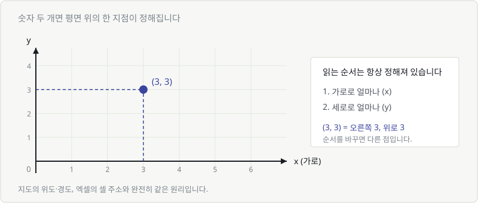
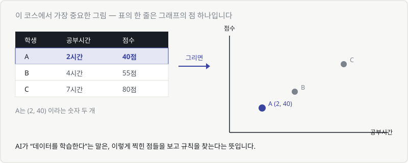
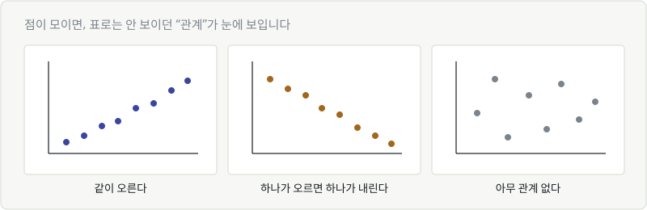
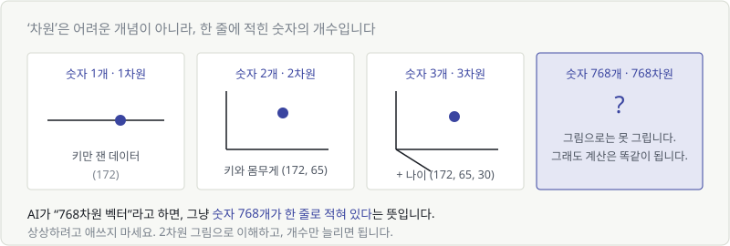
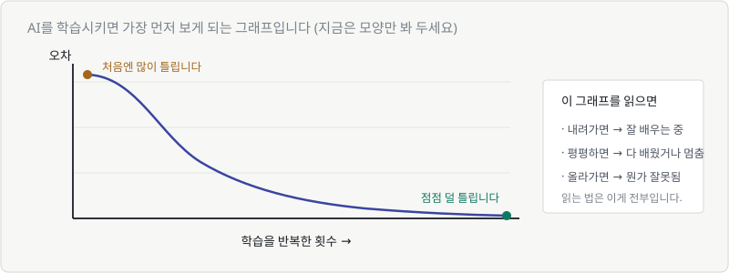

# Chapter 03. 좌표와 그래프 — 데이터를 눈으로 보기

> **이 장의 목표**
> **표(데이터)와 그래프(그림)를 머릿속에서 연결**합니다.
> 이 연결이 되면, 앞으로 나올 모든 AI 개념을 그림으로 이해할 수 있습니다.

---

## 3.1 좌표평면 — 숫자 두 개로 위치를 찍는다

숫자 하나로는 "선 위의 위치"밖에 못 나타냅니다.
숫자 **두 개**가 있으면 평면 위 어디든 가리킬 수 있습니다.

읽는 순서는 **항상** 정해져 있습니다.

> **(가로, 세로)** — 먼저 오른쪽으로, 그다음 위로.

`(3, 3)`은 오른쪽으로 3칸, 위로 3칸 간 지점입니다.
순서를 바꾸면 다른 점이 됩니다. `(1, 5)`와 `(5, 1)`은 전혀 다른 위치입니다.

이미 매일 쓰고 있는 개념입니다.

| 일상 | 가로 | 세로 |
|---|---|---|
| 지도 | 경도 | 위도 |
| 엑셀 | 열 (A, B, C) | 행 (1, 2, 3) |
| 화면 좌표 | x 픽셀 | y 픽셀 |
| 극장 좌석 | 15번 | F열 |

---

## 3.2 데이터 한 줄 = 점 하나

> 🚨 **이 코스에서 가장 중요한 그림입니다.** 여기서 막히면 반드시 다시 보세요.

학생 A의 데이터는 `공부시간 2시간, 점수 40점`입니다.
이건 그냥 **숫자 두 개** — `(2, 40)` — 이고,
숫자 두 개는 **평면 위의 점 하나**입니다.

| 표에서는 | 그래프에서는 |
|---|---|
| 한 **줄**(행) | 한 **점** |
| 한 **칸**(열) | 한 **축** |
| 100줄짜리 데이터 | 점 100개 |

**이게 머신러닝의 출발점입니다.**

엑셀 표를 아무리 오래 들여다봐도 규칙은 잘 안 보입니다.
그런데 점으로 찍는 순간 **눈에 보입니다.**

AI가 하는 일도 결국 같습니다.
점들을 보고 **"이 점들을 관통하는 규칙이 뭘까"**를 찾는 것.

---

## 3.3 점이 모이면 보이는 것 — 산점도

점을 여러 개 찍은 그림을 **산점도(scatter plot)** 라고 합니다.
점들의 배치만 봐도 관계가 보입니다.

| 모양 | 뜻 | 예 |
|---|---|---|
| 오른쪽 위로 올라감 | 하나가 커지면 다른 것도 커짐 | 공부시간 ↔ 점수 |
| 오른쪽 아래로 내려감 | 하나가 커지면 다른 것은 작아짐 | 가격 ↔ 판매량 |
| 흩어져 있음 | 관계 없음 | 신발 사이즈 ↔ 성적 |

**AI에서는 이렇게 이어집니다.**
왼쪽 그림처럼 점들이 대각선으로 늘어서 있으면,
그 사이에 **직선 하나를 그어서 예측**할 수 있습니다.

> "공부를 5시간 하면 몇 점쯤 나올까?" → 선 위의 위치를 보면 됩니다.

이게 **선형회귀**이고, Chapter 05에서 제대로 다룹니다.
지금은 **"점을 찍으면 규칙이 보인다"** 는 감각만 챙기면 충분합니다.

---

## 3.4 그래프를 읽는 세 가지 질문

그래프가 나오면 이 세 가지만 순서대로 물어보세요. 90%는 읽힙니다.

### ① 축이 뭐지?

가장 먼저 볼 것은 **가로축과 세로축의 이름**입니다.
같은 모양의 그래프도 축이 다르면 완전히 다른 얘기입니다.

### ② 어느 방향으로 가지?

올라가는가, 내려가는가, 평평한가.
**모양**만 봐도 절반은 읽은 겁니다.

### ③ 특별한 지점은 어디지?

- 가장 높은 곳 / 가장 낮은 곳
- 급격히 꺾이는 곳
- 평평해지는 곳

> 💬 앞으로 이 코스에서 **"가장 낮은 곳"** 을 지겹도록 찾게 됩니다.
> 오차가 가장 작은 지점이 거기 있기 때문입니다.

---

## 3.5 축이 3개를 넘어가면? — '차원'이라는 말

AI 문서를 보면 이런 표현이 나옵니다.

> "이 임베딩은 **768차원** 벡터입니다."

겁먹을 필요 없습니다. **차원 = 한 줄에 적힌 숫자의 개수**입니다.

| 데이터 | 숫자 개수 | 차원 |
|---|---|---|
| 키만 | 1개 (172) | 1차원 |
| 키, 몸무게 | 2개 (172, 65) | 2차원 |
| 키, 몸무게, 나이 | 3개 (172, 65, 30) | 3차원 |
| 문장 임베딩 | 768개 | 768차원 |

### 768차원을 상상해야 하나요?

**아니요. 아무도 못 합니다.** 상상하려고 애쓰지 마세요.

수학이 좋은 이유가 바로 이겁니다.
**2차원에서 성립한 규칙은 768차원에서도 그대로 성립합니다.**
그림으로 못 그릴 뿐, 계산은 똑같이 됩니다.

> 🎯 **이 코스의 전략**
> 모든 걸 **2차원 그림**으로 이해하고,
> "숫자 개수만 늘어난 것"이라고 생각하면 됩니다.
> 실제로 그게 맞습니다.

엑셀로 비유하면 이렇습니다.

- 2차원 = 열이 2개인 표
- 768차원 = 열이 768개인 표

열이 768개인 엑셀 파일은 상상 가능하죠? 그게 전부입니다.

---

## 💡 칼럼 — 학습 곡선(loss curve) 미리 보기

AI를 학습시키면 **반드시** 보게 되는 그래프가 하나 있습니다.
지금은 뜻을 몰라도 되니, 모양만 눈에 익혀 두세요.

- **가로축**: 학습을 반복한 횟수
- **세로축**: 오차 (얼마나 틀렸나)

읽는 법은 이게 전부입니다.

| 모양 | 뜻 |
|---|---|
| 내려간다 ↘️ | 잘 배우고 있습니다 |
| 평평해진다 ➡️ | 다 배웠거나, 더 못 배웁니다 |
| 올라간다 ↗️ | 뭔가 잘못됐습니다 (보통 학습률 문제) |

방금 배운 **세 가지 질문**을 그대로 써 보세요.

1. **축이 뭐지?** → 가로는 반복 횟수, 세로는 오차
2. **어느 방향?** → 내려간다
3. **특별한 지점?** → 오른쪽 끝에서 평평해진다

→ **"반복할수록 덜 틀리다가, 어느 순간부터 더 나아지지 않는다."**

이미 그래프를 읽으셨습니다. Chapter 03이 하려던 일이 이겁니다.

---

## ✅ 1분 확인

1. 표에서 한 **줄**은 그래프에서 무엇에 해당하나요?
2. `(2, 7)`과 `(7, 2)`는 같은 점인가요?
3. "512차원 벡터"는 무슨 뜻인가요?
4. 산점도의 점들이 오른쪽 아래로 내려가고 있다면, 두 값은 어떤 관계인가요?

답 보기

1. **점 하나** — 열(칸)은 축에 해당합니다.
2. **아니요** — (가로, 세로) 순서라서 완전히 다른 위치입니다.
3. **숫자가 512개 적혀 있다**는 뜻입니다. 상상할 필요 없습니다.
4. 하나가 커지면 다른 하나는 **작아지는** 관계입니다.

---

## 🎉 Part 1 완료

여기까지 오셨다면 이제 이런 상태입니다.

- ✅ 수식을 **소리 내어 읽을 수** 있습니다
- ✅ θ, η, ∑, ∂ 를 봐도 당황하지 않습니다
- ✅ $W^{(2)}$ 가 제곱이 아니라 층 번호라는 걸 압니다
- ✅ **데이터 한 줄 = 점 하나** 라는 그림이 머릿속에 있습니다
- ✅ 그래프를 세 가지 질문으로 읽을 수 있습니다

이제 진짜 수학으로 들어갑니다.
다음 파트는 이 코스의 **심장**입니다.

> **Part 2 — 함수: AI 모델의 정체**
> "AI 모델"이라는 말이 사실은 "함수 하나"를 가리킨다는 것을 보게 됩니다.

---

| ⬅️ 이전 | 다음 ➡️ |
|---|---|
| [Chapter 02. 수식을 읽는 최소한의 약속](ch02-reading-notation.md) | Chapter 04. 함수 — 입력과 출력의 상자 *(집필 예정)* |
