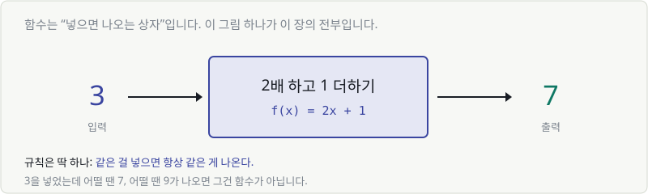
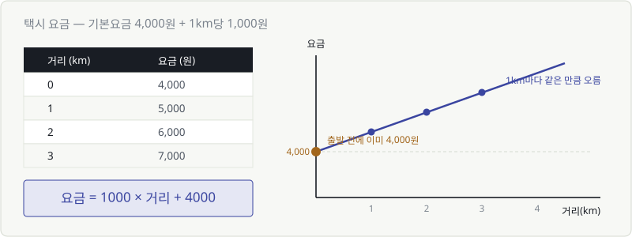
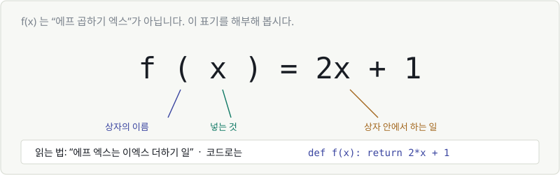
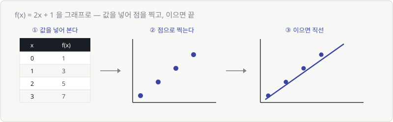
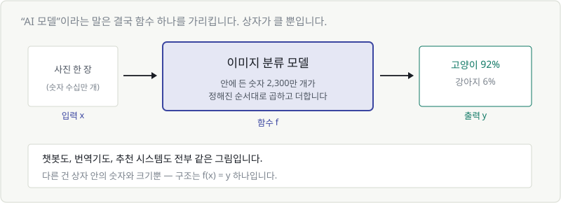
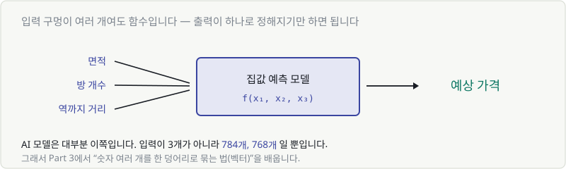

# Chapter 04. 함수 — 입력과 출력의 상자

> **이 장의 목표**
> **"AI 모델 = 함수 하나"** 라는 문장을 이해합니다.
> 이 장을 끝내면 "모델을 학습시킨다"는 말이 무슨 뜻인지 감이 잡힙니다.
>
> 🚨 이 장은 건너뛰면 안 됩니다. Part 2~6이 전부 여기 위에 올라갑니다.

---

## 4.1 함수란 무엇인가

함수는 **넣으면 나오는 상자**입니다. 그게 전부입니다.



3을 넣으면 7이 나옵니다. 상자 안에서는 "2배 하고 1 더하기"가 일어납니다.

규칙은 딱 하나뿐입니다.

> 🎯 **같은 것을 넣으면 항상 같은 것이 나온다.**

3을 넣었는데 어떨 땐 7, 어떨 땐 9가 나온다면 그건 함수가 아닙니다.
자판기에 1,000원을 넣고 콜라 버튼을 눌렀는데 어떨 땐 사이다가 나오면
고장 난 자판기죠. 함수는 고장 나지 않은 자판기입니다.

---

## 4.2 함수의 예 (1): 자판기

이미 우리는 함수에 둘러싸여 살고 있습니다.

| 입력 | 상자(하는 일) | 출력 |
|---|---|---|
| 버튼 A2 | 자판기 | 콜라 |
| 섭씨 온도 | 화씨 변환 | 화씨 온도 |
| 검색어 | 검색 엔진 | 결과 목록 |
| 사진 | 얼굴 인식 | "김OO입니다" |

전부 같은 구조입니다. **입력 → 상자 → 출력.**

상자 안이 얼마나 복잡한지는 상관없습니다.
자판기 안에 모터가 몇 개 들어있든, 우리에겐 "버튼 누르면 음료가 나온다"입니다.

---

## 4.3 함수의 예 (2): 택시 요금

숫자로 된 예를 하나 제대로 봅시다.

**기본요금 4,000원, 1km마다 1,000원씩 추가.**



표를 보면 규칙이 보입니다. 1km 갈 때마다 정확히 1,000원씩 늘어납니다.
이걸 한 줄로 적으면 이렇습니다.

$$
\text{요금} = 1000 \times \text{거리} + 4000
$$

그리고 오른쪽 그래프를 보세요. **직선**입니다.

> 💬 여기서 두 가지가 이미 보입니다.
> - **4,000원**: 아직 출발도 안 했는데 이미 있는 값 → 그래프의 **시작 높이**
> - **1,000원**: 1km마다 오르는 양 → 그래프의 **기울기**
>
> 이 둘이 Chapter 05의 주인공입니다. 그리고 AI에서는 **편향**과 **가중치**라고 불립니다.

---

## 4.4 함수 식을 쓰는 법

`f(x)`라는 표기를 처음 보면 "f 곱하기 x"로 읽고 싶어집니다. **아닙니다.**



| 부분 | 뜻 |
|---|---|
| `f` | 상자의 **이름** (function의 f) |
| `(x)` | 이 상자에 **넣는 것** |
| `= 2x + 1` | 상자 안에서 **하는 일** |

읽는 법: **"에프 엑스는 이 엑스 더하기 일"**

### 코드로 보면 완전히 같습니다

```python
def f(x):
    return 2*x + 1

f(3)    # 7
f(10)   # 21
```

`def f(x)` — 이름은 f, 받는 건 x. 수학과 글자 하나 다르지 않습니다.

### 이름은 마음대로

`f` 말고 다른 글자를 써도 됩니다. AI 문서에서는 이런 이름들을 자주 씁니다.

| 표기 | 보통 이런 뜻 |
|---|---|
| $f(x)$ | 일반적인 함수 |
| $\sigma(x)$ | 시그모이드 (Chapter 08) |
| $L(\theta)$ | 손실 함수 — 얼마나 틀렸나 (Chapter 06) |
| $p(x)$ | 확률 (Chapter 13) |

**괄호 앞의 글자는 이름일 뿐**입니다. 곱셈이 아닙니다.

---

## 4.5 함수를 그래프로 그려 보기

그래프 그리기는 어렵지 않습니다. **값을 넣어 점을 찍고, 잇습니다.**



Chapter 03에서 배운 것을 그대로 씁니다. **숫자 두 개 = 점 하나.**
`x = 1`일 때 `f(x) = 3`이니까 점 `(1, 3)`을 찍습니다.

> 💬 여기서 잠깐. Chapter 03에서는 **데이터**를 점으로 찍었고,
> 지금은 **함수**를 점으로 찍었습니다.
>
> 이 둘을 같은 평면에 겹쳐 놓는 것 — 그게 바로 머신러닝입니다.
> **데이터 점들 위에 함수 선을 얹어서, 가장 잘 맞는 선을 찾는 것.**
> Chapter 05에서 정확히 이걸 합니다.

---

## 4.6 AI 모델도 결국 함수 하나입니다

이제 이 장의 핵심입니다.



이미지 분류 모델에 사진을 넣으면 "고양이 92%"가 나옵니다.

**이건 함수입니다.**

- 입력: 사진 (숫자 수십만 개)
- 상자: 정해진 순서대로 곱하고 더하기 (숫자 2,300만 개가 관여)
- 출력: 확률

상자가 클 뿐, 구조는 `f(x) = 2x + 1`과 **완전히 같습니다.**

| | 택시 요금 | 이미지 분류 모델 |
|---|---|---|
| 입력 | 숫자 1개 (거리) | 숫자 15만 개 (픽셀) |
| 상자 안 숫자 | 2개 (1000, 4000) | 2,300만 개 |
| 출력 | 숫자 1개 (요금) | 숫자 1,000개 (각 확률) |
| **구조** | **입력 → 계산 → 출력** | **입력 → 계산 → 출력** |

### 그래서 "학습"이 뭔가요

택시 요금 함수에서 `1000`과 `4000`은 **택시 회사가 정해준 값**입니다.

그런데 이미지 분류 모델의 2,300만 개 숫자는 아무도 정해줄 수 없습니다.
사람이 손으로 적을 수가 없죠.

> 🎯 **그래서 기계가 데이터를 보고 스스로 찾습니다. 그게 "학습"입니다.**

즉 이렇게 정리됩니다.

| 말 | 실제 뜻 |
|---|---|
| "AI 모델" | 함수 하나 |
| "파라미터" | 함수 안에 든 숫자들 |
| "학습한다" | 그 숫자들의 **좋은 값을 찾는다** |
| "추론한다" | 찾은 숫자로 **계산을 한 번 돌린다** |

챗봇도, 번역기도, 추천 시스템도 전부 이 그림입니다.

---

## 💡 칼럼 — 입력이 여러 개인 함수

지금까지는 입력이 하나였습니다. 실제로는 여러 개인 경우가 훨씬 많습니다.



집값을 예측한다면 면적만으로는 부족합니다. 방 개수, 역까지 거리, 층수...
입력 구멍이 여러 개여도 **출력이 하나로 정해지기만 하면 함수**입니다.

$$
f(x_1, x_2, x_3) = \text{예상 가격}
$$

Chapter 02에서 배운 아래 첨자가 여기서 쓰입니다. $x_1$은 1번째 입력, $x_2$는 2번째 입력.

그리고 AI 모델은 대부분 이쪽입니다. 입력이 3개가 아니라 **784개, 768개**일 뿐이죠.

> 그런데 입력이 768개면 $f(x_1, x_2, ..., x_{768})$ 이라고 매번 쓸 수는 없습니다.
> 그래서 **숫자 여러 개를 한 덩어리로 묶는 방법**이 필요합니다.
> 그게 Part 3의 **벡터**입니다. 그때는 그냥 $f(\mathbf{x})$ 라고 씁니다.

---

## ✅ 1분 확인

1. `f(x)`는 "f 곱하기 x"인가요?
2. 어떤 상자에 3을 넣었더니 오늘은 7, 내일은 9가 나왔습니다. 이건 함수인가요?
3. "AI 모델을 학습시킨다"를 이 장의 표현으로 바꾸면?
4. 택시 요금 함수 `요금 = 1000×거리 + 4000`에서, 거리가 0일 때 요금은?

<details>
<summary>답 보기</summary>

1. **아니요** — f는 상자의 **이름**입니다. 곱셈이 아닙니다.
2. **아니요** — 같은 입력에 같은 출력이 나와야 함수입니다.
3. **"함수 안에 든 숫자들의 좋은 값을 찾는다"**
4. **4,000원** — 그래프에서 시작 높이에 해당합니다. AI에서는 이걸 **편향(bias)** 이라고 부릅니다.

</details>

---

| ⬅️ 이전 | 다음 ➡️ |
|---|---|
| [Chapter 03. 좌표와 그래프](../part1/ch03-coordinates.md) | [Chapter 05. 일차함수 — 가장 단순한 예측기](ch05-linear.md) |
