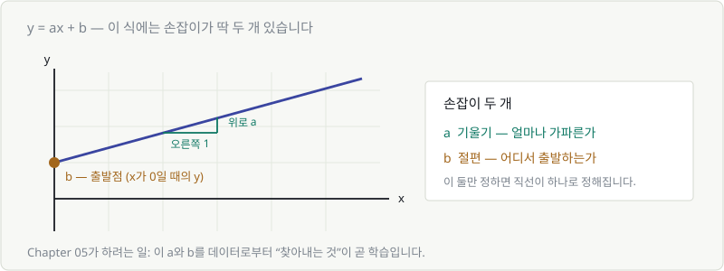
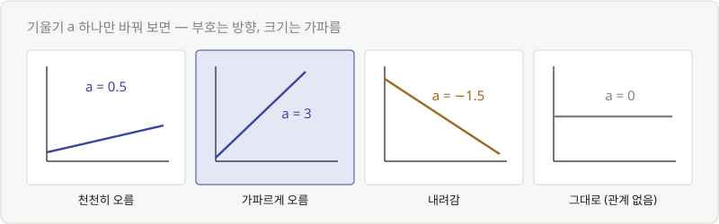
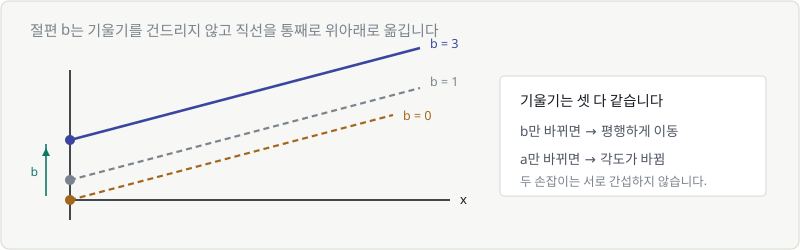
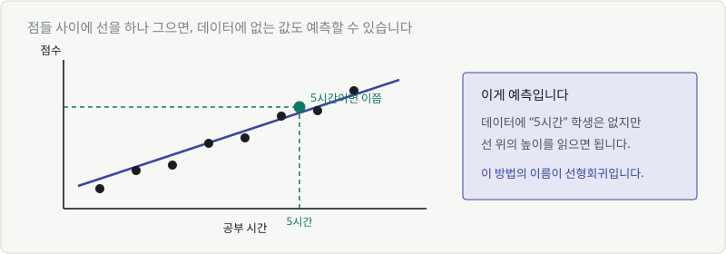
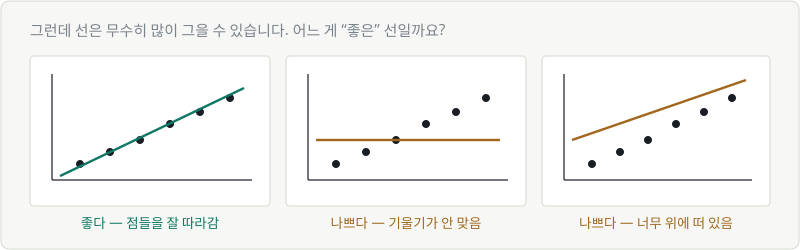
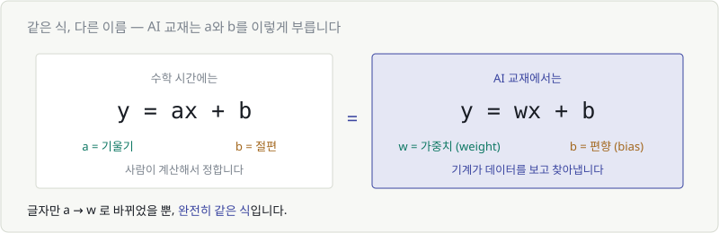

# Chapter 05. 일차함수 — 가장 단순한 예측기

> **이 장의 목표**
> $y = ax + b$ 하나로 **예측**이라는 걸 해봅니다.
> 그리고 이 식이 AI 교재에서 왜 $y = wx + b$ 로 쓰이는지 알게 됩니다.
>
> 이 장이 끝나면 **가중치**와 **편향**이라는 단어가 무섭지 않아집니다.

---

## 5.1 일차함수 $y = ax + b$

Chapter 04의 택시 요금을 다시 봅시다.

$$
\text{요금} = 1000 \times \text{거리} + 4000
$$

이름을 짧게 바꾸면 이렇게 됩니다.

$$
y = ax + b
$$

**이게 일차함수입니다.** 그래프로 그리면 항상 **직선**이 나옵니다.

"일차"라는 말은 **x가 어깨 위로 올라가지 않았다**는 뜻입니다.
$x^2$이나 $x^3$이 없이 그냥 $x$만 있으면 일차함수입니다.

---

## 5.2 일차함수의 그래프



직선 하나를 정하는 데 필요한 정보는 **딱 두 개**입니다.

| 손잡이 | 이름 | 하는 일 |
|---|---|---|
| $a$ | 기울기 | 얼마나 **가파른가** |
| $b$ | 절편 | 어디서 **출발하는가** |

이 두 개만 정하면 직선이 하나로 확정됩니다. 더도 덜도 필요 없습니다.

> 🎯 **이 장의 목표를 한 문장으로**
> 데이터를 보고 **a와 b를 찾아내는 것** — 그게 학습입니다.

---

## 5.3 기울기 $a$가 뜻하는 것

기울기는 **"x가 1 늘어날 때 y가 얼마나 변하는가"** 입니다.



| $a$ 값 | 그래프 모양 | 뜻 |
|---|---|---|
| $a = 3$ | 가파르게 올라감 | x가 1 늘면 y는 3 늘어남 |
| $a = 0.5$ | 완만하게 올라감 | x가 1 늘면 y는 0.5 늘어남 |
| $a = -1.5$ | 내려감 | x가 1 늘면 y는 1.5 **줄어듦** |
| $a = 0$ | 평평함 | x가 변해도 y는 **그대로** |

기울기 하나에 두 가지 정보가 들어 있습니다.

- **부호** = 방향 (양수면 올라감, 음수면 내려감)
- **크기** = 세기 (클수록 가파름)

> 💬 **AI에서 이게 왜 중요하냐면**
> "공부 시간이 점수에 얼마나 영향을 주는가"가 곧 기울기입니다.
> 기울기가 크면 → 영향이 큼. 기울기가 0에 가까우면 → 거의 상관없음.
>
> 학습이 끝난 모델의 가중치를 들여다보면, **어떤 입력이 중요했는지**를 이렇게 읽습니다.

---

## 5.4 절편 $b$가 뜻하는 것

절편은 **x가 0일 때의 y값**, 즉 출발점입니다.



$b$를 바꾸면 직선의 **각도는 그대로**인 채 통째로 위아래로 움직입니다.

- 택시 요금의 기본요금 4,000원
- 전기요금의 기본료
- 체중계에 아무것도 안 올렸을 때의 눈금

전부 절편입니다. **"아무 일도 안 했을 때 이미 있는 값."**

> ⚙️ **두 손잡이는 서로 간섭하지 않습니다**
> $a$만 바꾸면 → 각도만 바뀜
> $b$만 바꾸면 → 위치만 바뀜
>
> 이 독립성이 나중에 아주 중요해집니다. (Chapter 18 편미분)

---

## 5.5 예: 공부 시간과 점수

이제 진짜 데이터로 해봅시다.

| 학생 | 공부 시간 | 점수 |
|---|---|---|
| A | 2 | 40 |
| B | 4 | 55 |
| C | 5 | 62 |
| D | 7 | 80 |
| E | 8 | 85 |

Chapter 03에서 배운 대로 점으로 찍으면 — 오른쪽 위로 올라가는 모양이 나옵니다.
**공부를 많이 할수록 점수가 높다**는 관계가 눈에 보입니다.

여기에 직선을 하나 그어봅니다.

---

## 5.6 점들 사이에 선 하나 긋기 — 예측의 시작



이 그림이 중요한 이유는 이겁니다.

> **데이터에는 "5시간 공부한 학생"이 없어도, 선 위의 높이를 읽으면 예측할 수 있습니다.**

이게 **예측**입니다. 그리고 직선으로 예측하는 이 방법의 이름이
**선형회귀(linear regression)** — 머신러닝에서 가장 먼저 배우는 모델입니다.

### 그런데 선은 무수히 많습니다

여기서 진짜 문제가 나옵니다.



같은 점들 위에 선은 **무한히** 그을 수 있습니다.
어떤 건 잘 맞고, 어떤 건 엉망입니다.

그럼 **"잘 맞는다"를 어떻게 숫자로 판단**할까요?

> 🚨 **이게 Chapter 06의 질문입니다.**
> 그리고 그 답이 **손실 함수**입니다.
> 사람이 눈으로 고르는 게 아니라, 기계가 숫자로 비교할 수 있어야 하니까요.

---

## 5.7 $a$와 $b$를 AI는 '가중치'와 '편향'이라 부릅니다

이제 이름표만 바꿔 붙이면 됩니다.



$$
y = ax + b \qquad \Longleftrightarrow \qquad y = wx + b
$$

| 수학 시간 | AI 교재 | 영어 |
|---|---|---|
| $a$ (기울기) | 가중치 | **w**eight |
| $b$ (절편) | 편향 | **b**ias |

**완전히 같은 식입니다.** 글자만 $a \to w$ 로 바뀌었습니다.

### 딱 하나 다른 점

| | 수학 문제 | AI |
|---|---|---|
| $a$, $b$ 를 | 사람이 계산해서 구함 | **기계가 데이터를 보고 찾음** |

그리고 이제 이런 문장이 읽힙니다.

> **"이 모델은 파라미터가 700억 개입니다."**
> → *w와 b가 합쳐서 700억 개 있다는 뜻이구나.*

> **"학습이 끝났습니다."**
> → *그 700억 개 숫자의 좋은 값을 찾았다는 뜻이구나.*

### 뉴런 하나 = 일차함수 하나

신경망 그림에서 동그라미 하나(뉴런)가 하는 일이 정확히 이겁니다.

```python
# 뉴런 하나의 계산
output = w * x + b
```

입력이 여러 개면 이렇게 늘어날 뿐입니다.

```python
output = w1*x1 + w2*x2 + w3*x3 + b
```

곱하고 더하기. **그게 전부입니다.**

> 이걸 짧게 쓰는 방법이 Part 3의 **행렬 곱**이고,
> 이 결과를 구부리는 게 Chapter 08의 **활성화 함수**입니다.
> 딥러닝은 이 두 개의 반복입니다.

---

## 💡 칼럼 — 왜 하필 직선부터 시작할까

세상이 직선일 리가 없는데, 왜 모든 교재가 직선부터 시작할까요?

### 1. 이해할 수 있으니까

가중치가 3이면 "이 입력이 3배로 반영된다"고 **말로 설명할 수 있습니다.**
딥러닝 모델은 이게 안 됩니다. 그래서 의료, 금융처럼 **설명이 필요한 분야**에서는
여전히 선형 모델을 씁니다.

### 2. 놀랍게도 자주 충분하니까

데이터가 적을 때는 복잡한 모델이 오히려 더 나쁩니다.
데이터 50개에 700억 파라미터 모델을 쓰면, 그냥 답을 외워버립니다(과적합).

### 3. 딥러닝의 부품이 직선이니까

이게 가장 중요합니다.

신경망은 직선을 **버린 게 아니라 쌓은 것**입니다.
`Wx + b`가 층마다 들어 있고, 그 사이에 구부리는 함수를 끼웁니다.

> **직선을 이해하지 못하면 딥러닝도 이해할 수 없습니다.**
> 딥러닝은 직선의 반대가 아니라, 직선의 반복이니까요.

---

## ✅ 1분 확인

1. 기울기 $a = 0$ 이면 그래프는 어떤 모양인가요? 그 뜻은?
2. $y = 5x + 2$ 에서, x가 1 늘어나면 y는 얼마나 변하나요?
3. AI에서 $w$와 $b$를 각각 뭐라고 부르나요?
4. 같은 점들 위에 그을 수 있는 직선은 몇 개인가요?

<details>
<summary>답 보기</summary>

1. **평평한 가로선** — x가 변해도 y가 안 변한다, 즉 **관계가 없다**는 뜻입니다.
2. **5만큼 늘어납니다** — 기울기가 곧 "x 1당 변화량"입니다.
3. $w$ = **가중치(weight)**, $b$ = **편향(bias)**
4. **무한히 많습니다** — 그래서 "어느 게 제일 좋은가"를 재는 기준이 필요합니다. 그게 Chapter 06.

</details>

---

| ⬅️ 이전 | 다음 ➡️ |
|---|---|
| [Chapter 04. 함수 — 입력과 출력의 상자](ch04-function.md) | [Chapter 06. 이차함수 — 오차를 담는 골짜기](ch06-quadratic-loss.md) |
