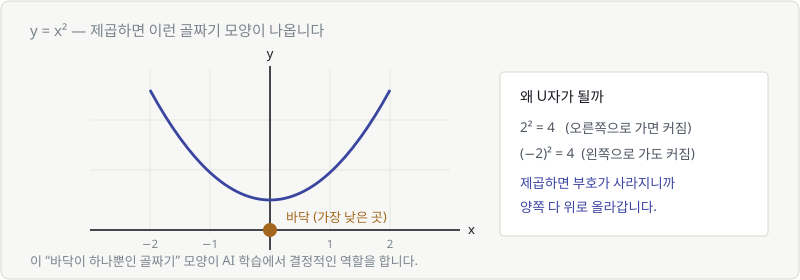
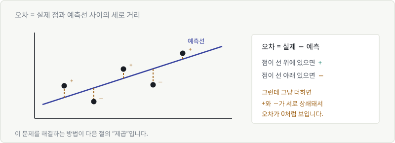
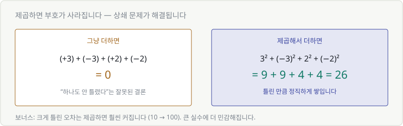
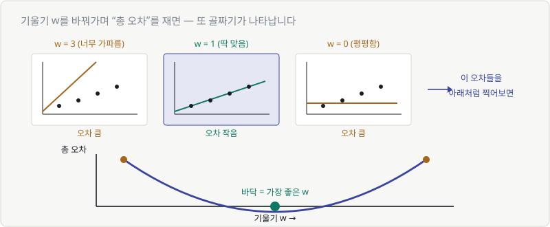

# Chapter 06. 이차함수 — 오차를 담는 골짜기

> **이 장의 목표**
> Chapter 05에서 남긴 질문 — **"어느 직선이 제일 좋은가?"** 에 답합니다.
> 그 답이 곧 **손실 함수(loss)** 이고, 이 장에서 처음부터 끝까지 직접 만들어 봅니다.
>
> 딥러닝의 "학습"이 왜 골짜기 이야기인지, 여기서 그림으로 이해하게 됩니다.

---

## 6.1 이차함수

일차함수는 $x$만 있었습니다. **이차함수는 $x^2$이 있습니다.**

$$
y = x^2
$$

값을 몇 개 넣어보면 이렇습니다.

| $x$ | −3 | −2 | −1 | 0 | 1 | 2 | 3 |
|---|---|---|---|---|---|---|---|
| $y = x^2$ | 9 | 4 | 1 | **0** | 1 | 4 | 9 |

**0에서 가장 작고, 양쪽으로 갈수록 커집니다.** 그리고 좌우가 대칭입니다.

---

## 6.2 이차함수의 그래프는 골짜기 모양

이 U자 모양을 **포물선**이라고 부릅니다.

### 왜 U자가 될까

Chapter 02에서 배운 것 하나면 설명됩니다. **제곱하면 부호가 사라집니다.**

- $2^2 = 4$ → 오른쪽으로 가도 커짐
- $(-2)^2 = 4$ → 왼쪽으로 가도 **똑같이** 커짐

그래서 양쪽 다 위로 올라가고, 가운데가 푹 꺼집니다.

> 🎯 **여기서 챙길 것은 딱 하나**
> 이 그래프에는 **가장 낮은 지점(바닥)이 정확히 하나** 있습니다.
> 이 성질이 AI 학습의 전부를 떠받칩니다.

---

## 6.3 예측이 틀린 정도를 숫자로 — 오차

이제 Chapter 05의 문제로 돌아갑니다. **어느 직선이 좋은 직선인가?**

먼저 "틀린 정도"를 재야 합니다.

**오차 = 실제 값 − 예측 값**

점이 선보다 위에 있으면 오차는 **양수**(덜 예측했다), 아래에 있으면 **음수**(더 예측했다).

| 학생 | 실제 점수 | 예측 점수 | 오차 |
|---|---|---|---|
| A | 40 | 43 | −3 |
| B | 55 | 52 | +3 |
| C | 62 | 60 | +2 |
| D | 80 | 82 | −2 |

### 그런데 문제가 있습니다

이 오차들을 그냥 다 더하면?

$$
(-3) + (+3) + (+2) + (-2) = 0
$$

**0입니다.** "하나도 안 틀렸다"는 결론이 나옵니다. 전부 틀렸는데요.

플러스와 마이너스가 서로를 지워버린 겁니다.

---

## 6.4 오차를 제곱해서 더하면 골짜기가 된다

해결책은 이미 6.2에서 봤습니다. **제곱하면 부호가 사라집니다.**

$$
(-3)^2 + 3^2 + 2^2 + (-2)^2 = 9 + 9 + 4 + 4 = 26
$$

이제 틀린 만큼 정직하게 쌓입니다. 이 숫자를 **총 오차**라고 부릅시다.

> **보너스 효과**
> 제곱은 **크게 틀린 것을 훨씬 크게** 만듭니다.
> 오차 2 → 4, 오차 10 → **100**.
>
> 조금씩 여러 번 틀리는 것보다 크게 한 번 틀리는 걸 더 나쁘게 봅니다.
> 대부분의 상황에서 이게 우리가 원하는 판단입니다.

이걸 수식으로 적으면 이렇게 됩니다.

$$
L = \frac{1}{n}\sum_{i=1}^{n}(y_i - \hat{y}_i)^2
$$

낯설어 보이지만 이미 Chapter 02에서 읽어봤던 그 식입니다.

> **"정답에서 예측을 빼고, 제곱해서, 전부 더한 다음, 개수로 나눈 것."**

- $y_i$ = i번째 **정답**
- $\hat{y}_i$ = i번째 **예측** (햇 기호 ^는 "예측값"이라는 표시)
- $\sum$ = 전부 더하기 (Chapter 16에서 제대로 다룹니다)
- $\frac{1}{n}$ = 개수로 나누기 (평균)

이름은 **평균제곱오차(MSE, Mean Squared Error)** 입니다.
이름은 어렵지만, 방금 우리가 손으로 만든 그것입니다.

---

## 6.5 골짜기의 바닥 = 가장 좋은 예측

이제 진짜 재미있는 부분입니다.

**기울기 $w$를 이것저것 바꿔가며 총 오차를 계산해 봅니다.**

- $w$가 너무 크면 → 선이 너무 가파름 → **오차 큼**
- $w$가 딱 맞으면 → 선이 점들을 잘 지나감 → **오차 작음**
- $w$가 너무 작으면 → 선이 평평함 → **오차 큼**

그리고 이 오차들을 그래프로 찍어보면...

### 🎉 또 골짜기가 나옵니다

가로축이 **기울기 $w$**, 세로축이 **총 오차**인 그래프.
바로 6.2에서 봤던 그 U자 모양입니다.

| 그래프 | 가로축 | 세로축 | 바닥의 의미 |
|---|---|---|---|
| 6.2의 포물선 | $x$ | $x^2$ | 그냥 0인 지점 |
| **6.5의 골짜기** | **기울기 $w$** | **총 오차** | **가장 좋은 $w$** |

> 🚨 **이 축 바꾸기를 놓치면 안 됩니다.**
> 가로축이 더 이상 데이터가 아니라, **우리가 조절하는 손잡이($w$)** 입니다.
> "손잡이를 어디에 놓으면 가장 덜 틀리는가"를 그린 그래프입니다.

---

## 6.6 이것이 손실 함수(loss)입니다

방금 우리가 만든 것에 이름을 붙이면 이렇습니다.

> **손실 함수(loss function)**
> = 파라미터(w, b)를 넣으면 → "얼마나 틀렸는지"가 나오는 함수

Chapter 04의 상자 그림 그대로입니다. 입력이 $w$이고, 출력이 오차일 뿐입니다.

$$
L(w) = \text{그 } w \text{를 썼을 때의 총 오차}
$$

그리고 학습의 목표가 한 문장으로 정리됩니다.

> 🎯 **학습 = 이 골짜기의 바닥을 찾는 것**

### 이제 이런 말들이 읽힙니다

| AI 용어 | 이 장의 그림으로 |
|---|---|
| "loss가 줄어든다" | 골짜기를 **내려가고 있다** |
| "loss가 수렴했다" | 바닥 근처에 **도착했다** |
| "loss가 발산한다" | 골짜기 밖으로 **튕겨 나갔다** |
| "최적화(optimization)" | 바닥을 **찾는 일** |

### 남은 질문 하나

바닥이 어딘지는 알겠는데, **어떻게 내려가죠?**

지금 우리 방법은 "$w$를 이것저것 넣어보기"입니다.
$w$가 하나뿐이면 가능합니다. 그런데 파라미터가 **700억 개**라면?

전부 시도해 보는 건 불가능합니다.

> 💡 **필요한 건 이것입니다.**
> *"지금 서 있는 자리에서, 어느 쪽이 내리막인지 알 수 있다면?"*
>
> 그럼 그냥 그쪽으로 한 발씩 가면 됩니다.
> **그 방향을 알려주는 도구가 미분입니다.** (Part 5)

Part 2에서 골짜기를 만들었고, Part 5에서 내려갑니다.

---

## 💡 칼럼 — 왜 하필 제곱을 할까

부호를 없애는 방법이 제곱만 있는 건 아닙니다. **절댓값**도 됩니다.

| 방법 | 식 | 이름 |
|---|---|---|
| 절댓값 | $\|y - \hat{y}\|$ | MAE |
| 제곱 | $(y - \hat{y})^2$ | MSE |

둘 다 씁니다. 그런데 제곱이 기본값이 된 이유가 있습니다.

### 1. 그래프가 매끄럽습니다

절댓값 그래프는 바닥이 **뾰족한 V자**입니다.
제곱 그래프는 바닥이 **둥근 U자**입니다.

뾰족한 지점에서는 "기울기가 얼마냐"고 물었을 때 답이 안 나옵니다.
Part 5에서 배울 미분이 그 지점에서 작동하지 않습니다.

**U자는 어디서든 기울기를 잴 수 있습니다.** 이게 결정적입니다.

### 2. 큰 실수를 크게 봅니다

오차 10을 제곱하면 100. 오차 1 열 개(총 10)보다 훨씬 나쁜 것으로 칩니다.

다만 이건 **양날의 검**입니다. 데이터에 이상치(outlier)가 하나 껴 있으면
제곱 때문에 그 하나가 전체를 지배해버립니다.
그래서 이상치가 많은 데이터에서는 오히려 절댓값(MAE)을 쓰기도 합니다.

> 손실 함수는 **정답이 있는 게 아니라 선택**입니다.
> "무엇을 더 나쁘게 볼 것인가"를 정하는 일이니까요.

---

## ✅ 1분 확인

1. 오차를 그냥 다 더하면 안 되는 이유는?
2. $y = x^2$ 그래프에서 가장 낮은 지점은 몇 개인가요?
3. 손실 함수 그래프의 **가로축**은 무엇인가요?
4. "loss가 줄어든다"를 골짜기 그림으로 말하면?

답 보기

1. **플러스와 마이너스가 상쇄되어** 실제로는 많이 틀렸는데 0으로 보일 수 있습니다.
2. **정확히 하나** — 이 성질 덕분에 "바닥을 찾는다"는 목표가 성립합니다.
3. **파라미터(w, b)** 입니다. 데이터가 아닙니다. 우리가 조절하는 손잡이입니다.
4. **골짜기를 내려가고 있다** — 더 나은 w에 가까워지고 있다는 뜻입니다.

---

| ⬅️ 이전 | 다음 ➡️ |
|---|---|
| [Chapter 05. 일차함수](ch05-linear.md) | [Chapter 07. 지수함수와 로그함수](ch07-exp-log.md) |
