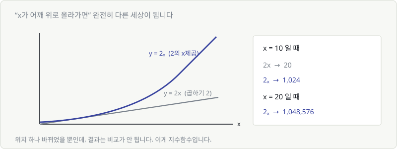
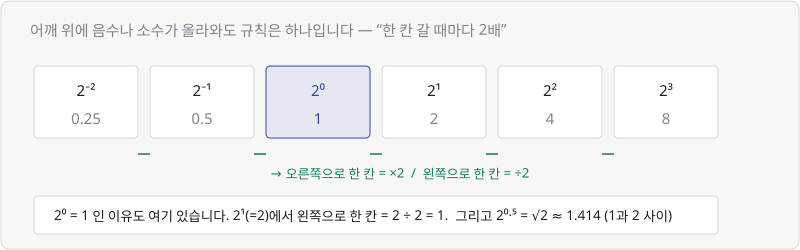
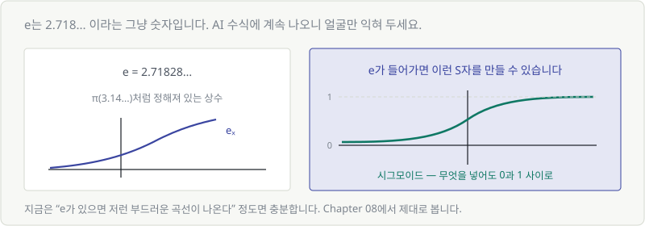
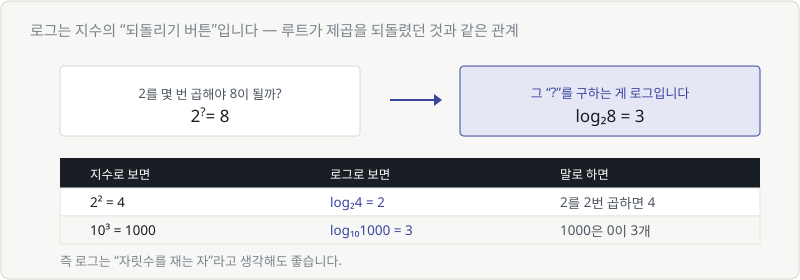
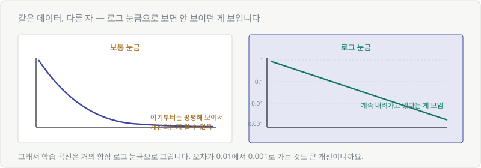
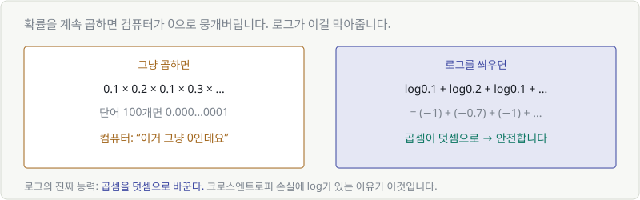

# Chapter 07. 지수함수와 로그함수

> **이 장의 목표**
> AI 수식에 끊임없이 등장하는 $e$와 $\log$ 를 **얼굴만이라도 익힙니다.**
> 계산은 하지 않습니다. "왜 여기 있는지"만 알면 충분합니다.
>
> 이 장이 끝나면 학습 곡선이 왜 로그 눈금으로 그려지는지,
> 손실 함수에 왜 log가 붙어 있는지 알게 됩니다.

---

## 7.1 거듭제곱 복습

Chapter 02에서 봤던 것입니다. 어깨 위 숫자는 **"몇 번 곱했는가"**.

$$
2^3 = 2 \times 2 \times 2 = 8
$$

지금까지는 어깨 위에 **정해진 숫자**가 있었습니다.
이번 장에서는 그 자리에 **$x$** 가 올라갑니다.

---

## 7.2 지수함수 — 급격히 증가하는 수

$$
y = 2^x
$$

$x$가 밑이 아니라 **어깨 위**에 있습니다. 이게 지수함수입니다.

$y = 2x$ 와 $y = 2^x$ 는 글자 위치 하나 차이지만, 결과는 비교가 안 됩니다.



| $x$ | $y = 2x$ | $y = 2^x$ |
|---|---|---|
| 1 | 2 | 2 |
| 5 | 10 | 32 |
| 10 | 20 | **1,024** |
| 20 | 40 | **1,048,576** |
| 30 | 60 | **10억 이상** |

직선은 성실하게 올라가고, 지수함수는 **폭발합니다.**

---

## 7.3 예: 두 배씩 늘어나는 것들

지수함수는 **"매번 같은 배수로 늘어나는 것"** 을 나타냅니다.

| 상황 | 매번 |
|---|---|
| 종이 접기 | 두께 2배 |
| 소문 퍼지기 | 아는 사람 2배 |
| 복리 이자 | 원금 1.05배 |
| 모델 크기 경쟁 | 파라미터 10배 |

### 종이 접기 이야기

0.1mm짜리 종이를 42번 접으면 얼마나 두꺼워질까요?

$$
0.1\text{mm} \times 2^{42} \approx 440,000\text{km}
$$

**달까지 닿습니다.** (실제 거리 약 38만 km)

"설마" 싶겠지만 계산은 정확합니다. 우리 직관이 지수를 못 따라가는 것뿐입니다.

> 💬 **AI 분야에서 자주 듣는 말**
> "모델 크기가 지수적으로 커지고 있다"
> → 매년 조금씩 커지는 게 아니라, **매번 몇 배씩** 커진다는 뜻입니다.

---

## 7.4 $2^{-1}$, $2^{0.5}$ 도 계산할 수 있다

"2를 −1번 곱한다"는 말은 이상합니다. 그런데 그림으로 보면 자연스럽습니다.



규칙은 하나뿐입니다.

> **오른쪽으로 한 칸 = ×2 &nbsp;&nbsp; 왼쪽으로 한 칸 = ÷2**

| | $2^{-2}$ | $2^{-1}$ | $2^{0}$ | $2^1$ | $2^2$ | $2^3$ |
|---|---|---|---|---|---|---|
| 값 | 0.25 | 0.5 | **1** | 2 | 4 | 8 |

$2^0 = 1$ 인 이유도 여기 있습니다. $2^1 = 2$ 에서 왼쪽으로 한 칸 = $2 \div 2 = 1$.

소수도 마찬가지입니다. $2^{0.5}$ 는 $2^0(=1)$과 $2^1(=2)$ 사이 어딘가.
정확히는 $\sqrt{2} \approx 1.414$ 입니다.

> **왜 이걸 알아야 하나요?**
> AI 수식에서 $e^{-x}$ 처럼 **어깨 위에 마이너스**가 붙은 걸 계속 만나게 됩니다.
> 그때 "아, 뒤집는 거구나(나누는 거구나)" 하고 넘어갈 수 있으면 됩니다.

---

## 7.5 $e$ — AI에서 가장 자주 보는 숫자

$e = 2.71828...$

$\pi$(원주율 3.14...)처럼 **그냥 정해져 있는 숫자**입니다. 외울 필요 없습니다.



### 왜 하필 2.718...일까

짧게 답하면 이렇습니다.

> **$e^x$ 는 미분해도 자기 자신이 나오는 유일한 함수입니다.**

지금은 이게 왜 대단한지 모르셔도 됩니다. Part 5에서 미분을 배우고 나면
"아, 그래서 계산이 편했구나" 하고 이해하게 됩니다.

지금 챙길 것은 이것뿐입니다.

> 🎯 **AI 수식에서 $e$를 보면 "부드러운 곡선을 만들려는구나"라고 생각하세요.**

### 어디서 만나게 되나

$$
\sigma(x) = \frac{1}{1 + e^{-x}}
$$

이게 **시그모이드**입니다. 무엇을 넣어도 **0과 1 사이**로 만들어 줍니다.

식을 뜯어보지 말고, 그림만 보세요. 부드러운 S자 곡선입니다.
확률처럼 "0에서 1 사이 값"이 필요할 때 씁니다. (Chapter 08에서 다시 다룹니다)

---

## 7.6 로그 — 몇 제곱을 하면 되는가

로그는 **지수의 되돌리기 버튼**입니다.
루트가 제곱을 되돌렸던 것과 정확히 같은 관계입니다.



> **"2를 몇 번 곱해야 8이 될까?"** → 3번 → $\log_2 8 = 3$

| 지수로 보면 | 로그로 보면 | 말로 하면 |
|---|---|---|
| $2^2 = 4$ | $\log_2 4 = 2$ | 2를 2번 곱하면 4 |
| $2^{10} = 1024$ | $\log_2 1024 = 10$ | 2를 10번 곱하면 1024 |
| $10^3 = 1000$ | $\log_{10} 1000 = 3$ | 1000은 0이 3개 |

### 로그 = 자릿수를 재는 자

$\log_{10}$ 으로 보면 감이 옵니다.

| 숫자 | $\log_{10}$ | |
|---|---|---|
| 10 | 1 | 두 자리 |
| 1,000 | 3 | 네 자리 |
| 1,000,000 | 6 | 일곱 자리 |

**엄청나게 큰 숫자를 작은 숫자로 압축**해 줍니다.
1,000,000이 6이 되니까요.

> 💬 밑(아래 작은 숫자)이 안 적혀 있으면?
> AI 문서에서 그냥 $\log$ 라고 쓰면 **거의 항상 밑이 $e$인 자연로그($\ln$)** 입니다.
> 밑이 뭐든 모양은 똑같으니, 처음엔 신경 쓰지 마세요.

---

## 7.7 로그함수와 로그 그래프

$y = \log x$ 의 그래프는 지수함수를 **대각선으로 뒤집은** 모양입니다.

| | 지수함수 $2^x$ | 로그함수 $\log_2 x$ |
|---|---|---|
| 모양 | 처음엔 느리다가 폭발 | 처음엔 빠르다가 완만 |
| 하는 일 | 작은 걸 크게 | **큰 걸 작게** |

로그의 "큰 걸 작게" 성질이 실무에서 계속 쓰입니다.

---

## 7.8 로그 스케일로 봐야 보이는 것

Chapter 03에서 봤던 학습 곡선을 다시 봅시다.



보통 눈금으로 그리면 **뒷부분이 전부 평평해 보입니다.**
오차가 0.01이든 0.001이든 화면에서는 둘 다 "바닥에 붙은 선"이니까요.

그런데 0.01 → 0.001은 **10배 개선**입니다. 엄청난 진전인데 안 보이는 겁니다.

**세로축을 로그 눈금으로 바꾸면**, 10배 차이가 항상 같은 간격으로 표시됩니다.
그래서 뒷부분에서도 개선이 눈에 보입니다.

| 눈금 | 한 칸의 뜻 |
|---|---|
| 보통 | +1, +2, +3... (더하기) |
| **로그** | ×10, ×100, ×1000... (곱하기) |

> 🎯 **그래서 AI에서 보는 그래프는 로그 축이 많습니다.**
> 학습 곡선, 학습률 스케줄, 모델 크기 비교 — 전부 몇 배씩 차이 나는 값들이니까요.
>
> 그래프를 볼 때 **축 눈금이 1, 10, 100, 1000** 이면 "아 로그구나" 하시면 됩니다.

---

## 7.9 확률에 로그를 씌우는 이유

AI 손실 함수를 보면 로그가 거의 항상 들어 있습니다. 이유는 아주 현실적입니다.



### 문제: 확률을 계속 곱하면 0이 됩니다

문장의 확률은 단어 확률을 전부 곱해서 구합니다.

$$
0.1 \times 0.2 \times 0.1 \times 0.3 \times \cdots
$$

단어가 100개면? 소수점 아래 0이 100개쯤 붙습니다.
**컴퓨터는 이걸 그냥 0으로 처리해버립니다.** (언더플로)

### 해결: 로그를 씌우면 곱셈이 덧셈이 됩니다

로그에는 이런 성질이 있습니다.

$$
\log(A \times B) = \log A + \log B
$$

그래서 곱셈의 연속이 **덧셈의 연속**으로 바뀝니다.

$$
\log 0.1 + \log 0.2 + \log 0.1 + \cdots = (-1) + (-0.7) + (-1) + \cdots
$$

0으로 뭉개지지 않고, 안전하게 계산됩니다.

> 🎯 **로그의 진짜 능력: 곱셈을 덧셈으로 바꾼다.**
>
> 크로스엔트로피 손실에 $\log$ 가 붙어 있는 이유가 바로 이것입니다.
> Chapter 21에서 그 식을 통째로 해부합니다.

### 확률에 로그를 씌우면 왜 음수인가

확률은 0과 1 사이입니다. 그리고 **1보다 작은 수의 로그는 항상 음수**입니다.

| 확률 | $\log$ | 뜻 |
|---|---|---|
| 1.0 (확실함) | 0 | 손실 없음 |
| 0.5 | −0.7 | 조금 손실 |
| 0.01 (거의 틀림) | −4.6 | **큰 손실** |

그래서 손실 함수에는 보통 앞에 마이너스를 붙여 $-\log p$ 로 씁니다.
**확신이 없을수록 손실이 커지는** 구조가 자연스럽게 만들어집니다.

---

## 💡 칼럼 — 계산기로 로그 구하기

$\log_2 1000$ 은 얼마일까요? 계산기에 `log₂` 버튼은 보통 없습니다.

밑을 바꾸는 공식이 있습니다.

$$
\log_2 1000 = \frac{\log_{10} 1000}{\log_{10} 2} = \frac{3}{0.301} \approx 9.97
$$

즉 **"2를 약 10번 곱하면 1000"** — 실제로 $2^{10} = 1024$ 이니 맞습니다.

파이썬에서는 그냥 이렇게 합니다.

```python
import math
math.log2(1000)    # 9.965...
math.log(1000)     # 자연로그(밑 e) = 6.907...
math.log10(1000)   # 3.0
```

> 다시 강조하지만, **손으로 계산할 일은 없습니다.**
> "로그는 지수를 되돌리는 것"이라는 의미만 챙기면 충분합니다.

---

## ✅ 1분 확인

1. $y = 2x$ 와 $y = 2^x$ 중 $x = 20$ 일 때 훨씬 큰 것은?
2. $2^0$ 은 0인가요, 1인가요?
3. $\log_{10} 10000$ 은 얼마인가요?
4. 확률을 계속 곱하는 대신 로그를 씌워 더하는 이유는?

<details>
<summary>답 보기</summary>

1. **$2^x$** — 40 대 약 100만입니다.
2. **1** — $2^1 = 2$ 에서 한 칸 왼쪽(÷2)이므로 1입니다.
3. **4** — 10을 4번 곱하면 10000. (0의 개수와 같습니다)
4. 계속 곱하면 값이 너무 작아져 **컴퓨터가 0으로 처리**해버립니다. 로그는 곱셈을 덧셈으로 바꿔 이를 막습니다.

</details>

---

| ⬅️ 이전 | 다음 ➡️ |
|---|---|
| [Chapter 06. 이차함수 — 오차를 담는 골짜기](ch06-quadratic-loss.md) | [Chapter 08. 합성함수와 활성화 함수](ch08-composite-activation.md) |
