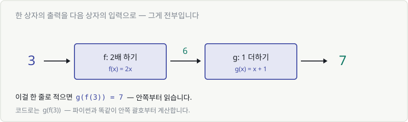
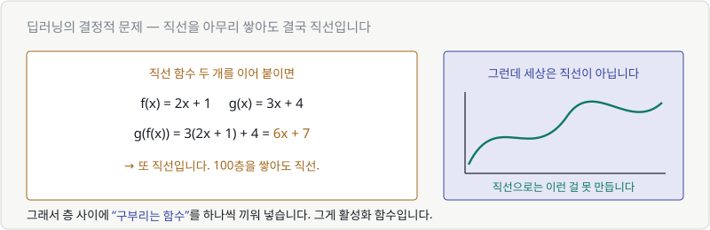
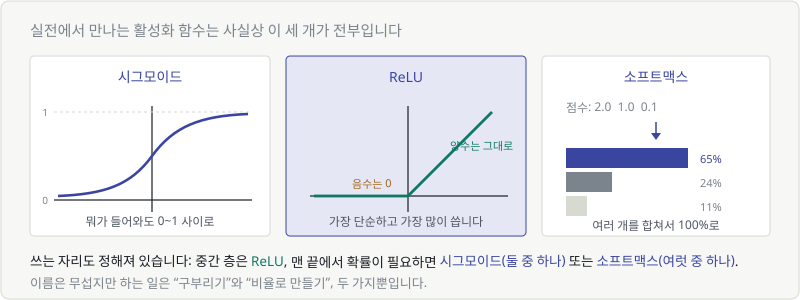
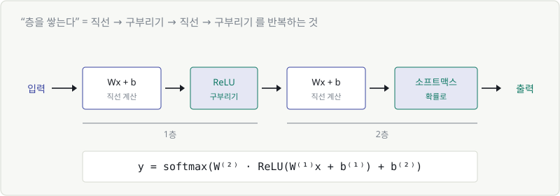

# Chapter 08. 합성함수와 활성화 함수 — 상자를 겹쳐 쌓기

> **이 장의 목표**
> **"층을 쌓는다(deep)"** 는 말의 진짜 의미를 이해합니다.
> 그리고 시그모이드 · ReLU · 소프트맥스가 **왜 필요한지** 알게 됩니다.
>
> 이 장이 Part 2의 마지막이자, "딥러닝"이라는 단어가 처음 완성되는 곳입니다.

---

## 8.1 함수를 함수에 넣기

상자 하나의 출력을 다음 상자의 입력으로 넣습니다. 그게 **합성함수**입니다.



- $f$: 2배 하기 → 3을 넣으면 6
- $g$: 1 더하기 → 6을 넣으면 7

이걸 한 줄로 적으면:

$$
g(f(3)) = 7
$$

**안쪽부터 읽습니다.** 먼저 $f(3)$을 계산하고, 그 결과를 $g$에 넣습니다.

```python
def f(x): return 2*x
def g(x): return x + 1

g(f(3))    # 7
```

파이썬과 완전히 같습니다. 괄호 안쪽부터 계산되죠.

> 💬 **이미 매일 하고 있습니다**
> `print(len(input()))` — 입력받고, 길이 재고, 출력합니다.
> 합성함수는 함수 파이프라인일 뿐입니다.

---

## 8.2 합성함수의 그래프

$f$가 직선이고 $g$도 직선이면, 합성한 결과는 어떤 모양일까요?

직접 계산해 봅시다.

$$
f(x) = 2x + 1, \qquad g(x) = 3x + 4
$$

$$
g(f(x)) = 3(2x+1) + 4 = 6x + 3 + 4 = 6x + 7
$$

**또 직선입니다.**

---

## 8.3 직선만 쌓으면 결국 직선입니다 — 한계

이게 딥러닝 역사에서 가장 중요한 문제였습니다.



직선 두 개를 합치면 직선. 세 개를 합쳐도 직선.
**100층을 쌓아도 직선입니다.**

$$
\underbrace{(6x + 7)}_{\text{2층}} \to \underbrace{(30x + 39)}_{\text{3층}} \to \cdots \to \text{여전히 } ax + b
$$

### 이게 왜 문제인가

세상은 직선이 아닙니다.

- 고양이 사진과 강아지 사진을 가르는 경계는 직선이 아닙니다
- 공부 시간이 늘어도 점수는 100점에서 멈춥니다 (직선은 안 멈춥니다)
- 약을 두 배 먹는다고 두 배 낫지 않습니다

> 🚨 **결론**
> 층을 100개 쌓아도 직선 하나와 성능이 똑같다면, 층을 쌓을 이유가 없습니다.
> **딥러닝이 "깊어질" 수 없습니다.**

---

## 8.4 그래서 구부러뜨립니다 — 활성화 함수

해결책은 놀랍도록 단순합니다.

> 🎯 **층과 층 사이에 "구부리는 함수"를 하나씩 끼워 넣는다.**

$$
\text{직선} \to \boxed{\text{구부리기}} \to \text{직선} \to \boxed{\text{구부리기}} \to \cdots
$$

이 "구부리는 함수"를 **활성화 함수(activation function)** 라고 부릅니다.

이름은 거창하지만 하는 일은 이게 전부입니다. **직선이 아니게 만들기.**

한 번 구부러지고 나면, 그다음 직선은 이미 구부러진 것 위에 얹힙니다.
그래서 층을 쌓을수록 **점점 복잡한 모양**을 만들 수 있게 됩니다.

이게 딥러닝이 작동하는 이유입니다.

---

## 8.5~8.7 실전에서 만나는 세 가지

수십 종류가 있지만, 실제로 쓰이는 건 사실상 세 개입니다.



### 8.5 시그모이드 — 무엇이든 0과 1 사이로

$$
\sigma(x) = \frac{1}{1 + e^{-x}}
$$

Chapter 07에서 만났던 그 S자 곡선입니다.

| 넣으면 | 나오는 값 |
|---|---|
| −100 | 거의 0 |
| 0 | 0.5 |
| +100 | 거의 1 |

**아무리 큰 수를 넣어도 1을 넘지 않습니다.** 그래서 "확률"이 필요한 자리에 씁니다.

> **쓰는 곳**: "스팸인가 아닌가", "합격인가 불합격인가" — **둘 중 하나**를 고를 때.

### 8.6 ReLU — 가장 단순하고 가장 많이 쓰이는 것

$$
\text{ReLU}(x) = \max(0, x)
$$

식이 무섭게 생겼지만, 하는 일은 한 줄입니다.

> **음수면 0, 양수면 그대로.**

```python
def relu(x):
    return max(0, x)
```

정말 이게 전부입니다. 그런데 이 단순한 게 시그모이드보다 **훨씬 잘 작동합니다.**

| | 시그모이드 | ReLU |
|---|---|---|
| 계산 | $e$ 계산 필요 (느림) | 비교 한 번 (빠름) |
| 깊은 층에서 | 학습이 잘 안 됨 | 잘 됨 |

> 💬 왜 ReLU가 깊은 신경망에서 더 잘 되는지는 **Part 5(미분)** 를 배운 뒤에야
> 제대로 설명할 수 있습니다. 지금은 "중간 층에는 거의 항상 ReLU"라고만 기억하세요.
>
> **쓰는 곳**: 신경망의 **중간 층 전부**. 사실상 기본값입니다.

### 8.7 소프트맥스 — 여러 개를 확률로

$$
\text{softmax}(z_i) = \frac{e^{z_i}}{\sum_j e^{z_j}}
$$

**첫 화면에서 봤던 그 수식입니다.** 이제 읽을 수 있습니다.

모델이 이런 점수를 뱉었다고 합시다.

| | 고양이 | 강아지 | 새 |
|---|---|---|---|
| 점수 | 2.0 | 1.0 | 0.1 |

이대로는 "확률"이라고 할 수 없습니다. 합이 1도 아니고, 음수가 나올 수도 있습니다.
소프트맥스가 두 단계로 정리해 줍니다.

**① 전부 양수로 만든다** — $e$를 씌웁니다.
Chapter 07에서 봤듯 $e^x$ 는 어떤 $x$를 넣어도 항상 양수입니다.

| | 고양이 | 강아지 | 새 |
|---|---|---|---|
| $e^{점수}$ | 7.39 | 2.72 | 1.11 |

**② 합이 1이 되도록 비율로 나눈다** — 전체 합(11.22)으로 각각을 나눕니다.

| | 고양이 | 강아지 | 새 |
|---|---|---|---|
| 확률 | **65.9%** | 24.2% | 9.9% |

이제 합이 100%입니다. 확률이 됐습니다.

> 🎯 **수식 다시 읽기**
> $$\text{softmax}(z_i) = \frac{e^{z_i}}{\sum_j e^{z_j}}$$
> **"점수를 전부 양수로 만든 뒤, 합이 1이 되도록 비율로 나눈다."**
>
> 분자 = 내 점수를 양수로 / 분모 = 모두의 점수를 양수로 만들어 더한 것.
>
> **쓰는 곳**: "고양이? 강아지? 새?" — **여럿 중 하나**를 고를 때.

---

## 8.8 '층을 쌓는다'의 진짜 의미

이제 전부 연결됩니다.



신경망은 이 두 가지의 반복입니다.

1. **`Wx + b`** — 곱하고 더하기 (Chapter 05의 일차함수)
2. **활성화 함수** — 구부리기 (이 장)

그리고 이걸 한 줄로 적으면 이렇게 됩니다.

$$
y = \text{softmax}\left(W^{(2)} \cdot \text{ReLU}(W^{(1)}x + b^{(1)}) + b^{(2)}\right)
$$

### 이 수식을 지금 읽어 봅시다

Chapter 02에서 배운 대로 **안쪽부터**, 그리고 **괄호 위 첨자는 층 번호**입니다.

| 순서 | 부분 | 하는 일 |
|---|---|---|
| ① | $W^{(1)}x + b^{(1)}$ | 1층에서 곱하고 더하기 |
| ② | $\text{ReLU}(\cdots)$ | 구부리기 |
| ③ | $W^{(2)} \cdot (\cdots) + b^{(2)}$ | 2층에서 곱하고 더하기 |
| ④ | $\text{softmax}(\cdots)$ | 확률로 바꾸기 |

**제곱은 하나도 없습니다.** 전부 층 번호입니다.

> 🎉 **축하합니다.**
> 두 달 전이라면 도망갔을 수식을, 지금 처음부터 끝까지 읽으셨습니다.
> 그리고 여기 쓰인 개념은 전부 Part 2에서 배운 것뿐입니다.

### 남은 것

이 수식에서 아직 설명 안 한 게 딱 하나 있습니다. **$W$가 대문자인 이유.**

입력이 784개, 다음 층 뉴런이 128개라면 $w$가 **10만 개** 필요합니다.
이걸 하나하나 쓸 수는 없죠.

> 💡 **그래서 숫자 뭉치를 한 덩어리로 다루는 문법이 필요합니다.**
> 그게 **Part 3: 벡터와 행렬**입니다.
> 대문자 $W$는 "숫자가 표로 묶여 있다"는 표시입니다.

---

## 💡 칼럼 — 활성화 함수 세 개를 그림으로 비교하기

| | 모양 | 출력 범위 | 쓰는 자리 |
|---|---|---|---|
| **ReLU** | 꺾인 직선 ⌐ | 0 ~ ∞ | 중간 층 (기본값) |
| **시그모이드** | 부드러운 S | 0 ~ 1 | 마지막 층, 둘 중 하나 |
| **소프트맥스** | (여러 값을 한꺼번에) | 합해서 1 | 마지막 층, 여럿 중 하나 |

기억할 규칙은 두 줄입니다.

> **중간에는 ReLU. 끝에서 확률이 필요하면 시그모이드(2개) 또는 소프트맥스(여러 개).**

### 마지막 층에 활성화 함수가 없는 경우도 있습니다

집값 예측처럼 **숫자 자체를 맞히는** 문제(회귀)에서는
마지막 층에 아무것도 씌우지 않습니다.
집값은 0~1 사이일 필요도, 확률일 필요도 없으니까요.

| 문제 종류 | 마지막 층 |
|---|---|
| 값 예측 (집값, 기온) | 없음 |
| 둘 중 하나 (스팸/정상) | 시그모이드 |
| 여럿 중 하나 (고양이/개/새) | 소프트맥스 |

---

## ✅ 1분 확인

1. 직선 함수 100개를 합성하면 어떤 모양이 나오나요?
2. `ReLU(-5)` 와 `ReLU(3)` 의 값은?
3. 소프트맥스가 하는 두 단계는?
4. $W^{(2)}$ 는 "W의 제곱"인가요?

<details>
<summary>답 보기</summary>

1. **직선** — 그래서 사이사이에 활성화 함수로 구부려 줘야 합니다.
2. `ReLU(-5) = 0`, `ReLU(3) = 3` — 음수는 0, 양수는 그대로.
3. ① $e$를 씌워 **전부 양수로**, ② 합으로 나눠 **합이 1이 되게**.
4. **아니요** — 괄호가 있으니 **2층의 W**입니다. (Chapter 02 참고)

</details>

---

## 🎉 Part 2 완료

Part 2를 시작할 때 "AI 모델이란 무엇인가"를 물었습니다. 이제 답할 수 있습니다.

> **AI 모델은 함수 하나다.**
> 그 함수는 `곱하고 더하기(Wx + b)` 와 `구부리기(활성화 함수)` 의 반복이고,
> **학습**이란 그 안의 숫자(w, b)를 데이터로부터 찾아내는 일이다.
> 잘 찾았는지는 **손실 함수**라는 골짜기의 높이로 판단한다.

여기까지 오면서 이런 것들이 손에 들어왔습니다.

- ✅ 함수 = 입력 → 상자 → 출력
- ✅ $y = wx + b$ 의 $w$는 가중치, $b$는 편향
- ✅ 오차를 제곱해 더하면 **골짜기**가 되고, 바닥이 정답
- ✅ $e$와 $\log$ 가 수식에 있는 이유
- ✅ **소프트맥스 수식을 직접 읽을 수 있음**
- ✅ 층을 쌓는다 = 직선과 구부리기의 반복

### 남은 두 가지 질문

Part 2는 두 개의 숙제를 남겼습니다.

| 질문 | 답이 있는 곳 |
|---|---|
| 숫자 10만 개를 어떻게 한꺼번에 다루지? | **Part 3 — 벡터와 행렬** |
| 골짜기 바닥으로 어떻게 내려가지? | **Part 5 — 미분** |

다음은 Part 3입니다. 대문자 $W$의 정체를 밝힙니다.

---

| ⬅️ 이전 | 다음 ➡️ |
|---|---|
| [Chapter 07. 지수함수와 로그함수](ch07-exp-log.md) | Chapter 09. 벡터 — 숫자 여러 개를 한 덩어리로 *(집필 예정)* |
