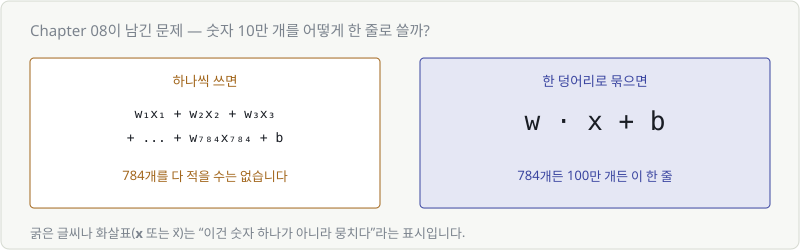
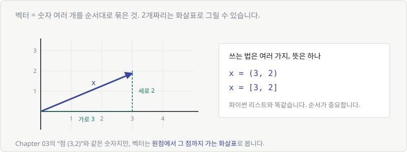
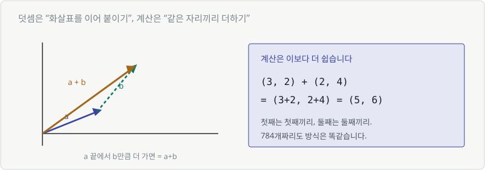
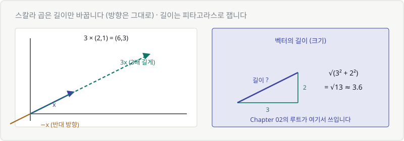
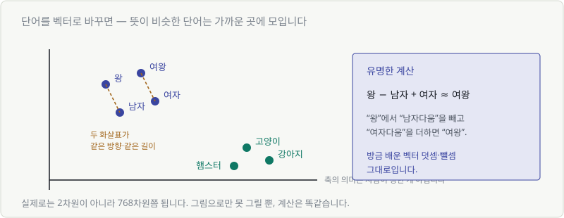

# Chapter 09. 벡터 — 숫자 여러 개를 한 덩어리로

> **이 장의 목표**
> Chapter 08이 남긴 숙제 — **"대문자 $W$는 뭔가?"** 의 절반을 풉니다.
> 그리고 "임베딩", "768차원 벡터" 같은 말이 무슨 뜻인지 알게 됩니다.

---

## 9.1 숫자 하나로는 부족하다

Chapter 05에서 뉴런 하나의 계산을 봤습니다.

$$
y = wx + b
$$

입력이 하나일 때 이야기입니다. 그런데 손글씨 숫자 인식만 해도 입력이 **784개**(28×28 픽셀)입니다.



$w_1x_1 + w_2x_2 + \cdots + w_{784}x_{784} + b$ 를 매번 적을 수는 없습니다.

> 🎯 **그래서 숫자 뭉치를 한 덩어리로 묶고, 이름 하나를 붙입니다.**
> 그 덩어리가 **벡터**입니다.

---

## 9.2 벡터 — 크기와 방향을 가진 화살표

**벡터 = 숫자 여러 개를 순서대로 묶은 것.**

숫자가 2개면 그림으로 그릴 수 있습니다.



$(3, 2)$ 는 "오른쪽으로 3, 위로 2 가는 화살표"입니다.

> 💬 **Chapter 03의 "점"과 뭐가 다른가요?**
> 숫자는 같습니다. 보는 관점이 다를 뿐입니다.
>
> | | 점 | 벡터 |
> |---|---|---|
> | 관심사 | **어디에 있나** | **어느 쪽으로 얼마나** |
> | 그림 | 점 하나 | 원점에서 뻗은 화살표 |
>
> 벡터로 보면 **방향**과 **길이**라는 두 가지 정보가 생깁니다. 이게 나중에 중요해집니다.

### 표기법

$$
\mathbf{x} = (3, 2) \qquad \text{또는} \qquad \mathbf{x} = [3, 2]
$$

굵은 글씨나 화살표($\vec{x}$)는 **"이건 숫자 하나가 아니라 뭉치다"** 라는 표시입니다.

파이썬으로는 그냥 리스트입니다.

```python
import numpy as np
x = np.array([3, 2])
```

**순서가 중요합니다.** $(3, 2)$와 $(2, 3)$은 다른 벡터입니다.

---

## 9.3 벡터를 좌표로 적기

3개, 4개, 768개도 똑같습니다. 그냥 나열합니다.

| 데이터 | 벡터 |
|---|---|
| 키 172, 몸무게 65 | $(172, 65)$ |
| RGB 색상 | $(255, 128, 0)$ |
| 28×28 흑백 이미지 | $(0, 0, 12, 255, ..., 3)$ — 784개 |
| 문장 임베딩 | 768개 숫자 |

Chapter 03에서 봤듯 **차원 = 숫자의 개수**입니다.
768차원 벡터는 그냥 **숫자 768개**입니다.

---

## 9.4 벡터의 덧셈과 뺄셈

계산은 놀랍도록 단순합니다. **같은 자리끼리 더합니다.**



$$
(3, 2) + (2, 4) = (3+2,\ 2+4) = (5, 6)
$$

그림으로는 **"화살표를 이어 붙이기"** 입니다.
$\mathbf{a}$ 만큼 간 다음, 그 끝에서 $\mathbf{b}$ 만큼 더 가면 도착하는 곳이 $\mathbf{a} + \mathbf{b}$.

뺄셈도 같습니다.

$$
(5, 6) - (2, 4) = (3, 2)
$$

```python
a = np.array([3, 2])
b = np.array([2, 4])
a + b    # array([5, 6])
```

784개짜리도 방식은 똑같습니다. 자리별로 더할 뿐입니다.

---

## 9.5 스칼라 곱 — 늘이고 줄이기

벡터에 **숫자 하나**를 곱하는 것을 스칼라 곱이라고 합니다.
(스칼라 = 그냥 숫자 하나, 벡터의 반대말)



$$
3 \times (2, 1) = (6, 3)
$$

모든 자리에 3을 곱합니다. 그림으로는 **화살표가 3배 길어집니다.**

| 곱하는 수 | 결과 |
|---|---|
| $3$ | 3배 길어짐, 방향 그대로 |
| $0.5$ | 절반으로 짧아짐, 방향 그대로 |
| $-1$ | 길이 그대로, **방향 반대** |

> 🔑 **핵심: 스칼라 곱은 방향을 바꾸지 않습니다** (음수는 정반대로 뒤집을 뿐)
>
> 이 성질이 Part 5에서 결정적으로 쓰입니다.
> "내리막 방향으로 **학습률만큼** 이동한다"가 바로 스칼라 곱이니까요.

---

## 9.6 벡터의 길이(크기)

화살표가 얼마나 긴지는 **피타고라스 정리**로 잽니다.

$$
|(3, 2)| = \sqrt{3^2 + 2^2} = \sqrt{13} \approx 3.6
$$

Chapter 02에서 배운 루트가 여기서 쓰입니다.
"제곱해서 더한 걸 다시 원래 단위로 되돌린다" — 그 자리입니다.

숫자가 많아져도 방식은 같습니다.

$$
|\mathbf{x}| = \sqrt{x_1^2 + x_2^2 + \cdots + x_n^2}
$$

```python
np.linalg.norm([3, 2])    # 3.605...
```

> 💬 **norm**이라는 단어를 자주 보게 됩니다. 벡터의 길이를 뜻합니다.
> "gradient norm이 커졌다" = **기울기 벡터가 길어졌다** (Part 5에서 만납니다)

---

## 9.7 단어를 벡터로 — 임베딩이란

이제 재미있는 부분입니다.

**단어를 숫자 뭉치로 바꾸면**, 컴퓨터가 단어의 의미를 다룰 수 있게 됩니다.
이 변환을 **임베딩(embedding)** 이라고 합니다.



핵심은 이겁니다.

> 🎯 **뜻이 비슷한 단어는 가까운 곳에 배치됩니다.**

"고양이"와 "강아지"는 가깝고, "고양이"와 "환율"은 멉니다.
축이 무엇을 뜻하는지는 **아무도 정해주지 않았습니다.** 학습하면서 저절로 그렇게 됩니다.

### 유명한 계산

$$
\text{왕} - \text{남자} + \text{여자} \approx \text{여왕}
$$

방금 배운 벡터 덧셈·뺄셈 그대로입니다.

"왕"에서 "남자다움"을 빼고 "여자다움"을 더하면 "여왕" 근처에 도착합니다.
**의미가 방향으로 표현된 것**입니다.

> 💬 실제로는 2차원이 아니라 768차원, 1536차원쯤 됩니다.
> 그림으로 못 그릴 뿐, 덧셈·뺄셈·길이 계산은 **완전히 똑같습니다.**

### 그런데 "가깝다"를 어떻게 재죠?

여기서 다음 장의 질문이 나옵니다.

두 벡터가 얼마나 닮았는지를 **숫자 하나**로 표현할 수 있어야
검색도, 추천도, RAG도 가능합니다.

> 그 도구가 **내적**입니다. Chapter 10에서 다룹니다.

---

## 💡 칼럼 — 3차원을 넘어가면 어떻게 상상할까

**상상하지 마세요.** 아무도 못 합니다.

수학자들도 4차원을 머릿속에 그리지 못합니다. 대신 이렇게 합니다.

> **2차원에서 성립한 규칙을 그대로 쓴다.**

| | 2차원 | 768차원 |
|---|---|---|
| 덧셈 | 자리별로 더함 | **자리별로 더함** |
| 길이 | $\sqrt{x_1^2+x_2^2}$ | $\sqrt{x_1^2+\cdots+x_{768}^2}$ |
| 가깝다 | 눈으로 보임 | 계산으로만 확인 |

**그림으로 이해하고, 개수만 늘리면 됩니다.**

굳이 비유하자면, 768차원 공간은 "질문이 768개인 설문지"입니다.
두 사람의 답이 대부분 비슷하면 → 가까운 사람.
그림은 안 그려져도 **비슷한 정도는 계산할 수 있죠.**

---

## ✅ 1분 확인

1. $(1, 5) + (4, 2)$ 는?
2. $2 \times (3, -1)$ 은?
3. $(3, 4)$ 의 길이는?
4. "768차원 임베딩"이란 무슨 뜻인가요?

<details>
<summary>답 보기</summary>

1. **$(5, 7)$** — 자리별로 더합니다.
2. **$(6, -2)$** — 모든 자리에 2를 곱합니다.
3. **5** — $\sqrt{3^2+4^2} = \sqrt{25} = 5$
4. 그 대상을 **숫자 768개로 표현했다**는 뜻입니다. 비슷한 것끼리 가까운 값을 갖도록 학습된 숫자들입니다.

</details>

---

| ⬅️ 이전 | 다음 ➡️ |
|---|---|
| [Chapter 08. 합성함수와 활성화 함수](../part2/ch08-composite-activation.md) | [Chapter 10. 내적 — '닮음'을 숫자로 재기](ch10-dot-product.md) |
