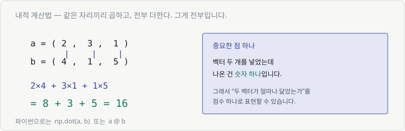
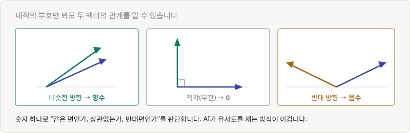
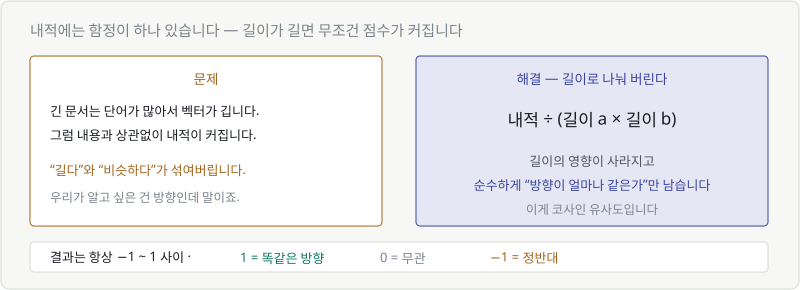
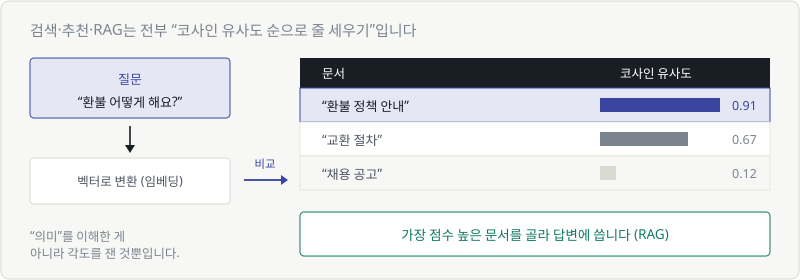

# Chapter 10. 내적 — '닮음'을 숫자로 재기

> **이 장의 목표**
> 두 벡터가 얼마나 닮았는지를 **숫자 하나**로 재는 법을 배웁니다.
> 검색, 추천, RAG가 전부 이 계산 위에서 돌아갑니다.

---

## 10.1 두 화살표가 얼마나 닮았는가

Chapter 09에서 단어를 벡터로 바꿨습니다. 그런데 "가깝다"를 어떻게 판단할까요?

눈으로는 보입니다. 그런데 768차원에서는 눈이 없습니다.
**숫자로 판단하는 방법**이 필요합니다.

> 🎯 이 장의 도구는 하나입니다. **내적(dot product)**.
> 벡터 두 개를 넣으면 **숫자 하나**가 나옵니다. 그 숫자가 "닮음 점수"입니다.

---

## 10.2 내적 계산법 — 곱해서 더한다

계산법부터 봅시다. 놀랍도록 간단합니다.



$$
(2, 3, 1) \cdot (4, 1, 5) = 2{\times}4 + 3{\times}1 + 1{\times}5 = 8 + 3 + 5 = 16
$$

> **같은 자리끼리 곱하고, 전부 더한다.**

수식으로는 이렇게 씁니다.

$$
\mathbf{a} \cdot \mathbf{b} = \sum_{i=1}^{n} a_i b_i
$$

Chapter 02에서 배운 $\sum$(전부 더하기)와 첨자가 여기 있습니다.
읽으면 **"에이 아이 곱하기 비 아이를, 아이가 1부터 엔까지 전부 더한 것."**

```python
np.dot(a, b)    # 또는
a @ b
```

### 결과가 숫자 하나라는 게 핵심

벡터 두 개(각각 768개 숫자)를 넣었는데 나온 건 **숫자 하나**입니다.

그래서 "이 문서가 질문과 얼마나 관련 있나"를 **점수 하나로 줄 세울 수 있습니다.**

---

## 10.3 내적의 부호가 말해 주는 것

내적 값이 얼마인지보다, 먼저 **부호**를 보세요.



| 두 벡터의 관계 | 내적 |
|---|---|
| 비슷한 방향 | **양수** (클수록 더 비슷) |
| 직각 (아무 관계 없음) | **0** |
| 반대 방향 | **음수** |

### 왜 이렇게 되는지

계산으로 확인해 봅시다.

| $\mathbf{a}$ | $\mathbf{b}$ | 내적 | 관계 |
|---|---|---|---|
| $(1, 1)$ | $(2, 2)$ | $2 + 2 = 4$ | 같은 방향 → 양수 |
| $(1, 0)$ | $(0, 1)$ | $0 + 0 = 0$ | 직각 → 0 |
| $(1, 1)$ | $(-1, -1)$ | $-1 - 1 = -2$ | 반대 → 음수 |

같은 자리의 부호가 **둘 다 양수거나 둘 다 음수면** 곱해서 양수가 됩니다.
한쪽만 음수면 곱해서 음수. Chapter 02의 부호 규칙 그대로입니다.

> 💬 **"직교한다(orthogonal)"** 는 말을 AI 문서에서 자주 봅니다.
> 내적이 0이라는 뜻이고, 일상어로는 **"서로 아무 상관 없다"** 입니다.

---

## 10.4 각도와 내적의 관계

내적에는 또 하나의 얼굴이 있습니다.

$$
\mathbf{a} \cdot \mathbf{b} = |\mathbf{a}| \times |\mathbf{b}| \times \cos\theta
$$

$\cos$(코사인)은 부록 B에서 다루니 지금은 이렇게만 알아두세요.

> **$\cos\theta$ 는 "두 화살표가 얼마나 같은 방향인가"를 −1 ~ 1로 나타내는 숫자입니다.**

| 각도 | $\cos\theta$ |
|---|---|
| 0° (똑같은 방향) | 1 |
| 90° (직각) | 0 |
| 180° (정반대) | −1 |

즉 내적은 이렇게 분해됩니다.

$$
\text{내적} = \underbrace{\text{길이}_a \times \text{길이}_b}_{\text{얼마나 큰가}} \times \underbrace{\cos\theta}_{\text{얼마나 같은 방향인가}}
$$

**그리고 여기에 문제가 하나 숨어 있습니다.**

---

## 10.5 코사인 유사도



### 문제: 길이가 끼어듭니다

긴 문서는 단어가 많아서 벡터가 깁니다.
그러면 **내용과 상관없이 내적이 커집니다.**

우리가 알고 싶은 건 "방향이 같은가"인데, "길이가 긴가"가 섞여버린 겁니다.

### 해결: 길이로 나눠 버립니다

$$
\text{cosine similarity} = \frac{\mathbf{a} \cdot \mathbf{b}}{|\mathbf{a}| \times |\mathbf{b}|} = \cos\theta
$$

내적을 두 벡터의 길이로 나누면 길이의 영향이 사라지고 $\cos\theta$ 만 남습니다.
**순수하게 방향만 비교**하게 됩니다.

이게 **코사인 유사도**입니다.

| 값 | 뜻 |
|---|---|
| **1** | 완전히 같은 방향 (매우 유사) |
| **0** | 무관 |
| **−1** | 정반대 |

> 🔑 **한 문장 요약**
> 코사인 유사도 = **길이를 무시하고 방향만 본 내적.**
> 결과가 항상 −1~1 사이라서 서로 비교하기 편합니다.

```python
from numpy import dot
from numpy.linalg import norm

cos_sim = dot(a, b) / (norm(a) * norm(b))
```

---

## 10.6 검색과 추천은 이걸로 돌아갑니다

이제 실제 시스템을 봅시다.



**"환불 어떻게 해요?"** 라고 물었을 때 일어나는 일:

1. 질문을 **벡터로 변환** (임베딩)
2. 문서 수천 개의 벡터와 **각각 코사인 유사도 계산**
3. **점수 높은 순으로 정렬**
4. 상위 몇 개를 골라 답변 생성에 사용

이게 **RAG(검색 증강 생성)** 의 핵심 동작입니다.

| 시스템 | 무엇과 무엇을 비교하나 |
|---|---|
| 문서 검색 | 질문 벡터 ↔ 문서 벡터 |
| 상품 추천 | 내 취향 벡터 ↔ 상품 벡터 |
| 유사 이미지 | 이미지 벡터 ↔ 이미지 벡터 |
| 얼굴 인식 | 찍은 얼굴 ↔ 등록된 얼굴 |

전부 **같은 계산**입니다.

> ⚠️ **오해하기 쉬운 점**
> AI가 "의미를 이해해서" 찾아주는 게 아닙니다.
> **각도를 잰 것**뿐입니다.
>
> 다만 그 벡터를 만드는 임베딩 모델이 워낙 잘 학습돼 있어서,
> 각도를 재는 것만으로도 의미가 통하는 결과가 나옵니다.

### 뉴런의 계산도 내적입니다

Chapter 05로 잠깐 돌아가 봅시다.

$$
w_1x_1 + w_2x_2 + w_3x_3 + b
$$

앞부분이 정확히 **내적**입니다.

$$
\mathbf{w} \cdot \mathbf{x} + b
$$

> 🎯 **뉴런 하나가 하는 일 = 입력 벡터와 가중치 벡터의 내적**
>
> 즉 뉴런은 **"이 입력이 내가 찾는 패턴과 얼마나 닮았는가"** 를 재고 있는 겁니다.
> 닮았으면 큰 값이 나오고, 아니면 작은 값이 나옵니다.
>
> Chapter 08에서 배운 ReLU가 그다음에 와서 **"충분히 안 닮았으면 0으로 꺼버립니다."**

---

## 💡 칼럼 — 길이를 1로 맞추면 편해진다

벡터를 **길이 1**로 만드는 걸 **정규화(normalize)** 라고 합니다.
방법은 간단합니다. 자기 길이로 나누면 됩니다.

$$
\hat{\mathbf{a}} = \frac{\mathbf{a}}{|\mathbf{a}|}
$$

예: $(3, 4)$ 는 길이가 5이므로 → $(0.6, 0.8)$. 이제 길이가 1입니다.

### 왜 이렇게 하나

**모든 벡터의 길이가 1이면, 내적이 곧 코사인 유사도가 됩니다.**

$$
\cos\theta = \frac{\mathbf{a} \cdot \mathbf{b}}{1 \times 1} = \mathbf{a} \cdot \mathbf{b}
$$

나눗셈이 사라지죠. 문서 100만 개를 검색해야 한다면 이 차이가 큽니다.

> 그래서 실제 벡터 DB(Pinecone, Chroma 등)는 저장할 때 미리 정규화해 둡니다.
> 검색할 때는 곱하고 더하기만 하면 되니까요.

---

## ✅ 1분 확인

1. $(1, 2, 3) \cdot (4, 0, 1)$ 은?
2. 두 벡터의 내적이 0이면 무슨 뜻인가요?
3. 코사인 유사도가 내적과 다른 점은?
4. 뉴런 하나의 계산 `w₁x₁ + w₂x₂ + b` 에서, 앞부분은 무엇인가요?

<details>
<summary>답 보기</summary>

1. **7** — $1{\times}4 + 2{\times}0 + 3{\times}1 = 4 + 0 + 3$
2. **서로 무관하다**(직각)는 뜻입니다.
3. **길이의 영향을 없앴습니다.** 방향만 비교하며, 항상 −1~1 사이입니다.
4. **내적** $\mathbf{w} \cdot \mathbf{x}$ 입니다. 뉴런은 입력이 가중치 패턴과 얼마나 닮았는지를 재고 있습니다.

</details>

---

| ⬅️ 이전 | 다음 ➡️ |
|---|---|
| [Chapter 09. 벡터](ch09-vector.md) | [Chapter 11. 행렬과 행렬 곱](ch11-matrix.md) |
