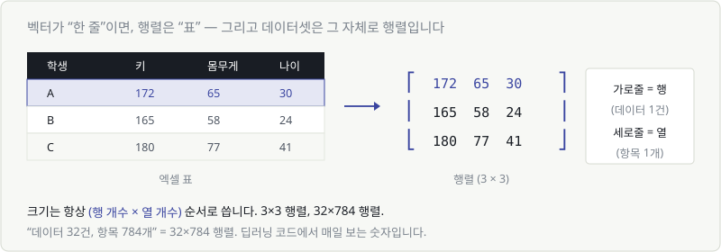
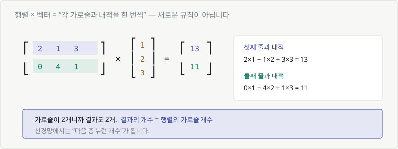
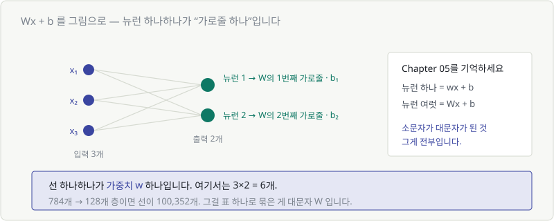
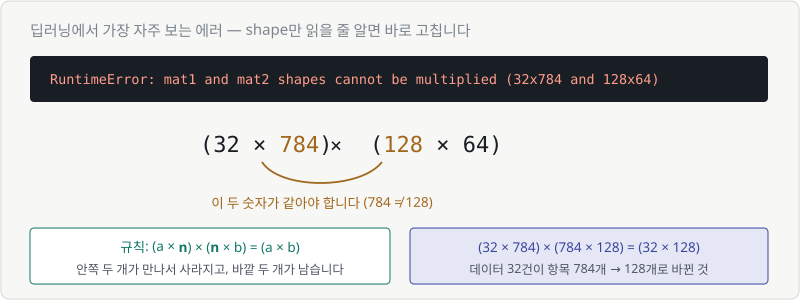

# Chapter 11. 행렬과 행렬 곱 — 신경망 한 층의 정체

> **이 장의 목표**
> Chapter 08이 남긴 숙제를 **완전히** 끝냅니다. 대문자 $W$의 정체를 밝히고,
> $Wx + b$ 가 그림으로 무슨 일을 하는지 봅니다.
>
> 덤으로, 딥러닝에서 가장 자주 만나는 **shape 에러**를 읽을 수 있게 됩니다.

---

## 11.1 행렬 — 숫자를 표로 묶기

벡터가 **한 줄**이면, 행렬은 **표**입니다.



$$
W = \begin{bmatrix} 172 & 65 & 30 \\ 165 & 58 & 24 \\ 180 & 77 & 41 \end{bmatrix}
$$

용어는 두 개뿐입니다.

| 용어 | 뜻 |
|---|---|
| **행** (row) | 가로줄 |
| **열** (column) | 세로줄 |

크기는 항상 **(행 × 열)** 순서로 씁니다. 위 행렬은 **3×3**입니다.

> ⚠️ 순서를 헷갈리면 계산이 전부 틀어집니다. **행이 먼저, 열이 나중.**
> "32×784" = 가로줄 32개, 세로줄 784개.

---

## 11.2 데이터셋은 그 자체로 행렬입니다

Chapter 03의 표를 다시 보세요. 그게 바로 행렬입니다.

| | 한 개 | 여러 개 |
|---|---|---|
| 데이터 1건 | **벡터** (숫자 여러 개) | |
| 데이터 여러 건 | | **행렬** (벡터를 쌓은 것) |

- **한 줄(행)** = 데이터 1건 (학생 한 명, 이미지 한 장)
- **한 칸(열)** = 항목 1개 (키, 픽셀 3번)

그래서 딥러닝 코드에서 이런 걸 매일 보게 됩니다.

```python
x.shape    # (32, 784)
```

> **"이미지 32장이 들어왔고, 각각 784개 픽셀로 표현돼 있다."**

여기서 32는 **배치 크기(batch size)** 입니다. 한 번에 처리하는 데이터 개수죠.

---

## 11.3 행렬과 벡터의 곱

이제 계산입니다. **새로운 규칙은 없습니다.** Chapter 10의 내적을 반복할 뿐입니다.



$$
\begin{bmatrix} 2 & 1 & 3 \\ 0 & 4 & 1 \end{bmatrix}
\times
\begin{bmatrix} 1 \\ 2 \\ 3 \end{bmatrix}
=
\begin{bmatrix} 13 \\ 11 \end{bmatrix}
$$

- 첫째 줄과 내적: $2{\times}1 + 1{\times}2 + 3{\times}3 = 13$
- 둘째 줄과 내적: $0{\times}1 + 4{\times}2 + 1{\times}3 = 11$

> 🎯 **행렬 × 벡터 = 가로줄마다 내적을 한 번씩**

그리고 결과의 개수가 정해집니다.

> **결과의 개수 = 행렬의 가로줄 개수**

가로줄이 2개니까 결과도 2개. 이게 신경망에서는 **"다음 층 뉴런 개수"** 가 됩니다.

---

## 11.4 행렬 곱을 그림으로 완전 정복

행렬 × 행렬도 똑같습니다. 오른쪽 행렬의 **세로줄 하나하나**를 벡터로 보고 반복합니다.

$$
(a \times \mathbf{n}) \times (\mathbf{n} \times b) = (a \times b)
$$

**규칙 한 줄로 정리하면:**

> 🔑 **안쪽 두 숫자가 같아야 하고, 만나면 사라집니다. 바깥 두 개가 결과 크기입니다.**

예를 들어:

| 계산 | 결과 | 가능? |
|---|---|---|
| (3×**4**) × (**4**×2) | (3×2) | ✅ |
| (32×**784**) × (**784**×128) | (32×128) | ✅ |
| (3×**4**) × (**5**×2) | — | ❌ 4 ≠ 5 |

> ⚠️ **행렬 곱은 순서를 바꾸면 안 됩니다.**
> 숫자는 $3 \times 5 = 5 \times 3$ 이지만, 행렬은 $AB \neq BA$ 입니다.
> 애초에 크기가 안 맞아서 계산 자체가 안 되는 경우가 대부분입니다.

---

## 11.5 $Wx + b$ — 신경망 한 층

이제 Chapter 08의 그 수식을 완전히 이해할 수 있습니다.



신경망 그림에서 **선 하나하나가 가중치 $w$ 하나**입니다.

입력 3개 → 출력 2개인 층이면 선이 $3 \times 2 = 6$개.
이 6개를 표로 묶은 게 **대문자 $W$** 입니다.

$$
\underbrace{\mathbf{w} \cdot x + b}_{\text{뉴런 하나 (Chapter 05)}}
\qquad \longrightarrow \qquad
\underbrace{W\mathbf{x} + \mathbf{b}}_{\text{뉴런 여러 개 (지금)}}
$$

> 🎉 **소문자가 대문자가 된 것. 그게 전부입니다.**

### 규모 감각

| 층 | $W$의 크기 | 가중치 개수 |
|---|---|---|
| 784 → 128 | 128×784 | 100,352개 |
| 128 → 10 | 10×128 | 1,280개 |

이걸 하나씩 쓸 수는 없으니 표로 묶었고, 표에 이름을 붙인 게 $W$입니다.
**"파라미터 700억 개"** 라는 말도 결국 이 표들의 칸을 전부 센 숫자입니다.

---

## 11.6 층을 여러 개 쌓으면

Chapter 08의 완성형 수식을 다시 봅시다.

$$
y = \text{softmax}\left(W^{(2)} \cdot \text{ReLU}(W^{(1)}\mathbf{x} + \mathbf{b}^{(1)}) + \mathbf{b}^{(2)}\right)
$$

이제 각 부분의 **크기**까지 읽을 수 있습니다.

| 단계 | 계산 | shape 변화 |
|---|---|---|
| 입력 | $\mathbf{x}$ | (32, 784) |
| 1층 | $W^{(1)}\mathbf{x} + \mathbf{b}^{(1)}$ | (32, 784) → **(32, 128)** |
| 활성화 | $\text{ReLU}(\cdots)$ | (32, 128) 그대로 |
| 2층 | $W^{(2)}(\cdots) + \mathbf{b}^{(2)}$ | (32, 128) → **(32, 10)** |
| 출력 | $\text{softmax}(\cdots)$ | (32, 10) 그대로 |

> 💡 **활성화 함수는 shape를 바꾸지 않습니다.**
> 값만 구부릴 뿐, 개수는 그대로입니다. 크기를 바꾸는 건 항상 $W$ 입니다.

마지막 (32, 10)의 뜻은 이렇습니다.
**"이미지 32장 각각에 대해, 0~9 열 개 숫자의 확률."**

```python
model = nn.Sequential(
    nn.Linear(784, 128),   # W⁽¹⁾ : 128×784
    nn.ReLU(),
    nn.Linear(128, 10),    # W⁽²⁾ : 10×128
)
```

PyTorch 코드와 수식이 **한 줄씩 정확히 대응**합니다.

---

## 11.7 shape 읽는 법과 차원 오류 메시지

딥러닝을 하면 반드시, 아주 자주 만나게 되는 에러입니다.



```
RuntimeError: mat1 and mat2 shapes cannot be multiplied (32x784 and 128x64)
```

무섭게 생겼지만 읽는 법은 하나입니다.

> **가운데 두 숫자를 보세요.** `32x`**`784`** 와 **`128`**`x64` → 784 ≠ 128 → 못 곱합니다.

고치는 법도 명확합니다. **두 번째 행렬의 첫 숫자를 784로 바꾸면 됩니다.**

```python
nn.Linear(784, 64)   # ✅  앞 층의 출력과 맞춤
```

| 에러 원인 | 증상 |
|---|---|
| 앞 층 출력 ≠ 뒤 층 입력 | 가운데 숫자 불일치 |
| 배치 차원을 빼먹음 | (784,) 와 (784, 128) — 차원 개수 자체가 다름 |
| 전치를 안 함 | 숫자가 뒤집혀 있음 |

> 🎯 **이 에러를 읽을 수 있으면 딥러닝 디버깅의 절반이 끝납니다.**
> 실제로 초보자 시간의 상당 부분이 여기서 소모되거든요.

---

## 💡 칼럼 — 전치(transpose)가 필요한 순간

**전치**는 행렬을 대각선 기준으로 뒤집는 것입니다. 행과 열이 바뀝니다.

$$
\begin{bmatrix} 1 & 2 & 3 \\ 4 & 5 & 6 \end{bmatrix}^T
=
\begin{bmatrix} 1 & 4 \\ 2 & 5 \\ 3 & 6 \end{bmatrix}
$$

(2×3) 이 (3×2) 가 됐습니다. 오른쪽 위 작은 $T$ 가 전치 기호입니다.

### 언제 쓰나

**크기가 안 맞을 때**입니다.

(32×784) × (128×784) 는 곱할 수 없습니다(784 ≠ 128).
그런데 뒤엣것을 전치하면 (784×128) 이 되어 계산이 됩니다.

```python
x @ W.T      # 자주 보는 패턴
```

> 💬 논문에서 $W^T\mathbf{x}$ 처럼 T가 붙어 있는 걸 자주 봅니다.
> **"크기를 맞추려고 뒤집었구나"** 정도로 읽고 넘어가면 됩니다.
> 하는 일은 여전히 곱하고 더하기입니다.

---

## ✅ 1분 확인

1. (5×3) 행렬과 (3×2) 행렬을 곱하면 결과 크기는?
2. (4×6) 과 (4×6) 은 곱할 수 있나요?
3. `x.shape = (64, 512)` 는 무슨 뜻인가요?
4. ReLU를 통과하면 shape가 바뀌나요?

<details>
<summary>답 보기</summary>

1. **(5×2)** — 안쪽 3이 사라지고 바깥 5와 2가 남습니다.
2. **아니요** — 안쪽 숫자가 6과 4로 다릅니다. 뒤엣것을 전치해 (6×4)로 만들면 가능합니다.
3. **데이터 64건, 각각 항목 512개** 입니다.
4. **안 바뀝니다** — 값만 구부릴 뿐입니다. shape를 바꾸는 건 항상 $W$ 입니다.

</details>

---

## 🎉 Part 3 완료

Chapter 08이 남긴 숙제를 다 풀었습니다.

- ✅ **벡터** = 숫자 여러 개를 한 덩어리로
- ✅ **내적** = 곱해서 더하기, 결과는 숫자 하나 (닮음 점수)
- ✅ **코사인 유사도** = 길이 빼고 방향만 — 검색·추천·RAG의 엔진
- ✅ **행렬** = 벡터를 쌓은 표, 데이터셋 그 자체
- ✅ **대문자 $W$** = 가중치를 전부 담은 표
- ✅ **shape 에러**를 읽고 고칠 수 있음

그리고 뉴런의 정체도 드러났습니다.

> **뉴런 하나 = 입력과 가중치의 내적.**
> 즉 "이 입력이 내가 찾는 패턴과 얼마나 닮았는가"를 재는 장치입니다.

### 남은 숙제 하나

Part 2에서 골짜기를 만들었고, Part 3에서 그릇을 만들었습니다.
이제 **딱 하나** 남았습니다.

> 🚨 **$W$ 안의 숫자 10만 개를, 대체 어떻게 정하지?**
>
> 전부 시도해 볼 수는 없습니다. 골짜기 바닥으로 **내려가는 방법**이 필요합니다.
> 그 도구가 **미분**입니다.

다음은 Part 4(확률과 통계)입니다. AI의 출력값을 읽는 법을 먼저 배우고,
Part 5에서 드디어 골짜기를 내려갑니다.

---

| ⬅️ 이전 | 다음 ➡️ |
|---|---|
| [Chapter 10. 내적](ch10-dot-product.md) | Chapter 12. 경우의 수 *(집필 예정)* |
