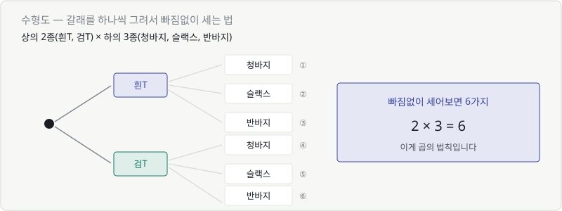
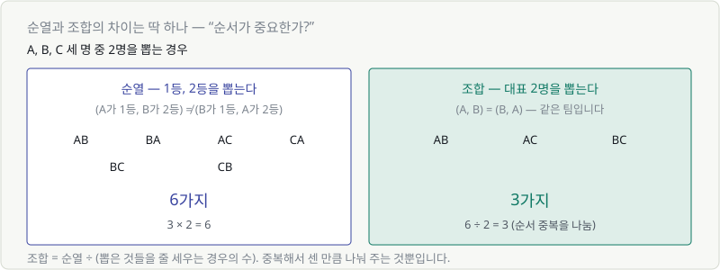
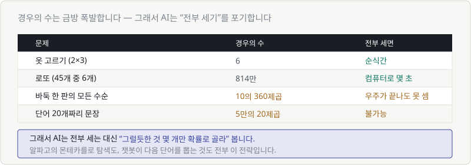

# Chapter 12. 경우의 수 — 세는 법부터

> **이 장의 목표**
> 확률을 배우기 전 준비운동입니다. **"몇 가지가 가능한가"** 를 빠짐없이 세는 법을 익힙니다.
> 그리고 이 숫자가 왜 금방 폭발하는지, AI가 그때 무엇을 포기하는지 봅니다.

---

## 12.1 가짓수를 세어 봅시다

확률을 구하려면 먼저 **전체가 몇 가지인지** 알아야 합니다.

> 확률 = 원하는 경우의 수 ÷ **전체 경우의 수**

분모를 모르면 확률을 못 구합니다. 그래서 세는 법부터 배웁니다.

---

## 12.2 수형도

가장 확실한 방법은 **가지를 그려서 하나씩 세는 것**입니다.

상의 2종(흰T, 검T), 하의 3종(청바지, 슬랙스, 반바지)으로 입을 수 있는 조합은?



가지를 따라가면 **6가지**입니다. 빠뜨린 것도, 중복도 없습니다.

> 💬 프로그래밍의 **이중 for 루프**와 같은 구조입니다.
> ```python
> for top in ["흰T", "검T"]:
>     for bottom in ["청바지", "슬랙스", "반바지"]:
>         print(top, bottom)   # 6줄 출력
> ```

---

## 12.3 수형도의 한계

수형도는 확실하지만 금방 못 쓰게 됩니다.

상의 5종, 하의 5종, 신발 5종, 모자 5종이면? 가지가 **625개**입니다.
종이에 그릴 수가 없습니다.

> 🎯 그래서 **그리지 않고 계산하는 법**이 필요합니다.

---

## 12.4 곱의 법칙

수형도를 자세히 보면 규칙이 보입니다.

- 상의를 고르는 방법: 2가지
- 그 각각에 대해 하의를 고르는 방법: 3가지
- 전체: $2 \times 3 = 6$

> 🔑 **곱의 법칙: 단계별 선택지를 전부 곱한다.**

| 상황 | 계산 | 결과 |
|---|---|---|
| 상의 2 × 하의 3 | $2 \times 3$ | 6 |
| 상의 5 × 하의 5 × 신발 5 × 모자 5 | $5^4$ | 625 |
| 4자리 비밀번호 (0~9) | $10^4$ | 10,000 |
| 8자리 영소문자 비밀번호 | $26^8$ | 약 2,090억 |

Chapter 07에서 배운 **거듭제곱**이 여기서 등장합니다.
같은 선택을 반복하면 거듭제곱이 됩니다.

> 💬 비밀번호를 길게 만들라는 이유가 이겁니다.
> 한 자리 늘릴 때마다 경우의 수가 **26배**가 됩니다. 지수함수니까요.

---

## 12.5~12.6 순열과 조합

같은 "뽑기"인데 답이 다른 두 상황이 있습니다.



A, B, C 세 명 중 2명을 뽑을 때:

### 순열 — 순서가 중요할 때

**1등과 2등을 뽑는다면** (A가 1등, B가 2등) ≠ (B가 1등, A가 2등)입니다. 다른 결과죠.

$$
3 \times 2 = 6 \text{가지}
$$

첫 번째 자리에 3명 중 아무나, 두 번째 자리엔 남은 2명 중 아무나. 곱의 법칙 그대로입니다.

### 조합 — 순서가 상관없을 때

**대표 2명을 뽑는다면** (A, B)와 (B, A)는 **같은 팀**입니다.

$$
\frac{6}{2} = 3 \text{가지}
$$

순열로 세면 각 조합을 2번씩 중복해서 셌으니, 그만큼 나눠줍니다.

> 🔑 **딱 하나만 물어보면 됩니다: "순서가 중요한가?"**
>
> | 질문 | 답 | 쓰는 것 |
> |---|---|---|
> | 1등/2등 뽑기 | 순서 중요 | 순열 |
> | 대표 2명 뽑기 | 순서 무관 | 조합 |
> | 비밀번호 만들기 | 순서 중요 | 순열 |
> | 로또 번호 6개 | 순서 무관 | 조합 |

### 기호

교재에서는 이렇게 씁니다. (지금은 얼굴만 익혀도 됩니다)

$$
{}_n P_r \quad \text{(순열)} \qquad {}_n C_r \quad \text{(조합)}
$$

$P$는 Permutation, $C$는 Combination입니다.
$_5C_2$는 **"5개 중 2개를 순서 없이 뽑는 경우의 수"** 라고 읽습니다.

```python
from math import perm, comb
perm(5, 2)   # 20  (순열)
comb(5, 2)   # 10  (조합)
```

---

## 12.7 가짓수가 폭발할 때 AI가 택하는 길

여기서부터가 이 장의 진짜 이야기입니다.



| 문제 | 경우의 수 | 전부 세면 |
|---|---|---|
| 옷 고르기 | 6 | 순식간 |
| 로또 (45개 중 6개) | 814만 | 컴퓨터로 몇 초 |
| 바둑 한 판의 모든 수순 | $10^{360}$ | **우주가 끝나도 못 셈** |
| 단어 20개짜리 문장 | $50000^{20}$ | **불가능** |

우주에 있는 원자 수가 약 $10^{80}$개입니다. 바둑은 그보다 훨씬 큽니다.

### 그래서 AI는 세는 걸 포기합니다

> 🎯 **AI의 전략: 전부 세지 않고, "그럴듯한 것 몇 개"만 확률로 골라 본다.**

| AI | 전부 센다면 | 실제로 하는 일 |
|---|---|---|
| 알파고 | 모든 수순 계산 | 유망한 수만 확률적으로 탐색 |
| 챗봇 | 모든 문장 비교 | 다음 단어 하나씩 확률로 뽑기 |
| 추천 시스템 | 모든 조합 평가 | 상위 몇 개만 계산 |

챗봇이 문장을 만드는 방식을 보면 명확합니다.
$50000^{20}$개 문장을 비교하는 게 아니라, **다음 단어 하나를 확률로 뽑는 것을 20번 반복**합니다.

> 💬 그래서 같은 질문에 매번 다른 답이 나옵니다.
> "계산해서 최선을 고른 것"이 아니라 **"확률에 따라 뽑은 것"** 이니까요.
>
> 이 이야기는 다음 장(13.7 temperature)에서 이어집니다.

---

## 💡 칼럼 — 게임과 경우의 수

경우의 수의 크기가 게임 AI의 난이도를 결정했습니다.

| 게임 | 대략적인 경우의 수 | AI가 인간을 이긴 해 |
|---|---|---|
| 오목 | $10^{105}$ | 1990년대 |
| 체스 | $10^{120}$ | 1997년 (딥블루) |
| 바둑 | $10^{360}$ | 2016년 (알파고) |

체스와 바둑은 20년 차이가 납니다. 규칙이 더 어려워서가 아니라 **경우의 수가 훨씬 커서**입니다.

딥블루는 사실상 "많이 세는" 방식이었습니다. 초당 2억 수를 계산했죠.
그런데 바둑에서는 그 방법이 통하지 않았습니다. 아무리 빨라도 $10^{360}$은 셀 수 없으니까요.

알파고가 바꾼 것은 이겁니다.

> **"전부 세지 말고, 어디를 볼지 신경망에게 물어보자."**

경우의 수의 벽 앞에서, 세는 대신 **확률로 감을 잡는 쪽**을 택한 것입니다.
그게 지금 AI의 기본 전략이 됐습니다.

---

## ✅ 1분 확인

1. 동전을 3번 던질 때 나올 수 있는 결과는 몇 가지인가요?
2. 5명 중 회장과 부회장을 뽑는 것은 순열인가요, 조합인가요?
3. 로또 번호를 고르는 것은?
4. AI가 경우의 수가 너무 클 때 택하는 전략은?

<details>
<summary>답 보기</summary>

1. **8가지** — $2 \times 2 \times 2 = 2^3$
2. **순열** — 회장과 부회장은 다른 자리이므로 순서가 중요합니다.
3. **조합** — 뽑힌 6개 번호의 순서는 상관없습니다.
4. **전부 세지 않고, 확률에 따라 그럴듯한 것 몇 개만 골라 봅니다.**

</details>

---

| ⬅️ 이전 | 다음 ➡️ |
|---|---|
| [Chapter 11. 행렬과 행렬 곱](../part3/ch11-matrix.md) | [Chapter 13. 확률과 기댓값](ch13-probability.md) |
