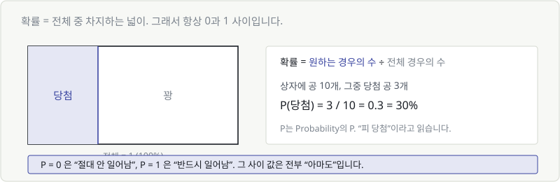
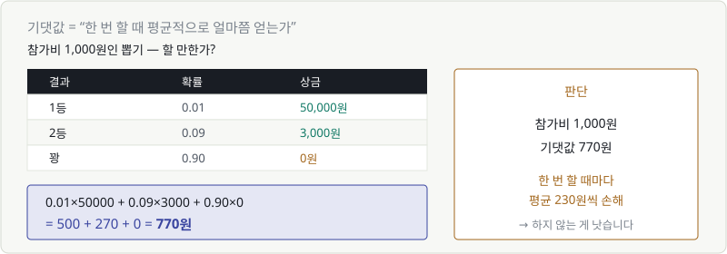
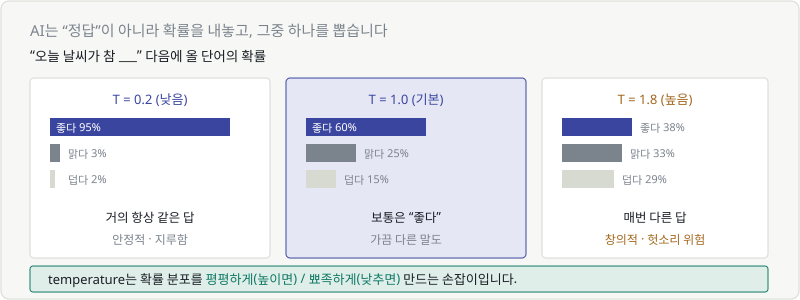

# Chapter 13. 확률과 기댓값

> **이 장의 목표**
> AI가 내놓는 숫자가 왜 "정답"이 아니라 **확률**인지 이해합니다.
> 그리고 `temperature` 라는 설정값이 실제로 무엇을 조절하는지 보게 됩니다.

---

## 13.1 확률 — 넓이로 이해하기

확률은 **전체 중에서 차지하는 비율**입니다. 넓이로 생각하면 쉽습니다.

$$
P(\text{사건}) = \frac{\text{원하는 경우의 수}}{\text{전체 경우의 수}}
$$

상자에 공 10개, 그중 당첨 공이 3개면:

$$
P(\text{당첨}) = \frac{3}{10} = 0.3 = 30\%
$$

$P$는 Probability의 P입니다. $P(\text{당첨})$은 **"피 당첨"** 이라고 읽습니다.

> 🔑 **확률은 항상 0과 1 사이입니다.**
> - $P = 0$ → 절대 안 일어남
> - $P = 1$ → 반드시 일어남
> - 그 사이 → 전부 "아마도"

Chapter 08에서 소프트맥스가 **"합이 1이 되도록"** 만들었던 이유가 이것입니다.
확률이 되려면 전체가 1이어야 하니까요.

---

## 13.2 확률을 계산하는 법

Chapter 12에서 배운 경우의 수가 그대로 쓰입니다.

**주사위 하나를 던져 3 이상이 나올 확률은?**

- 전체: 6가지 (1,2,3,4,5,6)
- 원하는 경우: 4가지 (3,4,5,6)
- $P = 4/6 = 2/3 \approx 0.67$

**동전 3번을 던져 전부 앞면일 확률은?**

- 전체: $2^3 = 8$가지
- 원하는 경우: 1가지
- $P = 1/8 = 0.125$

---

## 13.3 곱의 법칙과 덧셈

확률 계산에서 기억할 규칙은 두 개뿐입니다.

### "그리고" → 곱하기

$$
P(A \text{ 그리고 } B) = P(A) \times P(B) \quad \text{(서로 영향 없을 때)}
$$

동전 앞면 2번 연속: $0.5 \times 0.5 = 0.25$

### "또는" → 더하기

$$
P(A \text{ 또는 } B) = P(A) + P(B) \quad \text{(동시에 일어날 수 없을 때)}
$$

주사위에서 1 또는 6: $\frac{1}{6} + \frac{1}{6} = \frac{2}{6}$

> ⚠️ **곱하면 반드시 작아집니다.**
> 0.5 × 0.5 = 0.25. 1보다 작은 수끼리 곱하니 당연합니다.
>
> 이걸 100번 반복하면? 거의 0이 됩니다.
> **Chapter 07에서 로그를 씌운 이유**가 바로 이 문제였습니다.

---

## 13.4~13.5 기댓값 — '평균적으로 얼마쯤'

**기댓값**은 "한 번 할 때 평균적으로 얼마를 얻는가"입니다.

참가비 1,000원인 뽑기가 있습니다. 할 만할까요?

| 결과 | 확률 | 상금 |
|---|---|---|
| 1등 | 0.01 | 50,000원 |
| 2등 | 0.09 | 3,000원 |
| 꽝 | 0.90 | 0원 |

**계산법: (확률 × 값)을 전부 더한다.**

$$
0.01 \times 50000 + 0.09 \times 3000 + 0.90 \times 0 = 500 + 270 + 0 = 770
$$

기댓값은 **770원**. 참가비가 1,000원이니 **한 번 할 때마다 평균 230원씩 손해**입니다.

> 💬 "한 번 하면 770원 받는다"는 뜻이 아닙니다.
> 50,000원을 받거나, 3,000원을 받거나, 0원을 받습니다. 770원은 나올 수 없는 값이죠.
>
> **수천 번 반복하면 평균이 770원에 가까워진다**는 뜻입니다.

수식으로 쓰면 이렇습니다.

$$
E[X] = \sum_{i} p_i x_i
$$

Chapter 02에서 배운 $\sum$이 여기 있습니다. 읽으면 **"확률 곱하기 값을, 전부 더한 것."**

> 🔗 이 형태를 잘 봐 두세요. **크로스엔트로피 손실도 정확히 이 모양**입니다.
> Chapter 21에서 해부합니다.

---

## 13.6 AI의 출력은 정답이 아니라 확률입니다

이제 이 장의 핵심입니다.

Chapter 08에서 소프트맥스를 배웠습니다. 모델의 출력은 이렇게 생겼습니다.

| | 고양이 | 강아지 | 새 |
|---|---|---|---|
| 확률 | 65.9% | 24.2% | 9.9% |

> 🎯 **모델은 "고양이다"라고 말하지 않습니다. "고양이일 확률이 66%"라고 말합니다.**

"고양이"라는 답은 **우리가** 가장 높은 걸 골라서 붙인 것입니다.

이 구분이 실무에서 중요합니다.

| 출력 | 해석 | 대응 |
|---|---|---|
| 고양이 99% | 모델이 확신함 | 그대로 써도 됨 |
| 고양이 41%, 강아지 39% | **모델도 헷갈림** | 사람이 확인해야 함 |

> 💬 의료 진단이나 금융 심사처럼 중요한 영역에서는
> **"확률이 애매하면 사람에게 넘긴다"** 는 규칙을 넣습니다.
> 그게 가능한 이유가 모델의 출력이 확률이기 때문입니다.

---

## 13.7 확률을 조절하는 손잡이 — temperature

챗봇 API를 써 봤다면 `temperature` 라는 설정을 봤을 겁니다. 이게 뭘 하는 걸까요?

"오늘 날씨가 참 ___" 다음에 올 단어의 확률이 이렇다고 합시다.

| temperature | 좋다 | 맑다 | 덥다 | 결과 |
|---|---|---|---|---|
| **0.2 (낮음)** | 95% | 3% | 2% | 거의 항상 같은 답 |
| **1.0 (기본)** | 60% | 25% | 15% | 보통은 "좋다", 가끔 다른 말 |
| **1.8 (높음)** | 38% | 33% | 29% | 매번 다른 답 |

> 🔑 **temperature는 확률 분포를 뾰족하게(낮추면) / 평평하게(높이면) 만드는 손잡이입니다.**

| 값 | 성격 | 쓰는 곳 |
|---|---|---|
| 낮음 (0~0.3) | 안정적, 반복적 | 코드 생성, 사실 질의, 번역 |
| 기본 (0.7~1.0) | 균형 | 일반 대화 |
| 높음 (1.3~) | 창의적, 예측 불가 | 브레인스토밍, 창작 |

### 왜 "온도"라는 이름인가

원래 물리학에서 온 개념입니다. 온도가 높으면 분자가 활발하게 여기저기 움직이고,
낮으면 얌전히 있죠. 확률 분포도 똑같습니다.

수식으로는 소프트맥스에 나누기 하나가 추가된 것뿐입니다.

$$
\text{softmax}\left(\frac{z_i}{T}\right)
$$

- $T$가 작으면 → $z_i/T$가 커짐 → 차이가 벌어짐 → **뾰족해짐**
- $T$가 크면 → $z_i/T$가 작아짐 → 차이가 줄어듦 → **평평해짐**

> 💬 **"AI가 매번 다른 답을 하는 게 정상인가요?"**
> 네, 정상입니다. 확률에서 **뽑는(sampling)** 것이니까요.
> 항상 같은 답을 원하면 temperature를 0에 가깝게 낮추면 됩니다.

---

## 💡 칼럼 — 확률에 관한 흔한 오해

### "동전이 앞면만 5번 나왔으니 이제 뒷면이 나올 차례다"

**틀렸습니다.** 동전은 이전 결과를 기억하지 못합니다.
6번째도 여전히 50%입니다. (도박사의 오류)

### "확률 1%면 거의 안 일어난다"

시행 횟수에 따라 다릅니다. 100번 하면 한 번쯤 일어납니다.
**Chapter 14에서 볼 검사 이야기**가 정확히 이 함정입니다.

### "AI가 95% 확신했으니 맞다"

AI가 말하는 95%는 **"학습 데이터 기준으로 그렇다"** 는 뜻입니다.
학습 때 못 본 종류의 입력이 들어오면, 엉뚱한 답에 99%를 줄 수도 있습니다.

> 이걸 **과신(overconfidence)** 문제라고 하며, 현재도 활발히 연구되는 주제입니다.
> **모델이 말하는 확률과 실제 정확도가 일치하는지**를 따로 검증해야 합니다.

---

## ✅ 1분 확인

1. 주사위를 던져 짝수가 나올 확률은?
2. 동전을 2번 던져 둘 다 뒷면일 확률은?
3. 상금이 100원(확률 0.5), 0원(확률 0.5)인 게임의 기댓값은?
4. temperature를 0에 가깝게 낮추면 AI의 답은 어떻게 되나요?

답 보기

1. **1/2 (50%)** — 2, 4, 6 세 가지 / 전체 6가지
2. **0.25** — $0.5 \times 0.5$ ("그리고"는 곱하기)
3. **50원** — $0.5 \times 100 + 0.5 \times 0$
4. **거의 항상 같은 답**이 나옵니다. 확률이 가장 높은 것만 뽑히게 되니까요.

---

| ⬅️ 이전 | 다음 ➡️ |
|---|---|
| [Chapter 12. 경우의 수](ch12-counting.md) | [Chapter 14. 조건부확률과 베이즈 정리](ch14-bayes.md) |
