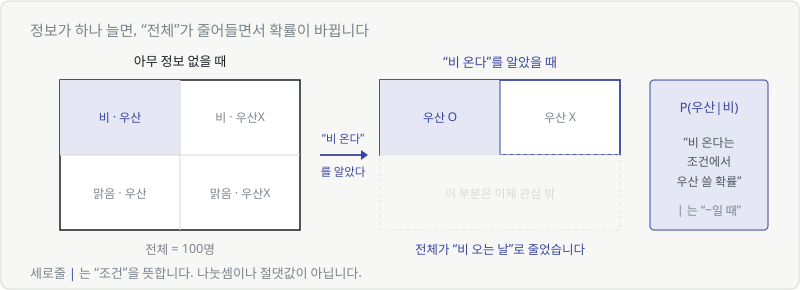
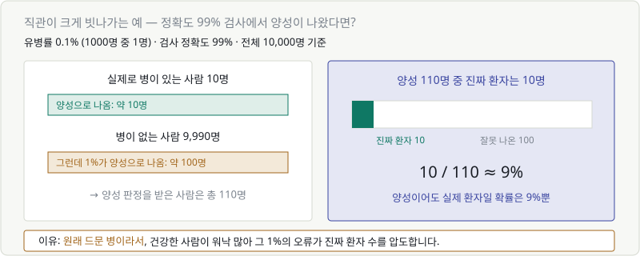
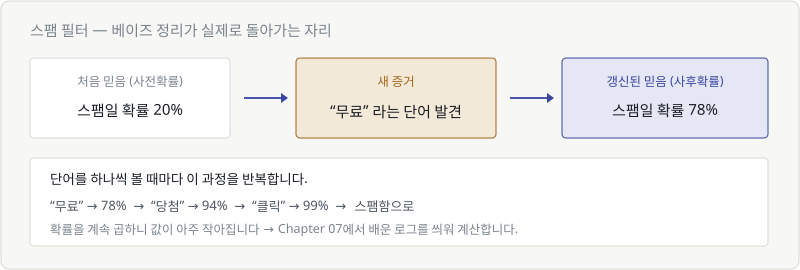

# Chapter 14. 조건부확률과 베이즈 정리

> **이 장의 목표**
> **"정보가 하나 더 생기면 확률이 어떻게 바뀌는가"** 를 다룹니다.
> 직관이 크게 빗나가는 유명한 예를 직접 계산해 보고, 스팸 필터의 원리를 이해합니다.

---

## 14.1 정보가 늘면 확률이 바뀐다

"오늘 우산을 쓸 확률은?" 이라고 물으면 답하기 어렵습니다.
그런데 **"오늘 비가 온대"** 라는 정보가 하나 붙으면 확률이 확 올라갑니다.

이렇게 **조건이 붙은 확률**을 조건부확률이라고 합니다.

$$
P(\text{우산} \mid \text{비})
$$

읽는 법: **"피 우산 given 비"** 또는 **"비가 올 때 우산을 쓸 확률"**

> ⚠️ 세로줄 `|` 은 나눗셈도 절댓값도 아닙니다. **"~라는 조건에서"** 라는 뜻입니다.
> Chapter 02에서 배운 기호 읽기의 연장입니다.

---

## 14.2 조건부확률을 그림으로

넓이로 보면 무슨 일이 일어나는지 명확합니다.

핵심은 이겁니다.

> 🎯 **조건이 붙으면 "전체"가 줄어듭니다.**

- 아무 정보 없을 때 → 전체는 **100명 전부**
- "비 온다"를 알았을 때 → 전체는 **비 오는 날만**

분모가 작아지니 확률이 달라지는 겁니다. 계산식으로는 이렇게 됩니다.

$$
P(A \mid B) = \frac{P(A \text{ 그리고 } B)}{P(B)}
$$

**"둘 다 일어나는 경우를, B가 일어나는 경우로 나눈다."**

---

## 14.3 베이즈 정리

여기서 아주 유용한 뒤집기가 나옵니다.

우리가 알고 싶은 것과 알고 있는 것이 **반대인 경우**가 많습니다.

| 알고 있는 것 | 알고 싶은 것 |
|---|---|
| 병이 있을 때 양성이 나올 확률 | **양성일 때 병이 있을 확률** |
| 스팸일 때 "무료"가 나올 확률 | **"무료"가 있을 때 스팸일 확률** |

이 둘을 뒤집어 주는 공식이 **베이즈 정리**입니다.

$$
P(A \mid B) = \frac{P(B \mid A) \times P(A)}{P(B)}
$$

식을 외울 필요는 없습니다. 대신 **의미**를 기억하세요.

> 🔑 **베이즈 정리 = 믿음을 갱신하는 공식**
>
> 처음 믿음 + 새로운 증거 → 갱신된 믿음

| 이름 | 뜻 |
|---|---|
| $P(A)$ | **사전확률** — 증거 보기 전의 믿음 |
| $P(A \mid B)$ | **사후확률** — 증거를 본 뒤의 믿음 |

---

## 14.4 예: 검사 결과가 양성이어도 안심인 이유

베이즈 정리가 유명한 이유는, **직관이 크게 틀리기 때문**입니다.

> **문제**: 어떤 병의 유병률은 0.1%(1000명 중 1명)입니다.
> 검사 정확도는 99%입니다. 당신이 양성 판정을 받았습니다.
> **실제로 병에 걸렸을 확률은?**

대부분 "99%"라고 답합니다. **실제로는 약 9%입니다.**

공식 없이, 사람 수로 세어 봅시다.

**10,000명을 검사했다고 하면:**

| | 인원 | 양성 판정 |
|---|---|---|
| 실제 환자 | 10명 | 약 **10명** (99% 정확) |
| 건강한 사람 | 9,990명 | 약 **100명** (1% 오류) |
| **양성 판정 합계** | | **110명** |

양성 판정을 받은 110명 중 진짜 환자는 10명뿐입니다.

$$
\frac{10}{110} \approx 9\%
$$

### 왜 이런 일이 생기나

> **원래 드문 병이기 때문입니다.**
>
> 건강한 사람이 9,990명이나 되니, 그중 1%만 잘못 나와도 100명입니다.
> 진짜 환자 10명을 압도해버리는 거죠.

이게 **사전확률(유병률 0.1%)이 결과를 지배하는** 현상입니다.

> 💬 **실무에서 이 함정을 만나는 곳**
> - 사기 거래 탐지 (전체 거래의 0.01%)
> - 불량품 검출 (전체의 0.1%)
> - 희귀 질병 진단
>
> 이런 **불균형 데이터**에서는 "정확도 99%"라는 말이 거의 무의미합니다.
> 전부 "정상"이라고만 답해도 99.99% 정확하니까요.

---

## 14.5 스팸 메일 필터의 원리

베이즈 정리가 실제로 돌아가는 대표적인 예입니다.

메일 한 통이 왔습니다.

1. **처음 믿음(사전확률)**: 전체 메일의 20%가 스팸 → 이 메일도 20%쯤 스팸
2. **증거 발견**: "무료" 라는 단어가 있다
3. **갱신**: 스팸에는 "무료"가 자주 나오고 정상 메일에는 드물다 → **78%로 상승**
4. **반복**: "당첨" 발견 → 94% → "클릭" 발견 → 99% → **스팸함으로**

> 🎯 **단어를 하나씩 볼 때마다 믿음을 갱신합니다.** 그게 전부입니다.

이 방식을 **나이브 베이즈 분류기**라고 부릅니다.
"나이브(순진한)"인 이유는 **단어들이 서로 독립이라고 가정**하기 때문입니다.
실제로는 "무료"와 "당첨"이 같이 나오는 경향이 있으니 엄밀히는 틀린 가정이죠.

그런데도 **놀랍도록 잘 작동합니다.** 지금도 쓰입니다.

### 여기서 Chapter 07이 다시 나옵니다

확률을 계속 곱하면 값이 아주 작아집니다.

$$
0.2 \times 0.8 \times 0.7 \times 0.9 \times \cdots
$$

단어 100개면 컴퓨터가 0으로 뭉개버립니다.
그래서 실제 구현은 **로그를 씌워 덧셈으로** 바꿉니다.

> Chapter 07에서 "로그는 곱셈을 덧셈으로 바꾼다"고 했던 이유가 여기 있습니다.
> 배운 것들이 계속 다시 만나고 있습니다.

---

## 💡 칼럼 — 사전확률과 사후확률

베이즈적 사고방식을 한 문장으로 하면 이렇습니다.

> **"믿음은 고정된 게 아니라, 증거에 따라 갱신되는 것이다."**

이건 AI 밖에서도 유용한 사고 도구입니다.

| 상황 | 사전확률 | 증거 | 사후확률 |
|---|---|---|---|
| 면접 | 지원자 합격률 5% | 좋은 포트폴리오 | 30% |
| 버그 원인 추정 | 이 모듈이 원인일 확률 10% | 로그에 해당 모듈 등장 | 70% |
| 의심스러운 메일 | 스팸 20% | 발신자가 지인 | 1% |

### AI 학습도 사실 이 구조입니다

> 처음엔 아무것도 모름(랜덤 초기값) → 데이터를 하나씩 봄 → 조금씩 믿음(가중치) 갱신

Part 5에서 배울 경사하강법도, 관점을 바꾸면 **"증거를 보고 조금씩 믿음을 고쳐 나가는 과정"** 입니다.

> 💬 참고로 **"베이지안 딥러닝"** 이라는 분야가 따로 있습니다.
> 가중치를 하나의 숫자가 아니라 **확률 분포**로 두어서,
> 모델이 "얼마나 확신하는지"까지 표현하려는 접근입니다.

---

## ✅ 1분 확인

1. $P(A \mid B)$ 에서 세로줄 `|` 은 무슨 뜻인가요?
2. 조건이 붙으면 확률 계산에서 무엇이 달라지나요?
3. 정확도 99% 검사에서 양성이 나왔는데 실제 환자일 확률이 낮은 이유는?
4. 스팸 필터가 단어를 하나씩 볼 때마다 하는 일은?

답 보기

1. **"~라는 조건에서"** 입니다. 나눗셈이나 절댓값이 아닙니다.
2. **전체(분모)가 줄어듭니다.** 조건에 해당하는 경우만 남으니까요.
3. **원래 드문 병이라서** 건강한 사람이 압도적으로 많고, 그중 1%의 오류가 진짜 환자 수를 넘어섭니다.
4. **믿음(스팸일 확률)을 갱신합니다.** 사전확률 → 증거 → 사후확률의 반복입니다.

---

| ⬅️ 이전 | 다음 ➡️ |
|---|---|
| [Chapter 13. 확률과 기댓값](ch13-probability.md) | [Chapter 15. 통계 — 데이터의 생김새 읽기](ch15-statistics.md) |
