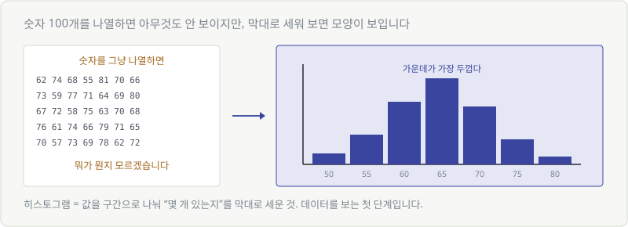
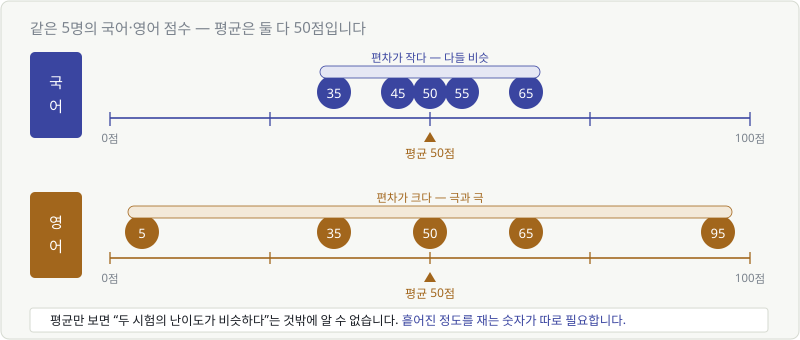
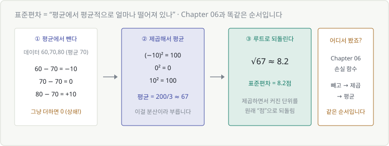
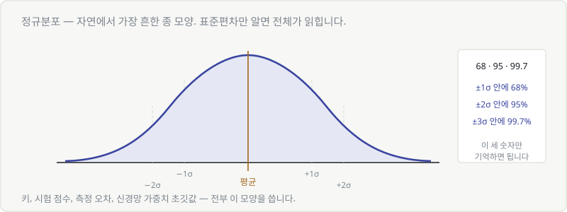
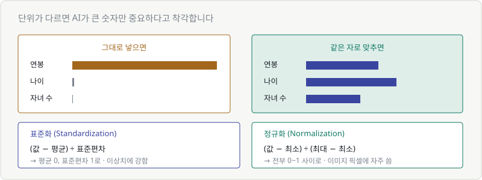
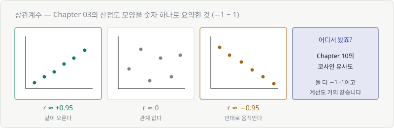

# Chapter 15. 통계 — 데이터의 생김새 읽기

> **이 장의 목표**
> 데이터를 **평균 하나로 뭉뚱그리지 않고** 읽는 법을 배웁니다.
> 그리고 AI 학습 전에 반드시 하는 **데이터 전처리**가 왜 필요한지 이해합니다.

---

## 15.1 데이터를 분석해 보자

숫자 100개가 주르륵 적혀 있으면 아무것도 안 보입니다.
통계는 **그 덩어리를 몇 개의 숫자로 요약하는 기술**입니다.

이 장에서 배울 요약 도구는 네 개뿐입니다.

| 도구 | 답해 주는 질문 |
|---|---|
| 히스토그램 | 전체적으로 **어떻게 생겼나** |
| 평균 | 대략 **어디쯤**인가 |
| 표준편차 | 얼마나 **흩어져** 있나 |
| 상관계수 | 두 값이 **같이 움직이나** |

---

## 15.2 히스토그램 — 전체 모양 보기

가장 먼저 할 일은 **그려 보는 것**입니다.



값을 구간으로 나눠 "몇 개 있는지"를 막대로 세우면, 숫자 나열로는 안 보이던 모양이 보입니다.

Chapter 03의 **"그래프를 읽는 세 가지 질문"** 을 그대로 씁니다.

1. 축이 뭐지? → 가로는 값, 세로는 개수
2. 어느 방향? → 가운데가 볼록
3. 특별한 지점? → 봉우리가 하나

> 💬 데이터 분석의 첫 단계는 **항상 그려 보기**입니다.
> 평균만 계산하고 넘어가면 중요한 걸 놓칩니다. 다음 절이 그 이야기입니다.

---

## 15.3 평균값

가장 익숙한 요약입니다. **전부 더해서 개수로 나눕니다.**

$$
\bar{x} = \frac{1}{n}\sum_{i=1}^{n} x_i
$$

이 식은 이미 여러 번 봤습니다. Chapter 06의 손실 함수, Chapter 13의 기댓값 —
전부 **"더해서 개수로 나누는"** 같은 구조입니다.

읽는 법: **"엔분의 일 곱하기, 엑스 아이를 아이가 1부터 엔까지 전부 더한 것."**

---

## 15.4 편차가 왜 중요한가

여기가 이 장의 핵심입니다. **평균만으로는 부족합니다.**



두 반 모두 평균이 70점입니다. 그런데:

- **A반**: 전원이 68~73점 → 다들 비슷함
- **B반**: 30점대와 100점대로 갈림 → 극과 극

평균만 보면 **똑같은 반**으로 보입니다. 완전히 다른 상황인데도요.

> 🎯 **그래서 "얼마나 흩어져 있는가"를 재는 숫자가 따로 필요합니다.**

---

## 15.5 분산과 표준편차

계산 순서는 **Chapter 06에서 이미 해 본 것과 똑같습니다.**



데이터가 60, 70, 80이고 평균이 70일 때:

### ① 평균에서 뺀다 (편차)

$$
-10, \quad 0, \quad +10
$$

그런데 그냥 더하면 **0**입니다. 또 상쇄 문제죠.

### ② 제곱해서 평균 낸다 (분산)

$$
\frac{(-10)^2 + 0^2 + 10^2}{3} = \frac{200}{3} \approx 67
$$

### ③ 루트로 되돌린다 (표준편차)

$$
\sqrt{67} \approx 8.2
$$

> 🔑 **표준편차 = "평균에서 평균적으로 8.2점쯤 떨어져 있다"**

### 왜 루트를 씌우나

제곱하면서 **단위가 변했기** 때문입니다.
점수를 제곱하면 "점²"이라는 이상한 단위가 됩니다.
루트를 씌우면 다시 "점"으로 돌아옵니다.

> 💬 **Chapter 06과 완전히 같은 순서라는 걸 눈치채셨나요?**
> `빼고 → 제곱하고 → 평균 내고`
>
> 손실 함수도, 표준편차도 같은 도구를 씁니다.
> "부호를 없애고 크기만 재는" 문제는 늘 같은 방법으로 풉니다.

기호는 $\sigma$(시그마, 소문자)를 씁니다. Chapter 02에서 봤던 그 글자입니다.

---

## 15.6 정규분포 — 가장 흔한 종 모양

자연에서 데이터를 모으면 놀랍도록 자주 이 모양이 나옵니다.



키, 시험 점수, 측정 오차, 제품 무게 — 전부 이 종 모양입니다.

### 기억할 것은 세 숫자뿐

| 범위 | 그 안에 들어가는 비율 |
|---|---|
| 평균 ± 1σ | **68%** |
| 평균 ± 2σ | **95%** |
| 평균 ± 3σ | **99.7%** |

**예시**: 평균 70점, 표준편차 8점인 시험이라면

- 62~78점 사이에 전체의 68%
- 54~86점 사이에 전체의 95%
- 86점을 넘으면 **상위 2.5%**

> 💬 **AI에서 정규분포가 나오는 곳**
> 신경망의 가중치 초깃값을 정규분포에서 뽑습니다.
> 전부 0으로 시작하면 모든 뉴런이 똑같이 학습돼 버리거든요.
> 적당히 흩어진 값으로 시작해야 뉴런마다 다른 걸 배웁니다.

---

## 15.7~15.8 데이터를 같은 자로 맞추기

이제 실무에서 **반드시** 하는 작업입니다.



집값을 예측한다고 합시다. 입력이 이렇습니다.

| 항목 | 값의 범위 |
|---|---|
| 연봉 | 30,000,000 ~ 100,000,000 |
| 나이 | 20 ~ 70 |
| 자녀 수 | 0 ~ 4 |

### 문제: AI가 큰 숫자만 중요하다고 착각합니다

Chapter 05에서 배웠듯 모델은 $w_1x_1 + w_2x_2 + w_3x_3$ 을 계산합니다.
연봉은 값이 수천만이고 자녀 수는 한 자리입니다.
**단위 때문에** 연봉이 결과를 지배해 버립니다. 실제 중요도와 무관하게요.

### 해결: 같은 자로 맞춥니다

| 방법 | 계산 | 결과 |
|---|---|---|
| **표준화** (Standardization) | (값 − 평균) ÷ 표준편차 | 평균 0, 표준편차 1 |
| **정규화** (Normalization) | (값 − 최소) ÷ (최대 − 최소) | 전부 0~1 사이 |

```python
# 표준화
x_std = (x - x.mean()) / x.std()

# 정규화
x_norm = (x - x.min()) / (x.max() - x.min())
```

| | 언제 쓰나 |
|---|---|
| 표준화 | 기본값. 이상치가 있어도 비교적 안전 |
| 정규화 | 범위가 확실히 정해진 데이터 (이미지 픽셀 0~255 등) |

> 🎯 **이걸 안 하면 학습이 잘 안 됩니다.**
> "모델은 맞는데 왜 학습이 안 되지?" 의 흔한 원인 1위가 스케일링 누락입니다.
>
> Part 5에서 배울 경사하강법이 **모든 방향으로 비슷한 보폭**으로 움직이기 때문입니다.
> 어떤 축은 수천만 단위이고 어떤 축은 한 자리면, 보폭 하나로 둘 다 맞출 수가 없습니다.

---

## 15.9 상관계수 — 두 값이 함께 움직이는가

Chapter 03에서 산점도의 세 가지 모양을 봤습니다.
그 모양을 **숫자 하나로** 요약한 것이 상관계수 $r$ 입니다.



| $r$ | 뜻 |
|---|---|
| **+1에 가까움** | 같이 오른다 |
| **0에 가까움** | 관계 없다 |
| **−1에 가까움** | 반대로 움직인다 |

> 💬 **어디서 본 것 같지 않나요?**
> Chapter 10의 **코사인 유사도**도 −1~1 사이였습니다.
> 우연이 아닙니다. 상관계수는 사실상 **평균을 뺀 뒤 구한 코사인 유사도**입니다.
> 계산 구조가 거의 같습니다.

### 실무에서 쓰는 곳

모델을 만들기 전에 **어떤 입력이 쓸모 있는지** 미리 봅니다.

```python
df.corr()    # 모든 항목 쌍의 상관계수를 한 번에
```

- $r$이 0에 가까운 항목 → 예측에 별 도움 안 될 가능성
- 두 입력끼리 $r$이 0.95 → 거의 같은 정보. 하나는 빼도 됨

---

## 💡 칼럼 — 평균값과 중앙값

연봉 데이터에 억대 연봉자가 한 명 섞이면 평균이 확 올라갑니다.

| 연봉 (만원) | |
|---|---|
| 3000, 3200, 3500, 3800, **50000** | 평균 = 12,700 |

평균 1억 2700만원. 그런데 5명 중 4명은 4000만원 미만입니다. **평균이 거짓말을 하는 것**이죠.

이럴 때 **중앙값**(줄 세웠을 때 한가운데 값)을 씁니다. 여기서는 **3,500만원**.
훨씬 현실적입니다.

> 🔑 **이상치(outlier)가 있으면 평균보다 중앙값이 정직합니다.**
> Chapter 06에서 "제곱은 큰 오차에 민감하다"고 했던 것과 같은 이야기입니다.

---

## 💡 칼럼 — 상관관계는 인과관계가 아니다

아이스크림 판매량과 익사 사고 건수는 **상관계수가 높습니다.**
아이스크림이 익사를 유발할까요?

아닙니다. **여름**이라는 숨은 원인이 둘 다 끌어올린 것뿐입니다.

> 🚨 **AI에서 이게 심각한 문제가 되는 순간**
>
> 모델은 상관관계만 학습합니다. 인과를 이해하지 못합니다.
>
> 병원 데이터로 학습한 모델이 "특정 의사가 진료하면 사망률이 높다"는 패턴을 찾았다고 합시다.
> 그 의사가 무능한 걸까요? 아니면 **중증 환자만 그 의사에게 배정**되는 걸까요?
>
> 모델은 이 둘을 구분하지 못합니다. 데이터에는 똑같이 보이거든요.

이게 AI 모델의 결과를 **사람이 해석해야 하는 이유**입니다.

---

## ✅ 1분 확인

1. 평균이 같은 두 데이터가 완전히 다를 수 있나요?
2. 표준편차를 구할 때 마지막에 루트를 씌우는 이유는?
3. 평균 70, 표준편차 10인 정규분포에서, 50~90점 사이에는 몇 %가 들어가나요?
4. 연봉(수천만)과 나이(수십)를 그대로 모델에 넣으면 무슨 문제가 생기나요?

<details>
<summary>답 보기</summary>

1. **네** — 흩어진 정도가 다를 수 있습니다. 그래서 표준편차가 필요합니다.
2. **제곱하면서 변한 단위를 원래대로 되돌리기 위해서**입니다.
3. **약 95%** — 평균 ± 2σ 범위입니다.
4. **연봉이 결과를 지배**해 버립니다. 값이 크다는 이유만으로요. 표준화나 정규화가 필요합니다.

</details>

---

## 🎉 Part 4 완료

AI가 내놓는 숫자를 읽는 법을 배웠습니다.

- ✅ 경우의 수가 폭발하면 AI는 **세지 않고 확률로 뽑습니다**
- ✅ AI의 출력은 정답이 아니라 **확신의 정도**
- ✅ **temperature**는 확률 분포를 뾰족하게/평평하게 만드는 손잡이
- ✅ 베이즈 = **믿음을 증거로 갱신하는 것** (드문 사건의 함정 포함)
- ✅ 평균만으로는 부족하고 **표준편차**가 필요
- ✅ 학습 전에 **스케일을 맞춰야** 하는 이유

### 이제 마지막 숙제가 남았습니다

| 파트 | 무엇을 했나 |
|---|---|
| Part 2 | 골짜기(손실 함수)를 만들었습니다 |
| Part 3 | 그릇(벡터·행렬)을 만들었습니다 |
| Part 4 | 출력값을 읽는 법을 배웠습니다 |

> 🚨 **그런데 골짜기 바닥으로 어떻게 내려가죠?**
>
> 파라미터가 700억 개면 전부 시도해 볼 수 없습니다.
> 지금 서 있는 자리에서 **어느 쪽이 내리막인지** 알아야 합니다.

다음 파트에서 그 도구를 만듭니다. **미분**입니다.
Part 5가 끝나면 "AI가 학습한다"는 말의 전 과정을 그림으로 그릴 수 있게 됩니다.

---

| ⬅️ 이전 | 다음 ➡️ |
|---|---|
| [Chapter 14. 조건부확률과 베이즈 정리](ch14-bayes.md) | Chapter 16. 수열과 시그마 *(집필 예정)* |
