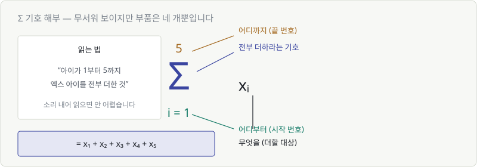
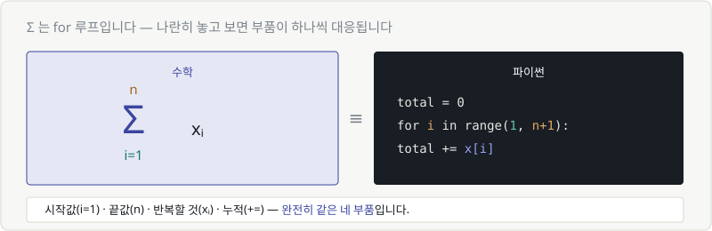
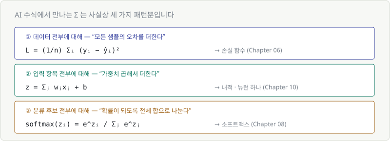

# Chapter 16. 수열과 시그마 — 반복을 적는 언어

> **이 장의 목표**
> AI 수식에서 가장 자주 보이는 기호 **Σ**를 확실히 읽을 수 있게 만듭니다.
> 결론부터 말하면 **Σ는 for 루프**입니다.

---

## 16.1 수열이란 수의 나열이다

**수열**은 규칙에 따라 늘어놓은 숫자들입니다. 그게 전부입니다.

$$
2,\ 4,\ 6,\ 8,\ 10,\ \ldots
$$

각 항에 번호를 붙여 부릅니다. Chapter 02에서 배운 아래 첨자입니다.

| 항 | $a_1$ | $a_2$ | $a_3$ | $a_4$ |
|---|---|---|---|---|
| 값 | 2 | 4 | 6 | 8 |

```python
a = [2, 4, 6, 8, 10]
a[0], a[1]    # a₁, a₂ (파이썬은 0부터)
```

> 💬 AI에서 수열이 등장하는 자리는 **"반복 과정"** 입니다.
> 학습 1회차의 손실, 2회차의 손실, 3회차의 손실... 이것도 수열입니다.
> Chapter 03에서 본 학습 곡선이 바로 이 수열을 그린 것이죠.

---

## 16.2 등차수열과 등비수열

규칙에는 두 가지 기본형이 있습니다.

| 종류 | 규칙 | 예 |
|---|---|---|
| **등차수열** | 매번 같은 값을 **더한다** | 2, 4, 6, 8 (+2씩) |
| **등비수열** | 매번 같은 값을 **곱한다** | 2, 4, 8, 16 (×2씩) |

Chapter 07에서 본 그림이 여기서 다시 나옵니다.

- 등차수열 → 일차함수처럼 **직선**으로 증가
- 등비수열 → 지수함수처럼 **폭발적으로** 증가

> 💬 **AI에서 만나는 예**
> - 학습률을 매 epoch마다 0.9배씩 줄인다 → **등비수열**
> - 배치 번호 1, 2, 3, 4... → **등차수열**

---

## 16.3 수열의 합

수열의 항들을 전부 더하는 일은 아주 자주 필요합니다.

$$
2 + 4 + 6 + 8 + 10 = 30
$$

항이 5개면 이렇게 쓸 수 있습니다. 그런데 **1000개**라면요?

$$
x_1 + x_2 + x_3 + \cdots + x_{1000}
$$

점 세 개(⋯)로 얼버무리는 건 좋은 표기가 아닙니다. 그래서 기호가 만들어졌습니다.

---

## 16.4 시그마(Σ) 기호 읽는 법



$$
\sum_{i=1}^{5} x_i
$$

부품은 **네 개**뿐입니다.

| 위치 | 뜻 |
|---|---|
| $\sum$ | "전부 더하라" |
| 아래 $i=1$ | **어디부터** 시작하나 |
| 위 $5$ | **어디까지** 가나 |
| 오른쪽 $x_i$ | **무엇을** 더하나 |

읽는 법: **"아이가 1부터 5까지, 엑스 아이를 전부 더한 것."**

$$
\sum_{i=1}^{5} x_i = x_1 + x_2 + x_3 + x_4 + x_5
$$

> 💬 Σ는 그리스 대문자 시그마입니다. Sum(합)의 S에 해당합니다.
> Chapter 02에서 봤던 소문자 σ(표준편차)와는 **다른 글자**입니다.

---

## 16.5 ∑는 for 루프입니다

프로그래밍을 아신다면 이 그림 하나로 끝납니다.



$$
\sum_{i=1}^{n} x_i
\qquad \equiv \qquad
\begin{aligned}
&\texttt{total = 0} \\
&\texttt{for i in range(1, n+1):} \\
&\texttt{\ \ \ \ total += x[i]}
\end{aligned}
$$

| Σ의 부품 | for 루프의 부품 |
|---|---|
| $i=1$ (시작) | `range(1, ...)` |
| $n$ (끝) | `range(..., n+1)` |
| $x_i$ (더할 것) | `x[i]` |
| $\sum$ (누적) | `total +=` |

**완전히 같은 네 부품입니다.**

```python
# Σ 를 그대로 옮기면
sum(x[i] for i in range(n))

# 또는 그냥
sum(x)
```

> 🎯 **앞으로 수식에서 Σ를 보면 이렇게 생각하세요.**
> *"아, 여기서 for 루프가 도는구나."*
>
> 그 이상 복잡한 건 없습니다.

---

## 16.6 AI 수식에서 만나는 Σ 세 가지 패턴

실제로 마주치는 Σ는 사실상 세 종류입니다. **무엇에 대해 도는지**만 다릅니다.



### ① 데이터 전부에 대해 — 손실 함수

$$
L = \frac{1}{n}\sum_{i=1}^{n}(y_i - \hat{y}_i)^2
$$

> "샘플 하나하나의 오차를 제곱해서 **전부 더하고**, 개수로 나눈다"

Chapter 06에서 만든 그 식입니다. Σ는 **데이터 개수만큼** 돕니다.

### ② 입력 항목 전부에 대해 — 뉴런 하나

$$
z = \sum_{j=1}^{m} w_j x_j + b
$$

> "가중치와 입력을 곱해서 **전부 더하고**, 편향을 더한다"

Chapter 10의 **내적**입니다. Σ는 **입력 개수만큼** 돕니다.

### ③ 분류 후보 전부에 대해 — 소프트맥스

$$
\text{softmax}(z_i) = \frac{e^{z_i}}{\sum_{j} e^{z_j}}
$$

> "내 점수를 **모든 후보 점수의 합**으로 나눈다"

Chapter 08의 그 식입니다. Σ는 **분류 후보 개수만큼** 돕니다.

> 🔑 **Σ를 만나면 딱 하나만 확인하세요: "무엇에 대해 도는가?"**
>
> | 첨자 | 보통 도는 대상 |
> |---|---|
> | $i$ | 데이터 샘플 |
> | $j$ | 입력 항목 또는 분류 후보 |
> | $t$ | 시간 단계 (시계열, 문장의 단어) |

---

## 💡 칼럼 — 첨자가 두 개인 Σ

가끔 Σ가 두 개 겹쳐 있는 걸 봅니다.

$$
\sum_{i=1}^{n}\sum_{j=1}^{m} a_{ij}
$$

겁먹을 것 없습니다. **이중 for 루프**입니다.

```python
total = 0
for i in range(n):
    for j in range(m):
        total += a[i][j]
```

Chapter 11에서 배운 **행렬**의 모든 칸을 다 더하는 것과 같습니다.
$a_{ij}$ 는 "i번째 행, j번째 열의 값"이니까요.

크로스엔트로피 손실을 여러 클래스에 대해 쓸 때 이 형태가 나옵니다.

$$
L = -\sum_{i=1}^{n}\sum_{c=1}^{C} y_{ic}\log \hat{y}_{ic}
$$

> "샘플 i마다(바깥 루프), 클래스 c마다(안쪽 루프) 계산해서 전부 더한다"

Chapter 21에서 이 식을 처음부터 끝까지 해부합니다.

---

## ✅ 1분 확인

1. $\sum_{i=1}^{3} i$ 는 얼마인가요?
2. Σ를 프로그래밍 용어로 한 단어로 말하면?
3. $\sum_{i=1}^{n} w_i x_i$ 는 Chapter 10의 무엇과 같은가요?
4. Σ 아래의 $i=1$ 과 위의 $n$ 은 각각 무엇을 뜻하나요?

<details>
<summary>답 보기</summary>

1. **6** — $1 + 2 + 3$
2. **for 루프** (누적 합계)
3. **내적** — 같은 자리끼리 곱해서 전부 더하는 계산입니다.
4. $i=1$은 **어디부터**, $n$은 **어디까지** 반복하는지입니다.

</details>

---

| ⬅️ 이전 | 다음 ➡️ |
|---|---|
| [Chapter 15. 통계](../part4/ch15-statistics.md) | [Chapter 17. 미분 — 변화의 속도를 보는 도구](ch17-derivative.md) |
