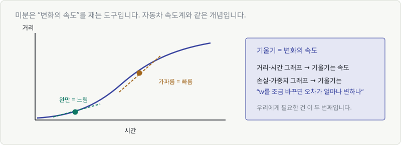
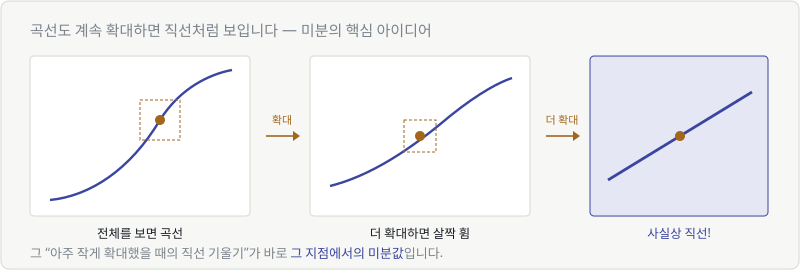
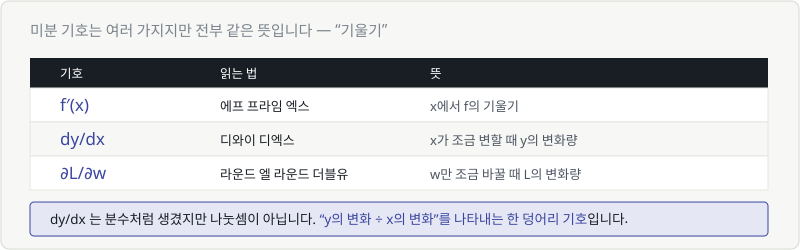
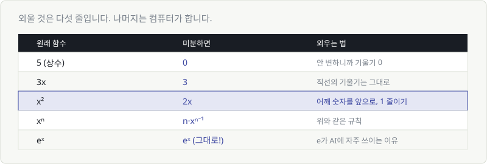
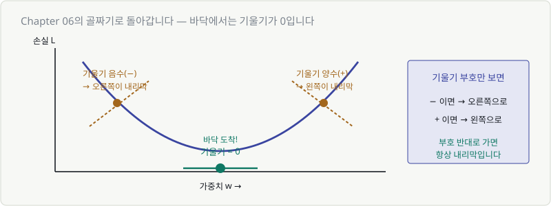

# Chapter 17. 미분 — 변화의 속도를 보는 도구

> **이 장의 목표**
> Part 2에서 만든 골짜기를 **내려갈 방법**을 손에 넣습니다.
> 미분은 계산 기술이 아니라 **"지금 서 있는 자리의 경사를 재는 도구"** 입니다.
>
> 🚨 이 장은 건너뛰면 안 됩니다. AI 학습의 원리가 전부 여기서 나옵니다.

---

## 17.1 변화의 속도란

미분이라는 단어는 무섭지만, 개념은 **자동차 속도계**와 똑같습니다.



거리-시간 그래프에서:

- 그래프가 **완만하면** → 천천히 가는 중
- 그래프가 **가파르면** → 빠르게 가는 중

> 🎯 **기울기 = 변화의 속도**

Chapter 05에서 이미 배운 것입니다. 기울기는 "x가 1 늘 때 y가 얼마나 변하는가"였죠.
달라진 건 **직선이 아니라 곡선**을 다룬다는 것뿐입니다.

### 우리에게 필요한 건 이것입니다

| 그래프 | 기울기의 의미 |
|---|---|
| 거리-시간 | 속도 |
| **손실 L - 가중치 w** | **w를 조금 바꾸면 오차가 얼마나 변하나** |

두 번째가 우리가 원하는 겁니다.
**"이 손잡이를 조금 돌리면 오차가 줄어드나, 늘어나나?"**

---

## 17.2 평균 기울기에서 순간 기울기로

직선은 어디서나 기울기가 같습니다. 그런데 **곡선은 지점마다 다릅니다.**

두 점 사이의 기울기(평균 기울기)는 쉽게 구합니다.

$$
\text{기울기} = \frac{y\text{의 변화}}{x\text{의 변화}}
$$

문제는 **"바로 이 지점에서"** 의 기울기입니다. 한 점만 있으면 변화량을 잴 수가 없죠.

---

## 17.3 접선 — 곡선도 확대하면 직선

여기서 미분의 핵심 아이디어가 나옵니다.



곡선의 한 지점을 계속 확대해 보세요. **점점 직선처럼 보입니다.**

> 💬 지구는 둥글지만, 우리 눈에는 땅이 평평해 보입니다.
> 충분히 작은 범위만 보면 곡선도 직선이니까요.

**아주 작게 확대했을 때의 그 직선 기울기**가 바로 그 지점의 **미분값**입니다.
그 직선을 **접선**이라고 부릅니다.

$$
\text{미분값} = \text{그 점에서의 접선의 기울기}
$$

> 🔑 이게 미분의 전부입니다. 나머지는 계산 요령입니다.

---

## 17.4 미분 기호 읽는 법

기호가 여러 개인데, **전부 같은 뜻**입니다.



| 기호 | 읽는 법 | 뜻 |
|---|---|---|
| $f'(x)$ | 에프 프라임 엑스 | x에서 f의 기울기 |
| $\dfrac{dy}{dx}$ | 디와이 디엑스 | x가 조금 변할 때 y의 변화량 |
| $\dfrac{\partial L}{\partial w}$ | 라운드 엘 라운드 더블유 | w만 조금 바꿀 때 L의 변화량 |

> ⚠️ $\dfrac{dy}{dx}$ 는 분수처럼 생겼지만 **나눗셈이 아닙니다.**
> "y의 변화 ÷ x의 변화"를 나타내는 **한 덩어리 기호**입니다.

세 번째 $\partial$(라운드)는 Chapter 18에서 다룹니다.
**변수가 여러 개일 때** 쓰는 기호라는 것만 지금 알아두세요.

---

## 17.5 미분 공식 최소 세트

외울 것은 **다섯 줄**입니다. 그 이상은 필요 없습니다.



| 원래 함수 | 미분하면 | 왜 |
|---|---|---|
| $5$ (상수) | $0$ | 안 변하니까 기울기 0 |
| $3x$ | $3$ | 직선의 기울기는 그대로 |
| $x^2$ | $2x$ | 어깨 숫자를 앞으로, 1 줄이기 |
| $x^n$ | $n x^{n-1}$ | 위와 같은 규칙 |
| $e^x$ | $e^x$ | **그대로!** |

### $x^2$ 을 미분하면 왜 $2x$ 인가

Chapter 06의 골짜기 그림으로 확인할 수 있습니다.

| x | 그래프 모양 | 미분값 $2x$ |
|---|---|---|
| −3 | 가파른 내리막 | −6 (음수, 큼) |
| −1 | 완만한 내리막 | −2 (음수, 작음) |
| **0** | **바닥, 평평** | **0** |
| +2 | 오르막 | +4 (양수) |

**부호와 크기가 그래프 모양과 정확히 일치합니다.** 공식이 맞다는 걸 눈으로 확인할 수 있죠.

### $e^x$ 이 특별한 이유

미분해도 자기 자신입니다. 계산이 극도로 편해집니다.

> 🎯 **Chapter 07의 "e가 AI에 자주 나오는 이유"가 바로 이것입니다.**
> 신경망은 미분을 수십억 번 합니다. 미분해도 안 변하는 함수는 엄청난 이점이죠.

---

## 17.6 기울기가 0인 곳 = 골짜기 바닥

이제 Chapter 06의 골짜기로 돌아갑니다.



골짜기 위 각 지점에서 접선을 그어 보면:

| 위치 | 기울기 부호 | 내리막은 어느 쪽? |
|---|---|---|
| 왼쪽 비탈 | **음수 (−)** | 오른쪽 |
| **바닥** | **0** | 도착! |
| 오른쪽 비탈 | **양수 (+)** | 왼쪽 |

> 🔑 **기울기 부호의 반대 방향으로 가면 항상 내리막입니다.**
>
> - 기울기가 −3 → 오른쪽으로 가야 함 (w를 늘려야 함)
> - 기울기가 +5 → 왼쪽으로 가야 함 (w를 줄여야 함)
>
> 이게 Chapter 19에서 배울 **경사하강법**의 전부입니다.
> 학습식 $\theta \leftarrow \theta - \eta \frac{\partial L}{\partial \theta}$ 에
> **마이너스**가 있는 이유가 바로 "부호 반대로 간다"입니다.

---

## 17.7 미분으로 손실 함수의 바닥 찾기

정리하면 이렇습니다.

| Part 2에서 | Part 5에서 |
|---|---|
| 골짜기(손실 함수)를 만들었다 | **어느 쪽이 내리막인지 알 수 있게 됐다** |
| 바닥이 정답이라는 걸 알았다 | **바닥에서는 기울기가 0이라는 걸 알았다** |
| 그런데 내려갈 방법이 없었다 | **한 발씩 내려갈 수 있게 됐다** |

> 💬 **"기울기가 0인 곳을 그냥 계산으로 찾으면 되지 않나요?"**
>
> 파라미터가 하나면 됩니다. 실제로 선형회귀는 그렇게 풉니다.
> 그런데 파라미터가 700억 개면 **방정식 700억 개를 동시에 풀어야** 합니다. 불가능하죠.
>
> 그래서 **한 발씩 걸어 내려가는** 방법을 씁니다. 그게 Chapter 19입니다.

---

## 💡 칼럼 — 미분에 관한 주의점

### 뾰족한 곳에서는 미분이 안 됩니다

$|x|$ (절댓값) 그래프는 0에서 **V자로 꺾입니다.**
그 지점에서 "기울기가 얼마냐"고 물으면 답이 없습니다. 왼쪽은 −1, 오른쪽은 +1이거든요.

> 🔗 **Chapter 06에서 "제곱이 절댓값보다 낫다"고 했던 이유가 이것입니다.**
> 제곱은 U자(둥근 바닥)라 어디서든 기울기를 잴 수 있습니다.

### 그런데 ReLU는요?

ReLU도 0에서 꺾입니다. 엄밀히는 미분이 안 되죠.

실무에서는 그냥 **0에서의 미분값을 0으로 정해 놓고** 씁니다.
데이터가 정확히 0.000...인 경우는 거의 없어서 문제가 안 됩니다.

> 💬 이론적으로 완벽하지 않아도 **실제로 잘 작동하면 쓴다** — 딥러닝의 흔한 태도입니다.

### 계산은 하지 않아도 됩니다

다시 강조하지만, 손으로 미분할 일은 없습니다.

```python
loss.backward()    # 이 한 줄이 미분 전체를 수행합니다
```

우리가 아는 것은 **"기울기가 방향을 알려준다"** 는 의미 하나면 충분합니다.

---

## ✅ 1분 확인

1. 곡선의 한 점에서 미분값은 무엇을 뜻하나요?
2. $x^2$ 을 미분하면?
3. 골짜기 바닥에서 기울기는 얼마인가요?
4. 기울기가 −4 라면, 손실을 줄이려면 w를 늘려야 할까요 줄여야 할까요?

<details>
<summary>답 보기</summary>

1. **그 점에서의 접선의 기울기** — 아주 작게 확대했을 때의 직선 기울기입니다.
2. **$2x$** — 어깨 숫자를 앞으로 내리고 1을 줄입니다.
3. **0** — 평평하므로 기울기가 0입니다.
4. **늘려야 합니다** — 기울기가 음수면 오른쪽(w가 커지는 쪽)이 내리막입니다.

</details>

---

| ⬅️ 이전 | 다음 ➡️ |
|---|---|
| [Chapter 16. 수열과 시그마](ch16-sequence-sigma.md) | [Chapter 18. 편미분과 기울기](ch18-gradient.md) |
