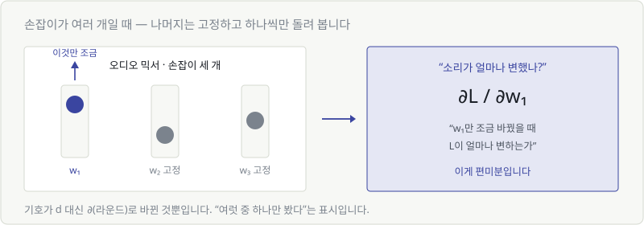
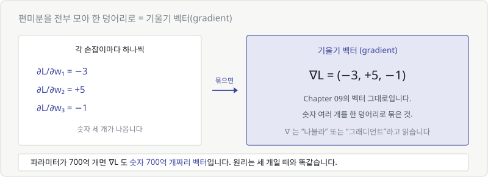
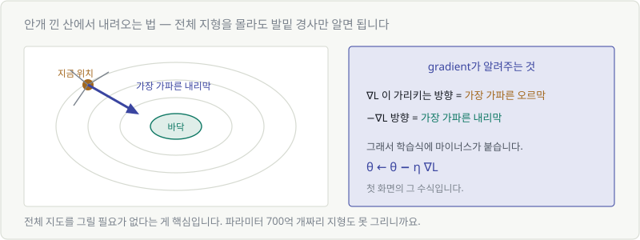

# Chapter 18. 편미분과 기울기 — 손잡이가 여러 개일 때

> **이 장의 목표**
> 파라미터가 **하나가 아니라 수억 개**일 때도 같은 원리가 통한다는 것을 봅니다.
> 그리고 `∂` 와 `∇` 라는 기호를 읽을 수 있게 됩니다.

---

## 18.1 변수가 여러 개인 함수

Chapter 17에서는 손잡이가 하나였습니다. 손실 $L$이 가중치 $w$ 하나에만 달려 있었죠.

실제 모델은 다릅니다.

$$
L(w_1, w_2, w_3, \ldots, w_{70000000000})
$$

손잡이가 700억 개입니다. **골짜기를 그림으로 그릴 수조차 없습니다.**

> 🚨 여기서 포기할 것 같지만, 사실 **원리는 하나도 안 바뀝니다.**

---

## 18.2 나머지는 고정하고 하나만 움직이기

해결책은 놀랍도록 단순합니다.

> 🎯 **한 번에 하나씩만 봅니다.**



오디오 믹서를 생각해 보세요. 손잡이가 여러 개인데 소리가 이상합니다.
어느 손잡이가 문제인지 어떻게 찾을까요?

**하나만 조금 돌려 보고, 소리가 어떻게 변하는지 듣습니다.** 나머지는 그대로 둔 채로요.

이게 **편미분**입니다.

---

## 18.3 편미분 기호 ∂

$$
\frac{\partial L}{\partial w_1}
$$

읽는 법: **"라운드 엘 라운드 더블유 원"**

뜻: **"$w_1$만 조금 바꿨을 때 $L$이 얼마나 변하는가"**

| 기호 | 언제 쓰나 |
|---|---|
| $\dfrac{dL}{dw}$ | 변수가 **하나**일 때 |
| $\dfrac{\partial L}{\partial w}$ | 변수가 **여럿**인데 그중 하나만 볼 때 |

> 💬 **글자만 $d$ → $\partial$ 로 바뀐 것뿐입니다.**
> "여럿 중 하나만 봤다"는 표시일 뿐, 계산 방법도 의미도 같습니다.

### 계산할 때는 나머지를 상수 취급합니다

$$
L = 3w_1 + 5w_2
$$

$w_1$ 로 편미분하면? $w_2$ 는 **그냥 숫자로 취급**합니다.

$$
\frac{\partial L}{\partial w_1} = 3
$$

Chapter 17의 다섯 줄 공식 그대로입니다. ($5w_2$는 상수이므로 미분하면 0)

---

## 18.4 기울기 벡터(gradient)

편미분을 **전부 모으면** 어떻게 될까요?



$$
\frac{\partial L}{\partial w_1} = -3, \quad
\frac{\partial L}{\partial w_2} = +5, \quad
\frac{\partial L}{\partial w_3} = -1
$$

숫자 세 개가 나옵니다. 이걸 한 덩어리로 묶으면?

$$
\nabla L = (-3,\ +5,\ -1)
$$

> 🎯 **Chapter 09의 벡터입니다.** 숫자 여러 개를 한 덩어리로 묶은 것.

$\nabla$ 는 **"나블라"** 또는 그냥 **"그래디언트"** 라고 읽습니다.

| 이름 | 뜻 |
|---|---|
| gradient / 기울기 벡터 | 모든 방향의 편미분을 모아 놓은 벡터 |

파라미터가 700억 개면 $\nabla L$ 도 **숫자 700억 개짜리 벡터**입니다.
개수만 다를 뿐 원리는 세 개일 때와 똑같습니다.

```python
loss.backward()
model.weight.grad    # ∇L 이 여기 들어 있습니다
```

---

## 18.5 가장 가파른 방향

기울기 벡터에는 놀라운 성질이 하나 있습니다.



> 🔑 **$\nabla L$ 이 가리키는 방향 = 가장 가파른 오르막**
> **따라서 $-\nabla L$ 방향 = 가장 가파른 내리막**

### 안개 낀 산 비유

산속에서 짙은 안개에 갇혔습니다. 아래로 내려가야 하는데 **아무것도 안 보입니다.**

어떻게 할까요?

1. 발밑을 더듬어 **어느 쪽이 가장 가파르게 내려가는지** 확인
2. 그쪽으로 **한 걸음** 이동
3. 다시 발밑 확인
4. 반복

> 🎯 **전체 지형도가 필요 없습니다. 발밑 경사만 알면 됩니다.**

이게 결정적입니다. 파라미터 700억 개짜리 지형은 아무도 그릴 수 없지만,
**지금 위치의 기울기**는 계산할 수 있으니까요.

### 그래서 학습식에 마이너스가 있습니다

$$
\theta \leftarrow \theta - \eta \nabla L
$$

**첫 화면에서 봤던 그 수식입니다.** 이제 거의 다 읽을 수 있습니다.

| 부분 | 뜻 |
|---|---|
| $\theta$ | 파라미터 전체 (Chapter 02) |
| $\leftarrow$ | 갱신, 덮어쓰기 (Chapter 02) |
| $-$ | **내리막으로 가려고** (이 장) |
| $\eta$ | 학습률, 보폭 (다음 장) |
| $\nabla L$ | 가장 가파른 방향 (이 장) |

> **"가장 가파른 방향을 찾아, 보폭 η만큼 아래로 한 발 내려간다."**

---

## 18.6 파라미터가 10억 개여도 원리는 같습니다

정리하면 이렇습니다.

| 파라미터 개수 | 골짜기를 그릴 수 있나 | 기울기를 구할 수 있나 |
|---|---|---|
| 1개 | ✅ 2D 곡선 | ✅ |
| 2개 | ✅ 3D 지형 | ✅ |
| 700억 개 | ❌ 불가능 | ✅ **가능** |

> 🎯 **그림으로 못 그려도 계산은 됩니다.**
> Chapter 03에서 "768차원을 상상하지 말라"고 했던 것과 같은 이야기입니다.
>
> **2차원 그림으로 이해하고, 개수만 늘리면 됩니다.**

### 남은 질문

이제 방향은 알았습니다. 그런데 **한 걸음을 얼마나 크게** 내디딜까요?

너무 작으면 평생 못 내려가고, 너무 크면 골짜기를 건너뛰어 버립니다.

> 그 보폭이 **학습률 $\eta$** 이고, 다음 장에서 다룹니다.

---

## 💡 칼럼 — 안개 낀 산에서 내려오기

이 비유에는 한계도 담겨 있습니다. 실제 학습에서 겪는 문제들이 전부 여기서 보입니다.

| 산에서 생기는 일 | AI 학습에서 |
|---|---|
| 작은 웅덩이에 갇힘 | **지역 최솟값** — 진짜 바닥이 아닌 곳에서 멈춤 |
| 평평한 고원에서 방향을 못 잡음 | **기울기 소실** — gradient가 0에 가까워 학습이 안 됨 |
| 절벽에서 굴러떨어짐 | **기울기 폭발** — 손실이 NaN이 됨 |
| 보폭이 너무 커서 계곡을 건너뜀 | **발산** — 학습률이 너무 큼 |

> 💬 딥러닝 논문에 나오는 **Adam, RMSProp, 모멘텀** 같은 이름들은
> 전부 **"어떻게 하면 더 잘 내려갈까"** 를 개선한 방법들입니다.
>
> - 모멘텀: 관성을 줘서 작은 웅덩이를 지나쳐 가게
> - Adam: 방향마다 보폭을 다르게
>
> 지금은 이름만 알아두면 충분합니다. 원리는 전부 **"기울기 방향으로 한 발씩"** 입니다.

---

## ✅ 1분 확인

1. $\partial$ 기호는 언제 쓰나요?
2. $\dfrac{\partial L}{\partial w_2}$ 를 말로 풀면?
3. 기울기 벡터 $\nabla L$ 은 무엇을 모아 놓은 것인가요?
4. 학습식에 마이너스가 붙어 있는 이유는?

<details>
<summary>답 보기</summary>

1. **변수가 여러 개인데 그중 하나만 볼 때** 씁니다.
2. **"$w_2$만 조금 바꿨을 때 L이 얼마나 변하는가"**
3. **모든 파라미터에 대한 편미분**을 전부 모은 벡터입니다.
4. $\nabla L$ 은 **오르막** 방향이라서, 내려가려면 **반대 방향**으로 가야 하기 때문입니다.

</details>

---

| ⬅️ 이전 | 다음 ➡️ |
|---|---|
| [Chapter 17. 미분](ch17-derivative.md) | [Chapter 19. 연쇄법칙과 경사하강법](ch19-chain-rule-gd.md) |
