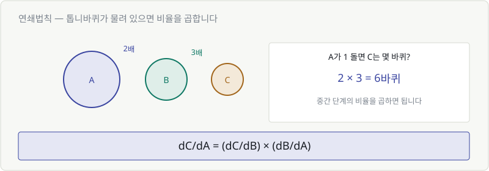
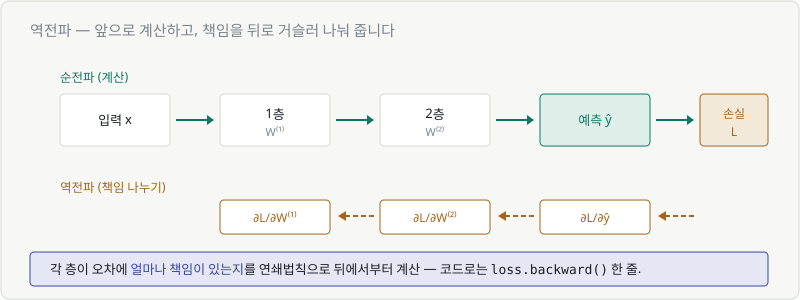
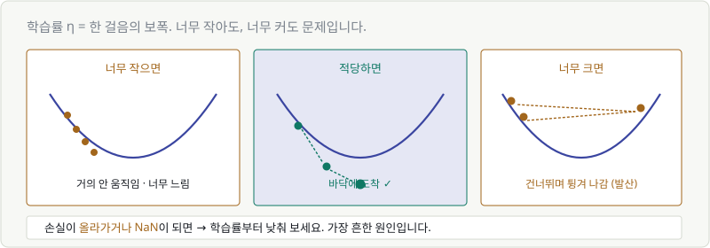
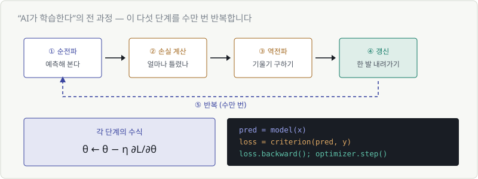

# Chapter 19. 연쇄법칙과 경사하강법 — 학습의 전 과정

> **이 장의 목표**
> **"AI가 학습한다"** 는 말의 전 과정을 그림 한 장으로 그릴 수 있게 됩니다.
> 그리고 첫 화면의 수식을 완전히 읽습니다.
>
> 이 장이 이 코스의 정점입니다.

---

## 19.1 함수가 겹쳐 있을 때의 미분

Chapter 08에서 신경망이 **합성함수**라는 걸 봤습니다.

$$
y = \text{softmax}\left(W^{(2)} \cdot \text{ReLU}(W^{(1)}x + b^{(1)}) + b^{(2)}\right)
$$

상자가 겹겹이 쌓여 있습니다. 그런데 우리가 알고 싶은 건 이겁니다.

> **"맨 안쪽의 $W^{(1)}$ 을 조금 바꾸면, 맨 바깥의 손실이 얼마나 변할까?"**

중간에 층이 여러 개 끼어 있는데 어떻게 알 수 있을까요?

---

## 19.2 연쇄법칙

톱니바퀴로 생각하면 명확합니다.



- A가 1바퀴 돌면 → B는 2바퀴
- B가 1바퀴 돌면 → C는 3바퀴
- **그럼 A가 1바퀴 돌면 C는?** → $2 \times 3 = 6$바퀴

> 🔑 **중간 단계의 비율을 곱하면 됩니다.**

수식으로는 이렇습니다.

$$
\frac{dC}{dA} = \frac{dC}{dB} \times \frac{dB}{dA}
$$

이게 **연쇄법칙(chain rule)** 입니다.

> 💬 분수처럼 $dB$ 가 약분되는 것처럼 보입니다.
> 엄밀히는 분수가 아니지만, **기억하는 데는 그렇게 생각해도 됩니다.**

### 신경망에 적용하면

$$
\frac{\partial L}{\partial W^{(1)}} = \frac{\partial L}{\partial y} \times \frac{\partial y}{\partial h} \times \frac{\partial h}{\partial W^{(1)}}
$$

층이 100개여도 똑같습니다. **곱셈을 100번 하면 됩니다.**

---

## 19.3 층을 거슬러 올라가기 — 역전파

연쇄법칙을 신경망에 적용한 것이 **역전파(backpropagation)** 입니다.



과정은 두 방향입니다.

### ① 순전파 (앞으로) — 계산

$$
\text{입력} \to \text{1층} \to \text{2층} \to \text{예측} \to \text{손실}
$$

### ② 역전파 (뒤로) — 책임 나누기

$$
\text{손실} \to \frac{\partial L}{\partial \hat{y}} \to \frac{\partial L}{\partial W^{(2)}} \to \frac{\partial L}{\partial W^{(1)}}
$$

> 🎯 **"이 오차에 각 층이 얼마나 책임이 있는가"** 를 뒤에서부터 계산합니다.

### 왜 뒤에서부터인가

앞에서부터 하면 같은 계산을 수없이 반복하게 됩니다.
뒤에서부터 하면 **한 번 계산한 결과를 재사용**할 수 있습니다.

> 💬 이 아이디어 덕분에 딥러닝이 가능해졌습니다.
> 역전파 없이는 파라미터 700억 개의 기울기를 현실적인 시간에 못 구합니다.

그리고 코드로는:

```python
loss.backward()    # 이 한 줄이 역전파 전체입니다
```

> 🔑 **Chapter 01에서 "계산은 컴퓨터가 합니다"라고 했던 그 자리입니다.**
> 우리는 **왜 이게 필요한지**만 알면 됩니다.

---

## 19.4 경사하강법의 한 걸음

이제 방향(기울기)도 알고, 각 층의 책임(역전파)도 구했습니다. 움직일 차례입니다.

$$
\theta \leftarrow \theta - \eta \frac{\partial L}{\partial \theta}
$$

한 걸음의 계산을 숫자로 따라가 봅시다.

| | 값 |
|---|---|
| 현재 가중치 $w$ | 5.0 |
| 기울기 $\partial L/\partial w$ | +2.0 (오르막) |
| 학습률 $\eta$ | 0.1 |

$$
w \leftarrow 5.0 - 0.1 \times 2.0 = 5.0 - 0.2 = 4.8
$$

기울기가 양수(오르막)였으니 **w를 줄여서** 내려갔습니다.
Chapter 17에서 배운 "부호 반대로 간다"가 여기서 실행됩니다.

---

## 19.5~19.6 학습률(learning rate)을 그림으로

$\eta$ (에타)는 **한 걸음의 보폭**입니다. 이 값 하나가 학습의 성패를 가릅니다.



| 학습률 | 무슨 일이 생기나 |
|---|---|
| **너무 작음** | 거의 안 움직임. 며칠을 돌려도 학습이 안 끝남 |
| **적당함** | 골짜기 바닥에 도착 ✅ |
| **너무 큼** | 골짜기를 건너뛰며 튕겨 나감. 손실이 오히려 증가 |

### 실무 감각

```python
optimizer = torch.optim.Adam(model.parameters(), lr=0.001)
```

`lr=0.001` 이 학습률입니다. 보통 이 근처에서 시작합니다.

> 🚨 **손실이 올라가거나 NaN이 되면 → 학습률부터 낮춰 보세요.**
> 딥러닝에서 가장 흔한 문제이고, 가장 먼저 시도할 해결책입니다.

Chapter 03의 학습 곡선을 다시 떠올려 보세요.

| 곡선 모양 | 진단 |
|---|---|
| 완만하게 내려감 | 정상 |
| 거의 안 내려감 | 학습률이 너무 작음 |
| 위아래로 요동침 | 학습률이 너무 큼 |
| 위로 치솟음 / NaN | 학습률이 훨씬 너무 큼 |

> 💬 **Chapter 15의 스케일링 이야기가 여기서 연결됩니다.**
> 어떤 축은 수천만 단위이고 어떤 축은 한 자리면,
> **보폭 하나로 두 방향을 동시에 맞출 수가 없습니다.**
> 그래서 학습 전에 표준화를 하는 겁니다.

---

## 19.7 학습 전체를 한 장으로

이제 전부 연결됩니다.



| 단계 | 하는 일 | 배운 곳 |
|---|---|---|
| ① **순전파** | 예측해 본다 | Ch 8, 11 |
| ② **손실 계산** | 얼마나 틀렸나 | Ch 6 |
| ③ **역전파** | 기울기를 구한다 | Ch 18, 19 |
| ④ **갱신** | 한 발 내려간다 | Ch 19 |
| ⑤ **반복** | 수만 번 | — |

```python
for epoch in range(100):
    pred = model(x)                    # ① 순전파
    loss = criterion(pred, y)          # ② 손실
    loss.backward()                    # ③ 역전파
    optimizer.step()                   # ④ 갱신
    optimizer.zero_grad()
```

> 🎉 **딥러닝 학습 코드는 이게 전부입니다.**
> 어떤 모델이든, GPT든 이미지 생성 모델이든 이 다섯 줄 구조입니다.

### 첫 화면의 수식, 완전 해독

$$
\theta \leftarrow \theta - \eta \frac{\partial L}{\partial \theta}
$$

| 기호 | 뜻 | 배운 곳 |
|---|---|---|
| $\theta$ | 파라미터 전체 | Ch 2 |
| $\leftarrow$ | 갱신 (덮어쓰기) | Ch 2 |
| $\eta$ | 학습률 = 보폭 | Ch 19 |
| $\partial$ | 편미분 (하나만 봄) | Ch 18 |
| $\frac{\partial L}{\partial \theta}$ | 이 방향으로 가면 손실이 늘어나는 정도 | Ch 18 |
| $-$ | 그러니 반대로 | Ch 17 |

> **"언덕에서 가장 가파른 방향을 찾아, 보폭 η만큼 아래로 한 발 내려간다."**

Chapter 01에서 약속했던 문장입니다. **이제 스스로 읽어내실 수 있습니다.**

---

## 💡 칼럼 — 지역 최솟값 이야기

골짜기가 하나뿐이면 좋겠지만, 실제 손실 지형은 울퉁불퉁합니다.
작은 웅덩이에 빠져서 **진짜 바닥이 아닌 곳에서 멈출** 수 있습니다.
이걸 **지역 최솟값(local minimum)** 이라고 합니다.

교과서에서는 이걸 큰 문제로 다룹니다. 그런데 실제 딥러닝에서는 **생각보다 문제가 안 됩니다.**

이유는 **차원이 높기 때문**입니다.

> 2차원에서 웅덩이에 갇히려면 **양쪽**이 다 막혀야 합니다.
> 700억 차원에서 갇히려면 **700억 방향이 전부** 막혀야 합니다.
> 그런 지점은 거의 없습니다. 어느 한 방향으로는 대개 빠져나갈 길이 있죠.

실제로 더 자주 겪는 문제는 따로 있습니다.

| 문제 | 증상 |
|---|---|
| **평평한 고원** | 기울기가 0에 가까워 학습이 안 나아감 |
| **기울기 소실** | 층이 깊으면 곱하다가 0에 수렴 (ReLU가 이걸 완화합니다) |
| **기울기 폭발** | 곱하다가 무한대. 손실이 NaN |

> 💬 **Chapter 08에서 "ReLU가 왜 시그모이드보다 잘 되는지는 Part 5에서"** 라고 미뤘던 답이 이것입니다.
>
> 시그모이드는 미분값이 최대 0.25입니다. 층을 10번 지나면
> $0.25^{10} \approx 0.00000095$ — 기울기가 사실상 사라집니다.
>
> ReLU는 양수 구간에서 미분값이 **1**입니다. 1을 아무리 곱해도 1이라
> 깊은 층까지 기울기가 살아서 전달됩니다.
>
> **약속했던 설명을 이제 드립니다.**

---

## ✅ 1분 확인

1. 연쇄법칙을 한 문장으로 하면?
2. 역전파는 어느 방향으로 계산하나요? 왜죠?
3. $w = 3.0$, 기울기 $= -4.0$, 학습률 $= 0.5$ 일 때 갱신된 $w$ 는?
4. 손실이 NaN이 됐습니다. 가장 먼저 확인할 것은?

<details>
<summary>답 보기</summary>

1. **중간 단계의 변화 비율을 곱한다** — 톱니바퀴 2배 × 3배 = 6배.
2. **뒤(손실)에서 앞으로** 계산합니다. 계산 결과를 재사용할 수 있어 훨씬 빠릅니다.
3. **$w = 3.0 - 0.5 \times (-4.0) = 3.0 + 2.0 = 5.0$** — 기울기가 음수라 w가 커졌습니다.
4. **학습률**입니다. 너무 크면 발산합니다. 낮춰서 다시 시도하세요.

</details>

---

| ⬅️ 이전 | 다음 ➡️ |
|---|---|
| [Chapter 18. 편미분과 기울기](ch18-gradient.md) | [Chapter 20. 적분 — 쌓인 값과 확률](ch20-integral.md) |
