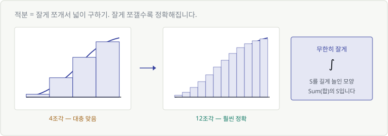
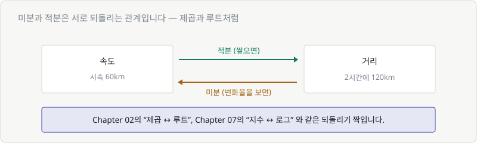
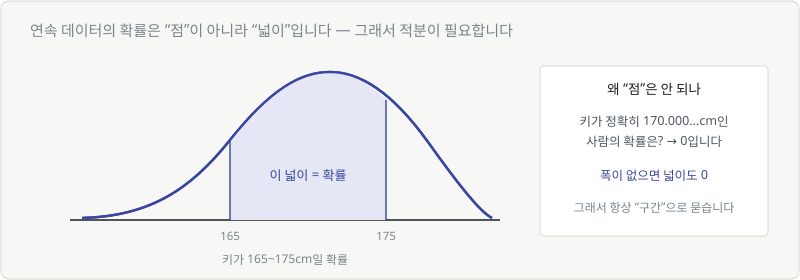

# Chapter 20. 적분 — 쌓인 값과 확률

> **이 장의 목표**
> 적분은 AI에서 미분만큼 자주 쓰이지는 않습니다. 그래서 **가볍게** 갑니다.
> **"넓이를 구하는 것"** 이라는 감각과, 확률에서 왜 필요한지만 잡으면 충분합니다.

---

## 20.1 누적값을 보는 적분

미분이 **"순간의 변화"** 를 봤다면, 적분은 **"쌓인 총량"** 을 봅니다.

| | 보는 것 | 예 |
|---|---|---|
| 미분 | 순간의 변화율 | 지금 속도는 시속 몇 km |
| **적분** | **쌓인 총량** | 2시간 동안 총 몇 km |

시속 60km로 2시간 달리면 120km. 이게 적분입니다.
속도가 계속 변하면 계산이 복잡해질 뿐, 개념은 같습니다.

---

## 20.2 잘게 쪼개서 넓이 구하기

속도가 계속 변할 때는 어떻게 할까요?

**잘게 쪼개서 직사각형으로 근사합니다.**

- 4조각으로 나누면 → 대충 맞음
- 12조각으로 나누면 → 훨씬 정확
- **무한히 잘게** → 정확한 값

이 "무한히 잘게 쪼개서 더하기"를 나타내는 기호가 $\int$ 입니다.

$$
\int_a^b f(x)\,dx
$$

> 💬 $\int$ 는 **S를 길게 늘인 모양**입니다. Sum(합)의 S죠.
> Chapter 16의 $\Sigma$ 와 사실상 형제입니다.
>
> | 기호 | 더하는 방식 |
> |---|---|
> | $\Sigma$ | 띄엄띄엄 (1, 2, 3...) |
> | $\int$ | 연속으로 (끊김 없이) |

읽는 법: **"에이부터 비까지 에프 엑스 디엑스를 적분"**

| 부분 | 뜻 |
|---|---|
| $a$, $b$ | 어디부터 어디까지 (구간) |
| $f(x)$ | 무엇의 넓이를 구하나 |
| $dx$ | 잘게 쪼갠 폭 (아주 작은 조각) |

**Σ와 부품이 거의 같습니다.** 시작·끝·대상.

---

## 20.3 적분 계산해 보기

Chapter 17의 미분 공식을 **거꾸로** 하면 됩니다.

| 미분 | 적분 (거꾸로) |
|---|---|
| $x^2 \to 2x$ | $2x \to x^2$ |
| $x^3 \to 3x^2$ | $3x^2 \to x^3$ |

규칙: **어깨 숫자를 1 늘리고, 그 숫자로 나눈다.** (미분의 정반대)

$$
\int x^2 dx = \frac{x^3}{3}
$$

> 💬 다시 강조하지만 **손으로 계산할 일은 거의 없습니다.**
> 딥러닝에서 적분이 필요한 자리는 대부분 **컴퓨터가 수치적으로 근사**합니다.
> "잘게 쪼개서 더한다"는 그 방식 그대로요.

---

## 20.4 미분과 적분은 정반대다

$$
\text{속도} \xrightarrow{\ \text{적분}\ } \text{거리}
\qquad
\text{거리} \xrightarrow{\ \text{미분}\ } \text{속도}
$$

이미 익숙한 관계입니다.

| 되돌리기 짝 | 배운 곳 |
|---|---|
| 제곱 ↔ 루트 | Chapter 02 |
| 지수 ↔ 로그 | Chapter 07 |
| **미분 ↔ 적분** | **Chapter 20** |

수학에는 이런 "짝"이 반복해서 나옵니다. 하나를 배우면 반대쪽은 절반쯤 아는 셈입니다.

---

## 20.5 확률밀도 — 넓이가 곧 확률

적분이 AI에서 실제로 의미를 갖는 자리입니다.

Chapter 15에서 정규분포를 봤습니다. 그런데 이런 질문에는 답이 이상해집니다.

> **"키가 정확히 170.000...cm인 사람의 확률은?"**

답은 **0**입니다. 소수점 아래로 무한히 정확한 값을 가질 확률은 0이니까요.

> 🎯 **그래서 연속적인 값은 "점"이 아니라 "구간"으로 묻습니다.**

> **"키가 165cm ~ 175cm 사이일 확률은?"** → 그 구간의 **넓이**

넓이를 구하는 것 = 적분입니다.

$$
P(165 \le x \le 175) = \int_{165}^{175} f(x)\,dx
$$

| | 확률을 구하는 법 |
|---|---|
| **이산** (주사위, 분류) | 그냥 **더한다** ($\Sigma$) |
| **연속** (키, 온도) | **넓이를 구한다** ($\int$) |

> 💬 Chapter 13에서 "확률은 넓이"라고 그림으로 설명했던 게 문자 그대로 맞았던 겁니다.

### 전체 넓이는 1

Chapter 13에서 "확률의 합은 1"이라고 했죠.
연속 분포에서는 **곡선 아래 전체 넓이가 1** 입니다.

$$
\int_{-\infty}^{\infty} f(x)\,dx = 1
$$

소프트맥스가 합을 1로 만들었던 것과 같은 원리입니다.

---

## 20.6 AUC라는 지표

AI 모델 성능 지표 중에 **AUC**가 자주 나옵니다.

> **AUC = Area Under the Curve = 곡선 아래 넓이**

이름 그대로 **적분값**입니다.

분류 모델의 성능을 하나의 숫자로 요약할 때 씁니다.

| AUC | 뜻 |
|---|---|
| 1.0 | 완벽한 분류 |
| 0.5 | 동전 던지기와 같음 (쓸모없음) |

> 💬 **Chapter 14의 불균형 데이터 이야기와 연결됩니다.**
> 사기 거래가 0.01%인 데이터에서는 "전부 정상"이라고만 해도 정확도 99.99%입니다.
> 그래서 정확도 대신 **AUC** 같은 지표를 씁니다.
>
> 지금은 **"AUC는 넓이구나"** 정도면 충분합니다.

---

## 💡 칼럼 — 적분 기호 읽는 법

$$
\int_0^1 x^2\,dx
$$

한 부분씩 소리 내어 읽으면 어렵지 않습니다.

> **"영부터 일까지, 엑스 제곱 디엑스를 적분"**

| 자주 보는 형태 | 뜻 |
|---|---|
| $\int_a^b$ | a부터 b까지 (정적분 — 값이 나옴) |
| $\int$ | 구간 없음 (부정적분 — 함수가 나옴) |
| $\int_{-\infty}^{\infty}$ | 전체 범위 (확률 분포에서 자주) |
| $\iint$ | 이중적분 (2차원 넓이/부피) |

$dx$ 는 **"x에 대해"** 라는 표시입니다.
$\int f(x, y)\,dx$ 라면 "y는 고정하고 x에 대해서만" — Chapter 18의 편미분과 같은 발상입니다.

> 🔑 **이 장에서 가져갈 것은 딱 하나입니다.**
> **$\int$ 를 보면 "넓이를 구하는구나" 라고 생각하세요.** 그거면 됩니다.

---

## ✅ 1분 확인

1. 적분은 무엇을 구하는 것인가요?
2. $\int$ 기호는 어떤 글자에서 왔나요?
3. "키가 정확히 170cm일 확률"이 0인 이유는?
4. AUC는 무엇의 줄임말인가요?

답 보기

1. **넓이(쌓인 총량)** 입니다. 잘게 쪼개서 더하는 방식으로 구합니다.
2. **S** (Sum의 S)를 길게 늘인 모양입니다. Σ와 형제입니다.
3. **폭이 없으면 넓이도 0**이기 때문입니다. 연속 값은 구간으로 물어야 합니다.
4. **Area Under the Curve** — 곡선 아래 넓이, 즉 적분값입니다.

---

## 🎉 Part 5 완료

**이 코스의 정점을 지났습니다.**

Part 2에서 골짜기를 만들고, Part 3에서 그릇을 만들고, Part 4에서 출력을 읽었습니다.
Part 5에서 드디어 **골짜기를 내려왔습니다.**

- ✅ **Σ = for 루프**
- ✅ **미분 = 그 지점의 접선 기울기 = 변화의 속도**
- ✅ 골짜기 바닥에서는 **기울기가 0**
- ✅ **편미분** = 손잡이 하나만 돌려 보기, **∇L** = 그걸 전부 모은 벡터
- ✅ **−∇L 방향이 가장 가파른 내리막** → 학습식의 마이너스
- ✅ **연쇄법칙 → 역전파** = `loss.backward()`
- ✅ **학습률**이 보폭이고, 크면 발산하고 작으면 안 움직임
- ✅ **ReLU가 시그모이드보다 잘 되는 이유** (Chapter 08의 약속 회수)

그리고 첫 화면의 수식을 **완전히** 읽어냈습니다.

$$
\theta \leftarrow \theta - \eta \frac{\partial L}{\partial \theta}
$$

> **"언덕에서 가장 가파른 방향을 찾아, 보폭 η만큼 아래로 한 발 내려간다."**

### 마지막 파트

이제 배운 도구가 전부 갖춰졌습니다.
남은 일은 **흩어진 조각을 하나로 조립하는 것**입니다.

> **Part 6 — 조립하기**
> 실제 AI 수식 다섯 개를 처음부터 끝까지 해부하고,
> 마지막에는 **계산기만으로 미니 신경망 학습 1회분을 손으로 굴려 봅니다.**

---

| ⬅️ 이전 | 다음 ➡️ |
|---|---|
| [Chapter 19. 연쇄법칙과 경사하강법](ch19-chain-rule-gd.md) | Chapter 21. AI 수식 해부하기 *(집필 예정)* |
