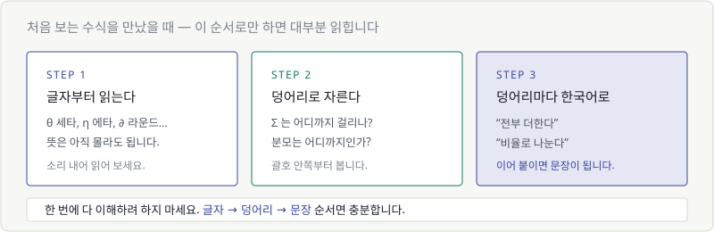
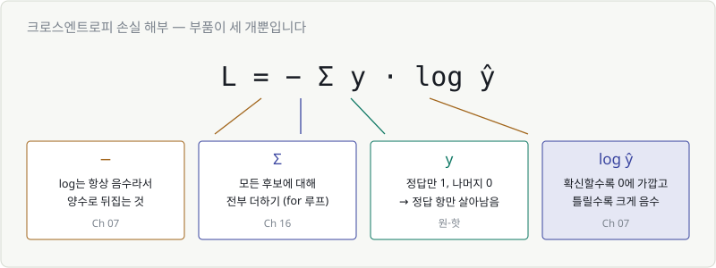
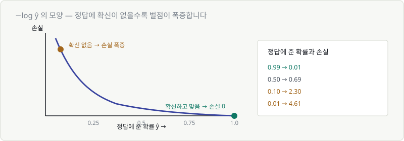

# Chapter 21. AI 수식 해부하기

> **이 장의 목표**
> **새로 배우는 것이 없습니다.** 지금까지 배운 것만으로 실제 AI 수식 다섯 개를
> 처음부터 끝까지 읽어냅니다.
>
> 이 장을 마치면 논문의 수식 블록을 봐도 도망가지 않게 됩니다.

---

## 수식을 읽는 3단계

먼저 방법부터 정합니다. 이 순서면 대부분 읽힙니다.

| 단계 | 하는 일 |
|---|---|
| **① 글자부터** | θ 세타, η 에타, ∂ 라운드 — 뜻은 몰라도 이름부터 (Ch 02) |
| **② 덩어리로 자르기** | Σ는 어디까지 걸리나? 분모는 어디까지? 괄호 안쪽부터 |
| **③ 덩어리마다 한국어로** | "전부 더한다", "비율로 나눈다" → 이어 붙이면 문장 |

> 🚨 **한 번에 다 이해하려고 하지 마세요.** 그게 수식이 어려워지는 유일한 이유입니다.

---

## 21.1 해부 ① 선형회귀

$$
\hat{y} = wx + b
$$

**① 글자**: 와이햇, 더블유, 엑스, 비
**② 덩어리**: 딱 세 조각 — $wx$ / $+b$ / $\hat{y}=$
**③ 한국어**:

> **"입력에 가중치를 곱하고, 편향을 더한 것이 예측값이다."**

| 기호 | 뜻 | 배운 곳 |
|---|---|---|
| $\hat{y}$ | 예측값 (햇 = 추정치 표시) | Ch 06 |
| $w$ | 가중치 = 기울기 | Ch 05 |
| $b$ | 편향 = 절편 | Ch 05 |

**가장 단순한 AI 모델의 전부입니다.** Chapter 05의 그 직선입니다.

---

## 21.2 해부 ② 신경망 순전파

$$
a^{(2)} = f\left(W^{(2)} a^{(1)} + b^{(2)}\right)
$$

**① 글자**: 위 첨자에 괄호가 있으니 **제곱이 아니라 층 번호** (Ch 02)
**② 덩어리**: 안쪽 $W^{(2)}a^{(1)} + b^{(2)}$ 를 먼저, 그다음 $f(\cdots)$
**③ 한국어**:

> **"1층의 출력에 2층의 가중치를 곱하고 2층의 편향을 더한 뒤,
> 활성화 함수를 통과시킨 것이 2층의 출력이다."**

| 부품 | 뜻 | 배운 곳 |
|---|---|---|
| $W^{(2)}$ | 2층 가중치 **행렬** (대문자!) | Ch 11 |
| $a^{(1)}$ | 1층의 출력 벡터 | Ch 09 |
| $f$ | 활성화 함수 (보통 ReLU) | Ch 08 |
| 곱셈 | 행렬 × 벡터 = 가로줄마다 내적 | Ch 10, 11 |

> 💡 **21.1과 비교해 보세요.**
> $wx + b$ 와 $Wx + b$ — 소문자가 대문자가 되고, $f()$ 가 씌워진 것뿐입니다.
> **신경망은 선형회귀를 여러 개 쌓고 사이사이 구부린 것**입니다.

---

## 21.3 해부 ③ 소프트맥스

$$
\text{softmax}(z_i) = \frac{e^{z_i}}{\sum_{j} e^{z_j}}
$$

**① 글자**: e는 2.718 (Ch 07), Σ는 전부 더하기 (Ch 16), 아래 첨자는 번호 (Ch 02)
**② 덩어리**: 분자 $e^{z_i}$ / 분모 $\sum_j e^{z_j}$ — 분수 하나
**③ 한국어**:

> **"내 점수를 양수로 만든 것을, 모두의 점수를 양수로 만들어 더한 값으로 나눈다."**
> = **"점수를 전부 양수로 만든 뒤, 합이 1이 되도록 비율로 나눈다."**

| 부품 | 하는 일 | 왜 |
|---|---|---|
| $e^{z}$ | 전부 양수로 | 지수는 항상 양수 (Ch 07) |
| $\sum_j e^{z_j}$ | 전체 합 | 확률의 합은 1이어야 (Ch 13) |
| 나누기 | 비율로 | |

> 🎉 **Chapter 08에서 숫자로 직접 계산해 본 그 식입니다.**
> `2.0, 1.0, 0.1` → `65.9%, 24.2%, 9.9%`

---

## 21.4 해부 ④ 크로스엔트로피 손실

가장 무섭게 생겼지만, 부품은 세 개뿐입니다.

$$
L = -\sum_{c} y_c \log \hat{y}_c
$$

**③ 한국어**:

> **"정답 클래스에 준 확률에 로그를 씌우고, 부호를 뒤집은 것이 손실이다."**

### 왜 이렇게 되는지

$y_c$ 는 **정답만 1이고 나머지는 0** 입니다 (원-핫 인코딩).
그래서 Σ를 돌아도 **정답 항만 살아남습니다.**

정답이 "고양이"이고 모델이 각각 이렇게 예측했다면:

| | 고양이 | 강아지 | 새 |
|---|---|---|---|
| $y$ (정답) | **1** | 0 | 0 |
| $\hat{y}$ (예측) | 0.66 | 0.24 | 0.10 |
| $y \times \log\hat{y}$ | **−0.42** | 0 | 0 |

$$
L = -(-0.42) = 0.42
$$

**나머지 항은 $y=0$ 이라 전부 사라집니다.** 결국 이 식이 하는 일은:

> **"정답에 얼마나 확신했는가"만 본다.**

### 앞의 마이너스는 왜

로그는 1보다 작은 수에 대해 **항상 음수**입니다 (Ch 07).
손실은 양수여야 하니 뒤집어 주는 겁니다.

| 정답에 준 확률 | 손실 |
|---|---|
| 0.99 (확신, 맞음) | **0.01** |
| 0.50 (반반) | 0.69 |
| 0.10 (거의 틀림) | 2.30 |
| 0.01 (완전히 틀림) | **4.61** |

> 🔑 **확신하고 맞으면 벌점 거의 0, 확신 없이 맞으면 벌점 증가, 확신하고 틀리면 벌점 폭증.**
>
> Chapter 06의 MSE와 목적이 같습니다. "틀린 만큼 벌점"을 주는 것.
> 다만 **확률**을 다룰 때는 제곱보다 로그가 더 적절해서 이 형태를 씁니다.

---

## 21.5 해부 ⑤ 경사하강 갱신식

$$
\theta \leftarrow \theta - \eta \frac{\partial L}{\partial \theta}
$$

**Chapter 19에서 이미 완전히 해독했습니다.** 다시 한번 확인만 합니다.

| 기호 | 뜻 | 배운 곳 |
|---|---|---|
| $\theta$ | 파라미터 전체 | Ch 02 |
| $\leftarrow$ | 갱신 (`=` 아님, 덮어쓰기) | Ch 02 |
| $\eta$ | 학습률 = 보폭 | Ch 19 |
| $\partial$ | 편미분 — 하나만 봄 | Ch 18 |
| $\frac{\partial L}{\partial \theta}$ | 이쪽으로 가면 손실이 늘어나는 정도 | Ch 18 |
| $-$ | 그러니 반대로 = 내리막 | Ch 17 |

> **"언덕에서 가장 가파른 방향을 찾아, 보폭 η만큼 아래로 한 발 내려간다."**

---

## 21.6 처음 보는 수식을 만났을 때

논문에서 이런 걸 만났다고 합시다.

$$
\text{Attention}(Q,K,V) = \text{softmax}\left(\frac{QK^T}{\sqrt{d_k}}\right)V
$$

트랜스포머의 핵심 수식입니다. **3단계로 읽어 봅시다.**

**① 글자**: Q, K, V는 그냥 이름(행렬), $T$는 전치(Ch 11), √는 루트(Ch 02)

**② 덩어리**: 안쪽부터 — $QK^T$ → $\div\sqrt{d_k}$ → softmax → $\times V$

**③ 한국어**:

| 덩어리 | 무슨 일 | 배운 곳 |
|---|---|---|
| $QK^T$ | 행렬 곱 = **내적** — Q와 K가 얼마나 닮았는지 점수 | Ch 10, 11 |
| $\div \sqrt{d_k}$ | 크기 조절 (스케일링) | Ch 15 |
| softmax | 점수를 **확률**로 | Ch 08 |
| $\times V$ | 그 확률을 **가중치 삼아** V를 섞음 | Ch 11 |

> **"Q와 K가 얼마나 닮았는지 재서, 그 정도를 확률로 바꾸고, 그 비율대로 V를 섞는다."**

**전부 이 코스에서 배운 도구입니다.** 새로운 수학은 하나도 없습니다.

> 🎯 **이게 이 코스가 목표했던 지점입니다.**
> 논문 수식을 **증명하는 것**이 아니라, **무슨 일을 하는지 읽어내는 것.**

---

## ✅ 1분 확인

1. $W^{(2)}$ 의 위 첨자는 제곱인가요?
2. 소프트맥스의 분모는 무슨 일을 하나요?
3. 크로스엔트로피에서 정답이 아닌 클래스 항은 왜 사라지나요?
4. $QK^T$ 는 Chapter 10의 무엇에 해당하나요?

답 보기

1. **아니요** — 괄호가 있으면 **층 번호**입니다.
2. **모든 후보의 값을 더해서**, 나눴을 때 합이 1이 되게 만듭니다.
3. $y_c = 0$ 이라서 곱하면 0이 됩니다. **정답 항만 남습니다.**
4. **내적** — 두 벡터(행렬)가 얼마나 닮았는지 재는 계산입니다.

---

| ⬅️ 이전 | 다음 ➡️ |
|---|---|
| [Chapter 20. 적분](../part5/ch20-integral.md) | [Chapter 22. 종이 위에서 굴려보는 미니 신경망](ch22-hand-run-network.md) |
