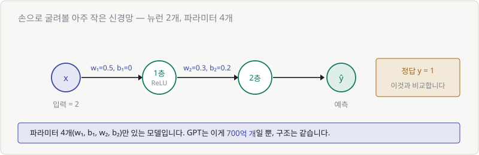
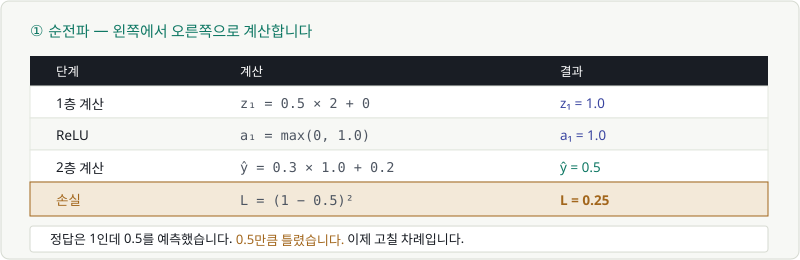
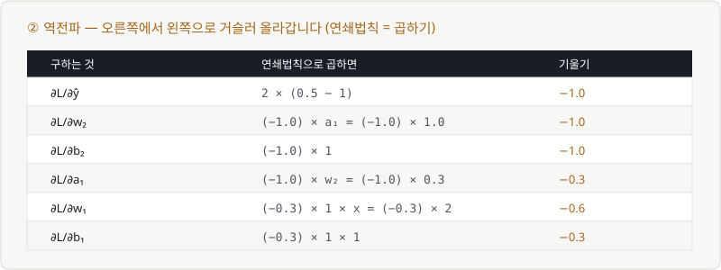
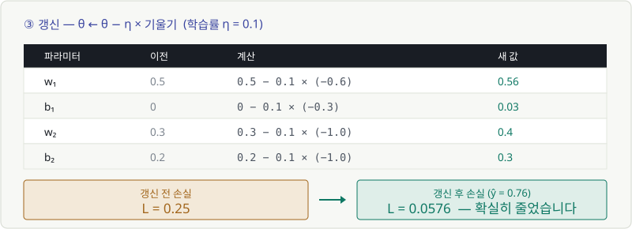
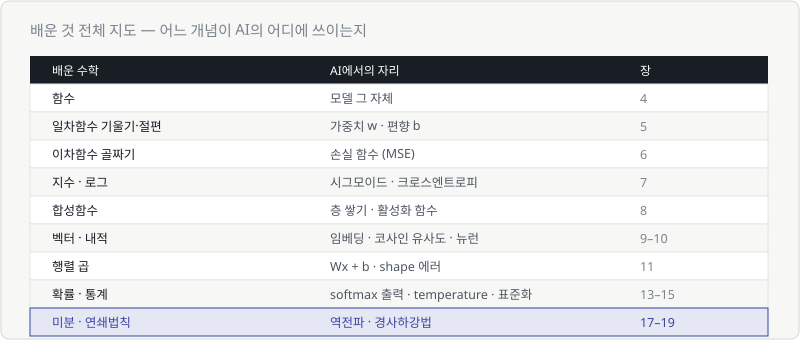

# Chapter 22. 종이 위에서 굴려보는 미니 신경망

> **이 장의 목표**
> **계산기 하나로** 신경망 학습 1회분을 직접 굴려 봅니다.
> 순전파 → 손실 → 역전파 → 갱신을 전부 손으로 계산하고,
> **손실이 실제로 줄어드는 것**을 눈으로 확인합니다.
>
> 여기까지 하면 "AI 학습"은 더 이상 블랙박스가 아닙니다.

---

## 22.1 아주 작은 신경망 하나

파라미터가 **4개**뿐인 모델을 만듭니다.



| | 값 |
|---|---|
| 입력 $x$ | 2 |
| 정답 $y$ | 1 |
| 1층 | $w_1 = 0.5$, $b_1 = 0$ → ReLU |
| 2층 | $w_2 = 0.3$, $b_2 = 0.2$ |
| 학습률 $\eta$ | 0.1 |

> 💬 GPT는 이 파라미터가 **700억 개**일 뿐, 구조는 똑같습니다.
> 4개로 이해하면 700억 개도 이해한 겁니다.

---

## 22.2 순전파를 손으로 계산하기

왼쪽에서 오른쪽으로 갑니다. **곱하고 더하고, 구부리기.**



### 1층

$$
z_1 = w_1 x + b_1 = 0.5 \times 2 + 0 = 1.0
$$

### ReLU (Chapter 08)

$$
a_1 = \max(0,\ 1.0) = 1.0
$$

양수니까 그대로 통과합니다.

### 2층

$$
\hat{y} = w_2 a_1 + b_2 = 0.3 \times 1.0 + 0.2 = 0.5
$$

**예측값은 0.5입니다.**

---

## 22.3 손실 계산하기

정답은 1인데 0.5를 예측했습니다. 얼마나 틀렸을까요? (Chapter 06)

$$
L = (y - \hat{y})^2 = (1 - 0.5)^2 = 0.25
$$

> 🎯 **이제 이 0.25를 줄이는 게 목표입니다.**
> 방법은 하나 — 파라미터 4개를 조금씩 고치는 것.

---

## 22.4 역전파와 갱신 1회

### ① 역전파 — 오른쪽에서 왼쪽으로

각 파라미터가 오차에 **얼마나 책임이 있는지** 연쇄법칙으로 구합니다. (Chapter 19)



**출발점**부터. 손실을 예측값으로 미분합니다.

$$
\frac{\partial L}{\partial \hat{y}} = 2(\hat{y} - y) = 2(0.5 - 1) = -1.0
$$

> $x^2$ 을 미분하면 $2x$ — Chapter 17의 다섯 줄 공식입니다.

이제 **곱하면서 뒤로** 갑니다.

| 구하는 것 | 곱하면 | 결과 |
|---|---|---|
| $\partial L/\partial w_2$ | $(-1.0) \times a_1 = (-1.0) \times 1.0$ | **−1.0** |
| $\partial L/\partial b_2$ | $(-1.0) \times 1$ | **−1.0** |
| $\partial L/\partial a_1$ | $(-1.0) \times w_2 = (-1.0) \times 0.3$ | **−0.3** |
| $\partial L/\partial w_1$ | $(-0.3) \times 1 \times x = (-0.3) \times 2$ | **−0.6** |
| $\partial L/\partial b_1$ | $(-0.3) \times 1 \times 1$ | **−0.3** |

> 💬 중간의 $\times 1$ 은 **ReLU의 미분값**입니다.
> $z_1 = 1.0 > 0$ 이라 그대로 통과(미분값 1)했습니다.
> 만약 $z_1$ 이 음수였다면 미분값이 0이라 **여기서 기울기가 끊깁니다.**

### ② 갱신 — 한 발 내려가기

$$
\theta \leftarrow \theta - \eta \frac{\partial L}{\partial \theta}
$$



| 파라미터 | 이전 | 계산 | 새 값 |
|---|---|---|---|
| $w_1$ | 0.5 | $0.5 - 0.1 \times (-0.6)$ | **0.56** |
| $b_1$ | 0 | $0 - 0.1 \times (-0.3)$ | **0.03** |
| $w_2$ | 0.3 | $0.3 - 0.1 \times (-1.0)$ | **0.4** |
| $b_2$ | 0.2 | $0.2 - 0.1 \times (-1.0)$ | **0.3** |

기울기가 전부 **음수**였으니, 마이너스를 곱해서 값이 **커졌습니다.**
Chapter 17의 "기울기 부호 반대로 간다"가 그대로 실행됐습니다.

### ③ 정말 나아졌을까? — 확인

새 파라미터로 다시 계산해 봅니다.

$$
z_1 = 0.56 \times 2 + 0.03 = 1.15
$$
$$
a_1 = \max(0,\ 1.15) = 1.15
$$
$$
\hat{y} = 0.4 \times 1.15 + 0.3 = 0.76
$$
$$
L = (1 - 0.76)^2 = 0.0576
$$

| | 갱신 전 | 갱신 후 |
|---|---|---|
| 예측 | 0.5 | **0.76** |
| 손실 | 0.25 | **0.0576** |

> 🎉 **손실이 0.25에서 0.0576으로 줄었습니다.**
> 정답 1에 더 가까워졌습니다. **이게 "학습"입니다.**

### 이걸 반복하면

```python
x, y = 2.0, 1.0
w1, b1, w2, b2 = 0.5, 0.0, 0.3, 0.2
lr = 0.1

for step in range(20):
    z1 = w1*x + b1
    a1 = max(0, z1)
    yhat = w2*a1 + b2
    loss = (y - yhat)**2

    dy  = 2*(yhat - y)
    dw2, db2 = dy*a1, dy
    da1 = dy*w2
    dz1 = da1 * (1 if z1 > 0 else 0)
    dw1, db1 = dz1*x, dz1

    w1 -= lr*dw1;  b1 -= lr*db1
    w2 -= lr*dw2;  b2 -= lr*db2
    print(step, round(yhat, 4), round(loss, 6))
```

방금 손으로 한 계산을 그대로 옮긴 것뿐입니다.
돌려 보면 예측이 **1에 점점 가까워지고 손실이 0으로 수렴**합니다.

> 🎯 **PyTorch의 `loss.backward()` 와 `optimizer.step()` 이 하는 일이 정확히 이겁니다.**
> 파라미터가 4개가 아니라 700억 개일 뿐입니다.

---

## 22.5 전체 복습 — 한 장 요약



| 배운 수학 | AI에서의 자리 | 장 |
|---|---|---|
| 함수 | 모델 그 자체 | 4 |
| 일차함수 기울기·절편 | **가중치 w · 편향 b** | 5 |
| 이차함수 골짜기 | **손실 함수** | 6 |
| 지수 · 로그 | 시그모이드 · 크로스엔트로피 | 7 |
| 합성함수 | **층 쌓기 · 활성화 함수** | 8 |
| 벡터 · 내적 | 임베딩 · 코사인 유사도 · 뉴런 | 9–10 |
| 행렬 곱 | **Wx + b · shape 에러** | 11 |
| 확률 · 통계 | softmax 출력 · temperature · 표준화 | 13–15 |
| 미분 · 연쇄법칙 | **역전파 · 경사하강법** | 17–19 |

### 세 문장으로 압축하면

> **1. AI 모델은 함수 하나다.** 곱하고 더하고(Wx+b), 구부리는(활성화) 것의 반복.
> **2. 학습은 골짜기를 내려가는 일이다.** 손실이 골짜기이고, 미분이 내리막을 알려준다.
> **3. 출력은 정답이 아니라 확률이다.** 그래서 확률과 통계를 읽을 줄 알아야 한다.

---

## 22.6 여기서 어디로 갈까

축하합니다. 이제 이런 것들이 가능해졌습니다.

- ✅ 논문의 수식 블록을 보고 **무슨 일을 하는지 읽을 수 있음**
- ✅ 학습 곡선을 보고 **문제를 진단**할 수 있음
- ✅ shape 에러를 **고칠 수 있음**
- ✅ 학습률·temperature 같은 설정이 **뭘 바꾸는지 앎**

### 다음 단계 (부록 E에서 자세히)

| 방향 | 추천 시점 |
|---|---|
| **직접 만들어 보기** | 지금 바로 — 이해가 코드로 굳어집니다 |
| 선형대수 더 깊이 | 트랜스포머·어텐션을 제대로 파고 싶을 때 |
| 확률·통계 더 깊이 | 생성 모델, 불확실성 추정에 관심 있을 때 |
| 최적화 이론 | 학습이 안 될 때 원인을 깊이 알고 싶을 때 |

> 💬 **가장 추천하는 것은 첫 번째입니다.**
> 이 코스로 얻은 감각은 **코드를 만지면서** 진짜 이해로 바뀝니다.
> 22.4의 파이썬 코드를 직접 돌려 보는 것부터 시작하세요.

---

## ✅ 1분 확인

1. 순전파의 순서는?
2. 역전파는 어디서 출발해서 어디로 가나요?
3. 기울기가 음수인 파라미터는 갱신 후 커지나요, 작아지나요?
4. ReLU에서 $z$ 가 음수면 그 경로의 기울기는 어떻게 되나요?

<details>
<summary>답 보기</summary>

1. **곱하고 더하기 → 활성화 → 곱하고 더하기 → 예측 → 손실**
2. **손실에서 출발해 입력 쪽으로** 거슬러 갑니다. 연쇄법칙으로 곱하면서요.
3. **커집니다** — $\theta - \eta \times (\text{음수})$ 이므로 더해지는 셈입니다.
4. **0이 됩니다** — 기울기가 그 지점에서 끊깁니다. (ReLU의 미분값이 0)

</details>

---

## 🎉 본편 완주를 축하합니다

Chapter 01에서 이렇게 시작했습니다.

$$
\theta \leftarrow \theta - \eta \frac{\partial L}{\partial \theta}
\qquad
\text{softmax}(z_i) = \frac{e^{z_i}}{\sum_j e^{z_j}}
$$

> *"저 기호들을 소리 내어 읽을 수조차 없다."*

지금은 두 수식 모두 **문장으로 읽고, 손으로 계산하고, 왜 그렇게 생겼는지 설명**하실 수 있습니다.

22개 장을 지나오는 동안 배운 것은 사실 그리 많지 않습니다.
**곱하고 더하기, 기울기, 확률.** 이 셋의 조합이었을 뿐입니다.

AI가 어려워 보였던 건 수학이 어려워서가 아니라,
**아무도 그림으로 설명해 주지 않았기 때문**입니다.

이제 부록은 **사전처럼** 쓰세요. 순서대로 읽는 자료가 아닙니다.
막히는 게 생기면 그때 펼치면 됩니다.

---

| ⬅️ 이전 | 다음 ➡️ |
|---|---|
| [Chapter 21. AI 수식 해부하기](ch21-dissect-formulas.md) | 부록 A. 기호 치트시트 *(집필 예정)* |
